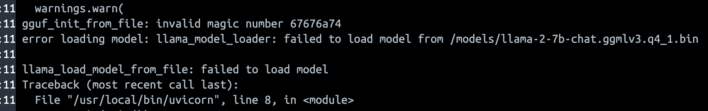

# Jan

Jan is a free, source-available and [fair code licensed](https://faircode.io/) AI Inference Platform. We help enterprises, small businesses and hobbyists to self-host AI on their own infrastructure efficiently, to protect their data, lower costs, and put powerful AI capabilities in the hands of users.

## Features

- Web, Mobile and APIs
- LLMs and Generative Art models
- AI Catalog
- Model Installer
- User Management
- Support for Apple Silicon, CPU architectures

## Installation

### Pre-Requisites

- **Supported Operating Systems**: This setup is only tested and supported on Linux, Macbook Docker Desktop, or Windows Subsystem for Linux (WSL) with Docker.

- **Docker**: Make sure you have Docker installed on your machine. You can install Docker by following the instructions [here](https://docs.docker.com/get-docker/).

- **Docker Compose**: Make sure you also have Docker Compose installed. If not, follow the instructions [here](https://docs.docker.com/compose/install/).

- **Clone the Repository**: Make sure to clone the repository containing the `docker-compose.yml` and pull the latest git submodules.

  ```bash
  git clone https://github.com/janhq/jan.git

  cd jan

  # Pull latest submodule
  git submodule update --init
  ```

- **Environment Variables**: You will need to set up several environment variables for services such as Keycloak and Postgres. You can place them in `.env` files in the respective folders as shown in the `docker-compose.yml`.

  ```bash
  cp sample.env .env
  ```

  | Service (Docker)       | env file                                                                                                                        |
  | ---------------------- | ------------------------------------------------------------------------------------------------------------------------------- |
  | Global env             | `.env`, just run `cp sample.env .env`                                                                                           |
  | Keycloak               | `.env` presented in global env and initiate realm in `conf/keycloak_conf/example-realm.json`                                    |
  | Keycloak PostgresDB    | `.env` presented in global env                                                                                                  |
  | jan-inference          | `.env` presented in global env                                                                                                  |
  | app-backend (hasura)   | `conf/sample.env_app-backend` refer from [here](https://hasura.io/docs/latest/deployment/graphql-engine-flags/config-examples/) |
  | app-backend PostgresDB | `conf/sample.env_app-backend-postgres`                                                                                          |
  | web-client             | `conf/sample.env_web-client`                                                                                                    |

### Docker Compose

Jan offers an [Docker Compose](https://docs.docker.com/compose/) deployment that automates the setup process.

Run the following command to start all the services defined in the `docker-compose.yml`

```shell
# Docker Compose up
docker compose up
```

To run in detached mode:

```shell
# Docker Compose up detached mode
docker compose up -d
```

| Service (Docker)     | URL                   | Credential                                                                                                                                                           |
| -------------------- | --------------------- | -------------------------------------------------------------------------------------------------------------------------------------------------------------------- |
| Keycloak             | http://localhost:8088 | Admin credentials are set via the environment variables `KEYCLOAK_ADMIN` and `KEYCLOAK_ADMIN_PASSWORD`                                                               |
| app-backend (hasura) | http://localhost:8080 | Admin credentials are set via the environment variables `HASURA_GRAPHQL_ADMIN_SECRET` in file `conf/sample.env_app-backend`                                          |
| web-client           | http://localhost:3000 | Users are signed up to keycloak, default created user is set via `conf/keycloak_conf/example-realm.json` on keycloak with username: `username`, password: `password` |
| llm service          | http://localhost:8000 |                                                                                                                                                                      |

After all service up and running, just access to `web-client` via `http://localhost:3000` and test the llm model with `chatgpt` session.

## Developers

### Architecture

- [ ] Architecture Diagram

### Dependencies

- [Keycloak Community](https://github.com/keycloak/keycloak) (Apache-2.0)
- [Hasura Community Edition](https://github.com/hasura/graphql-engine) (Apache-2.0)

### Repo Structure

Jan is a monorepo that pulls in the following submodules

```shell
├── docker-compose.yml
├── mobile-client
├── web-client
├── app-backend
├── inference-backend
├── docs                # Developer Docs
├── adrs                # Architecture Decision Records
```

## Live Demo

You can access the live demo at https://cloud.jan.ai.

## Common Issues and Troubleshooting

**Error in `jan-inference` service** 

- Error: download model not incomplete
- Solution:
  - Manually download the LLM model using the URL specified in the environment variable `MODEL_URL` within the `.env` file. The URL is typically https://huggingface.co/TheBloke/Llama-2-7B-Chat-GGML/resolve/main/llama-2-7b-chat.ggmlv3.q4_1.bin
  - Copy the downloaded file `llama-2-7b-chat.ggmlv3.q4_1.bin` to the folder `jan-inference/llm/models`
  - Run `docker compose down` followed by `docker compose up -d` again to restart the services.
