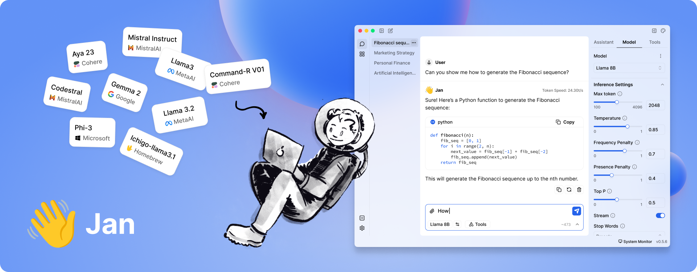

# Jan - Local AI Assistant



<p align="center">
  <!-- ALL-CONTRIBUTORS-BADGE:START - Do not remove or modify this section -->
  
  
  
  
  
</p>

<p align="center">
  <a href="https://jan.ai/docs/quickstart">Getting Started</a> 
  - <a href="https://jan.ai/docs">Docs</a> 
  - <a href="https://github.com/janhq/jan/releases">Changelog</a> 
  - <a href="https://github.com/janhq/jan/issues">Bug reports</a> 
  - <a href="https://discord.gg/AsJ8krTT3N">Discord</a>
</p>

<p align="center">
⚠️ <b> Jan is currently in Development</b>: Expect breaking changes and bugs!
</p>


Jan is a ChatGPT-alternative that runs 100% offline on your device. Our goal is to make it easy for a layperson to download and run LLMs and use AI with **full control** and **privacy**.

Jan is powered by [Cortex](https://github.com/janhq/cortex.cpp), our embeddable local AI engine that runs on any hardware.
From PCs to multi-GPU clusters, Jan & Cortex supports universal architectures:

- [x] NVIDIA GPUs (fast)
- [x] Apple M-series (fast)
- [x] Apple Intel
- [x] Linux Debian
- [x] Windows x64

#### Features:
- [Model Library](https://jan.ai/docs/models/manage-models#add-models) with popular LLMs like Llama, Gemma, Mistral, or Qwen 
- Connect to [Remote AI APIs](https://jan.ai/docs/remote-models/openai) like Groq and OpenRouter
- Local API Server with OpenAI-equivalent API
- [Extensions](https://jan.ai/docs/extensions) for customizing Jan

## Download

<table>
  <tr style="text-align:center">
    <td style="text-align:center"><b>Version Type</b></td>
    <td style="text-align:center"><b>Windows</b></td>
    <td style="text-align:center"><b>MacOS Universal</b></td>
    <td colspan="2" style="text-align:center"><b>Linux</b></td>
  </tr>
  <tr style="text-align:center">
    <td style="text-align:center"><b>Stable (Recommended)</b></td>
    <td style="text-align:center">
      <a href='https://app.jan.ai/download/latest/win-x64'>
        
        <b>jan.exe</b>
      </a>
    </td>
    <td style="text-align:center">
      <a href='https://app.jan.ai/download/latest/mac-universal'>
        
        <b>jan.dmg</b>
      </a>
    </td>
    <td style="text-align:center">
      <a href='https://app.jan.ai/download/latest/linux-amd64-deb'>
        
        <b>jan.deb</b>
      </a>
    </td>
    <td style="text-align:center">
      <a href='https://app.jan.ai/download/latest/linux-amd64-appimage'>
        
        <b>jan.AppImage</b>
      </a>
    </td>
  </tr>
  <tr style="text-align:center">
    <td style="text-align:center"><b>Beta (Preview)</b></td>
    <td style="text-align:center">
      <a href='https://app.jan.ai/download/beta/win-x64'>
        
        <b>jan.exe</b>
      </a>
    </td>
    <td style="text-align:center">
      <a href='https://app.jan.ai/download/beta/mac-universal'>
        
        <b>jan.dmg</b>
      </a>
    </td>
    <td style="text-align:center">
      <a href='https://app.jan.ai/download/beta/linux-amd64-deb'>
        
        <b>jan.deb</b>
      </a>
    </td>
    <td style="text-align:center">
      <a href='https://app.jan.ai/download/beta/linux-amd64-appimage'>
        
        <b>jan.AppImage</b>
      </a>
    </td>
  </tr>
  <tr style="text-align:center">
    <td style="text-align:center"><b>Nightly Build (Experimental)</b></td>
    <td style="text-align:center">
      <a href='https://app.jan.ai/download/nightly/win-x64'>
        
        <b>jan.exe</b>
      </a>
    </td>
    <td style="text-align:center">
      <a href='https://app.jan.ai/download/nightly/mac-universal'>
        
        <b>jan.dmg</b>
      </a>
    </td>
    <td style="text-align:center">
      <a href='https://app.jan.ai/download/nightly/linux-amd64-deb'>
        
        <b>jan.deb</b>
      </a>
    </td>
    <td style="text-align:center">
      <a href='https://app.jan.ai/download/nightly/linux-amd64-appimage'>
        
        <b>jan.AppImage</b>
      </a>
    </td>
  </tr>
</table>

Download the latest version of Jan at https://jan.ai/ or visit the [GitHub Releases](https://github.com/janhq/jan/releases) to download any previous release.

## Demo

https://github.com/user-attachments/assets/c3592fa2-c504-4d9d-a885-7e00122a50f3

*Real-time Video: Jan v0.5.7 on a Mac M2, 16GB Sonoma 14.2*

## Quicklinks

### Jan

- [Jan Website](https://jan.ai/)
- [Jan GitHub](https://github.com/janhq/jan)
- [Documentation](https://jan.ai/docs)
- [Jan Changelog](https://jan.ai/changelog)
- [Jan Blog](https://jan.ai/blog)

### Cortex.cpp
Jan is powered by **Cortex.cpp**. It is a C++ command-line interface (CLI) designed as an alternative to [Ollama](https://ollama.com/). By default, it runs on the llama.cpp engine but also supports other engines, including ONNX and TensorRT-LLM, making it a multi-engine platform.


- [Cortex Website](https://cortex.so/)
- [Cortex GitHub](https://github.com/janhq/cortex.cpp)
- [Documentation](https://cortex.so/docs/)
- [Models Library](https://cortex.so/models)
- API Reference: *Under development*
  
## Requirements for running Jan

- **MacOS**: 13 or higher
- **Windows**:
  - Windows 10 or higher
  - To enable GPU support:
    - Nvidia GPU with CUDA Toolkit 11.7 or higher
    - Nvidia driver 470.63.01 or higher
- **Linux**:
  - glibc 2.27 or higher (check with `ldd --version`)
  - gcc 11, g++ 11, cpp 11 or higher, refer to this [link](https://jan.ai/guides/troubleshooting/gpu-not-used/#specific-requirements-for-linux) for more information
  - To enable GPU support:
    - Nvidia GPU with CUDA Toolkit 11.7 or higher
    - Nvidia driver 470.63.01 or higher

## Troubleshooting

As Jan is in development mode, you might get stuck on a some common issues:
- [Troubleshooting a broken build](https://jan.ai/docs/troubleshooting#broken-build)
- [Troubleshooting NVIDIA GPU](https://jan.ai/docs/troubleshooting#troubleshooting-nvidia-gpu)
- [Troubleshooting Something's Amiss](https://jan.ai/docs/troubleshooting#somethings-amiss)


If you can't find what you need in our troubleshooting guide, feel free reach out to us for extra help:
1. Copy your [error logs & device specifications](https://jan.ai/docs/troubleshooting#how-to-get-error-logs).
2. Go to our [Discord](https://discord.com/invite/FTk2MvZwJH) & send it to **#🆘|get-help** channel for further support.

*Check the logs to ensure the information is what you intend to send. Note that we retain your logs for only 24 hours, so report any issues promptly.*
  

## Contributing

Contributions are welcome! Please read the [CONTRIBUTING.md](CONTRIBUTING.md) file

### Pre-requisites

- node >= 20.0.0
- yarn >= 1.22.0
- make >= 3.81

### Instructions

1. **Clone the repository and prepare:**

   ```bash
   git clone https://github.com/janhq/jan
   cd jan
   git checkout -b DESIRED_BRANCH
   ```

2. **Run development and use Jan Desktop**

   ```bash
   make dev
   ```

This will start the development server and open the desktop app.


### For production build

```bash
# Do steps 1 and 2 in the previous section
# Build the app
make build
```

This will build the app MacOS m1/m2 for production (with code signing already done) and put the result in `dist` folder.

## Acknowledgements

Jan builds on top of other open-source projects:

- [llama.cpp](https://github.com/ggerganov/llama.cpp)
- [LangChain](https://github.com/langchain-ai)
- [TensorRT](https://github.com/NVIDIA/TensorRT)
- [TensorRT-LLM](https://github.com/NVIDIA/TensorRT-LLM)

## Contact

- Bugs & requests: file a GitHub ticket
- For discussion: join our Discord [here](https://discord.gg/FTk2MvZwJH)
- For business inquiries: email hello@jan.ai 
- For jobs: please email hr@jan.ai

## Trust & Safety

Beware of scams!

- We will never request your personal information.
- Our product is completely free; no paid version exists.
- We do not have a token or ICO.
- We are a [bootstrapped company](https://en.wikipedia.org/wiki/Bootstrapping), and don't have any external investors (*yet*). We're open to exploring opportunities with strategic partners want to tackle [our mission](https://jan.ai/about#mission) together.

## License

Jan is free and open source, under the **AGPLv3** license.
