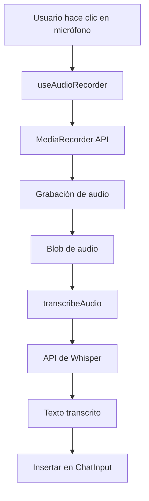

# 🎤 Integración de Whisper en Jan

Esta guía explica cómo usar la integración de Whisper para entrada de voz en Jan.

## 📋 Tabla de Contenidos

1. [Características](#características)
2. [Requisitos](#requisitos)
3. [Configuración](#configuración)
4. [Uso](#uso)
5. [Solución de Problemas](#solución-de-problemas)
6. [Personalización](#personalización)
7. [Arquitectura Técnica](#arquitectura-técnica)

---

## ✨ Características

- 🎙️ **Grabación de audio** directo desde el navegador
- 🔄 **Transcripción en tiempo real** usando tu API de Whisper personalizada
- ⏸️ **Controles de grabación** (pausar, reanudar, cancelar)
- 🌍 **Multi-idioma** con detección automática
- 🔒 **Privado y seguro** - conecta tu propia API
- 📝 **Inserción automática** del texto transcrito en el chat

---

## 📦 Requisitos

### Mínimos:
- ✅ Navegador moderno con soporte de MediaRecorder API
- ✅ Permisos de micrófono
- ✅ API de Whisper configurada (tu servidor: https://whisper.contextcompany.com.co)
- ✅ Clave de API válida

### Navegadores Soportados:
- Chrome/Edge 49+
- Firefox 25+
- Safari 14.1+
- Opera 36+

---

## ⚙️ Configuración

### Paso 1: Acceder a la Configuración

1. Abre Jan
2. Ve a **Settings** (Configuración)
3. Selecciona **Whisper** en el menú lateral


### Paso 2: Configurar la API

Ingresa la siguiente información:

#### **API URL** (Requerido)
```
https://whisper.contextcompany.com.co/v1/audio/transcriptions
```

#### **API Key** (Requerido)
Tu clave de autenticación personal. Por ejemplo:
```
your-api-key-here
```
> ⚠️ **Seguridad**: Tu API key se guarda localmente en tu navegador y nunca se comparte.

#### **Model Name** (Opcional)
El modelo de Whisper a usar:
```
whisper-1
```
o
```
whisper-large-v3
```

#### **Language** (Opcional)
- Deja como `auto` para detección automática
- O especifica: `es` (Español), `en` (Inglés), `fr` (Francés), etc.

### Paso 3: Guardar y Probar

1. Haz clic en **Save** para guardar la configuración
2. Haz clic en **Test Connection** para probar
3. Habla cuando aparezca el diálogo de grabación
4. Verifica que la transcripción funcione correctamente

---

## 🎤 Uso

### Grabación Básica

1. **Iniciar Grabación**
   - Haz clic en el icono de micrófono 🎙️ en el input del chat
   - Se abrirá una ventana de grabación
   - Habla claramente hacia tu micrófono

2. **Durante la Grabación**
   - ⏸️ **Pausar**: Pausa temporalmente la grabación
   - ▶️ **Reanudar**: Continúa grabando
   - ✅ **Finalizar**: Detiene y transcribe el audio
   - ❌ **Cancelar**: Descarta la grabación

3. **Después de Grabar**
   - El audio se envía automáticamente a tu API de Whisper
   - Recibirás una notificación cuando termine la transcripción
   - El texto se inserta en el campo de mensaje
   - Puedes editarlo antes de enviarlo al chat

### Ejemplo de Flujo

```
1. Usuario hace clic en 🎙️
   ↓
2. Sistema solicita permiso de micrófono (primera vez)
   ↓
3. Usuario habla: "Hola, ¿cuál es el clima en Madrid hoy?"
   ↓
4. Usuario hace clic en ✅
   ↓
5. Sistema transcribe: "Hola, ¿cuál es el clima en Madrid hoy?"
   ↓
6. Texto aparece en el input del chat
   ↓
7. Usuario puede editarlo o enviarlo directamente
```

---

## 🔧 Solución de Problemas

### El micrófono no funciona

**Problema**: No se detecta el micrófono

**Soluciones**:
1. Verifica permisos del navegador:
   - Chrome: `chrome://settings/content/microphone`
   - Firefox: Configuración → Privacidad y Seguridad → Permisos
2. Conecta un micrófono físico si usas desktop
3. Reinicia el navegador

### Error de API

**Problema**: "Failed to transcribe audio"

**Soluciones**:
1. Verifica que la URL de la API sea correcta
2. Confirma que tu API key sea válida
3. Revisa la conectividad de red
4. Verifica los logs del navegador (F12 → Console)

### Audio no se transcribe

**Problema**: La grabación funciona pero no hay transcripción

**Soluciones**:
1. Verifica que hablaste lo suficientemente fuerte
2. Asegúrate que la grabación duró más de 1 segundo
3. Revisa el formato de audio soportado por tu API
4. Prueba con el botón "Test Connection"

### Transcripción incorrecta

**Problema**: El texto transcrito no es correcto

**Soluciones**:
1. Habla más claramente y despacio
2. Especifica el idioma en la configuración (en vez de 'auto')
3. Reduce el ruido de fondo
4. Usa un micrófono de mejor calidad

---

## 🎨 Personalización

### Ajustar según tu API

Si tu API de Whisper usa un formato diferente al estándar de OpenAI, puedes modificar:

**Archivo**: `web-app/src/services/whisper/whisper.ts`

```typescript
// Modifica la función transcribeAudio según tu API
export async function transcribeAudio(
  audioBlob: Blob,
  config: WhisperConfig
): Promise<TranscriptionResponse> {
  // Ajusta los headers
  const headers: HeadersInit = {
    'Authorization': `Bearer ${config.apiKey}`,
    // Agrega headers personalizados aquí
    'X-Custom-Header': 'value',
  }

  // Ajusta los parámetros del FormData
  formData.append('file', audioFile)
  formData.append('custom_param', 'value')

  // Ajusta el manejo de la respuesta
  const data = await response.json()
  return {
    text: data.your_text_field, // Cambia según tu respuesta
    language: data.your_language_field,
  }
}
```

### Cambiar formato de audio

Por defecto se usa WebM. Para cambiar:

**Archivo**: `web-app/src/hooks/useAudioRecorder.ts`

```typescript
// Línea ~40-42
const mimeType = 'audio/wav' // Cambia a tu formato preferido
```

---

## 🏗️ Arquitectura Técnica

### Componentes Creados

```
web-app/src/
├── hooks/
│   └── useAudioRecorder.ts         # Hook para grabación de audio
├── services/
│   └── whisper/
│       └── whisper.ts               # Servicio de API de Whisper
├── containers/
│   ├── MicrophoneButton.tsx        # Componente de botón con UI
│   └── ChatInput.tsx                # Integración en el chat (modificado)
└── routes/
    └── settings/
        └── whisper.tsx               # Página de configuración
```

### Flujo de Datos



### Tecnologías Usadas

- **MediaRecorder API**: Captura de audio del navegador
- **Fetch API**: Comunicación con API de Whisper
- **LocalStorage**: Almacenamiento de configuración
- **React Hooks**: Gestión de estado
- **TypeScript**: Type safety

---

## 📝 Notas de Implementación

### Formato de Audio

- **Formato predeterminado**: WebM con codec Opus
- **Sample rate**: 16kHz (óptimo para Whisper)
- **Bits per second**: 128kbps

### Seguridad

- La API key se guarda en `localStorage`
- No se envían datos a terceros
- Todo el audio se procesa por tu API privada

### Limitaciones

- **Tamaño máximo**: 25MB por archivo de audio
- **Duración**: Sin límite (pero depende de tu API)
- **Idiomas**: Según soporte de tu API de Whisper

---

## 🤝 Contribuir

Si encuentras bugs o tienes sugerencias:

1. Reporta en GitHub Issues
2. Incluye logs del navegador (F12 → Console)
3. Describe los pasos para reproducir

---

## 📄 Licencia

Esta integración es parte de Jan, licenciado bajo AGPLv3.

---

## 🆘 Soporte

- **Documentación oficial de Jan**: https://jan.ai/docs
- **Tu API de Whisper**: https://whisper.contextcompany.com.co/docs
- **Discord de Jan**: https://discord.gg/Exe46xPMbK
- **GitHub Issues**: https://github.com/janhq/jan/issues

---

¡Disfruta usando la entrada de voz en Jan! 🎉
