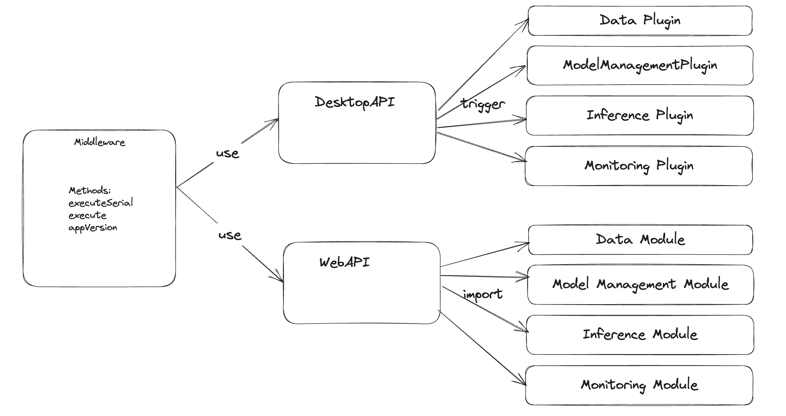

# ADR #001: Jan deployable cloud-native

## Changelog

- 23.10.03: Initial unfinished draft
- 23.10.16: Remove authentication

## Authors

- @nam-john-ho
- @louis

## Context

### Status Quo

* User doesn't have a local GPU machine but wants to run Jan on a rented server
* User wants a quick, fast way to experiment with Jan on a rented GPU
* https://github.com/janhq/jan/issues/255

## Decision

* This ADR aims to outline design decisions for deploying Jan in cloud native environments such as: Runpod, AWS, Azure, GCP in a fast and simple way.
* The current code-base should not change too much.
* The current plugins must be reusable across enviroments (Desktop, Cloud-native).

### Key Design Decisions

#### Why middleware
* The /web codebase needs to operate in both browser and electron environments
* The /web codebase needs to route plugin routes accordingly, either to /server or /electron
* Middleware takes care of this
* We will have a /server codebase that takes care of routing to plugins
#### Unsuitable Alternatives
* Not possible to just run electron headless
* /web is on a different chromium window
* Does not have all the electron handlers
* Does not have the IPC handler

## Alternative Approaches
Separated server process runs along side with electron. https://github.com/janhq/jan/pull/184/commits/6005409a945bb0e80a61132b9eb77f47f19d0aa6 

## Considerations
* Due to the limitation of accessing the file system in web browsers, the first version of the web app will load all the current plugins by default, and users will not be able to add, remove, or update plugins.
* Simple authentication will be implemented as a plugin.

## References

- https://www.runpod.io/console/templates
- https://repost.aws/articles/ARQ0Tz9eorSL6EAus7XPMG-Q/how-to-install-textgen-webui-on-aws
- https://www.youtube.com/watch?v=_59AsSyMERQ
- https://gpus.llm-utils.org/running-llama-2-on-runpod-with-oobaboogas-text-generation-webui/
- https://medium.com/@jarimh1984/installing-oobabooga-and-oobabooga-api-to-runpod-cloud-step-by-step-tutorial-47457974dfa5
