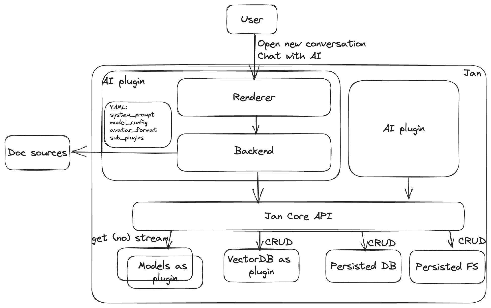

# ADR #002: Jan AI apps

## Changelog
- Oct 4th 2023: Initial draft
- Oct 6th 2023: Update sample API

## Authors
- @vuonghoainam - Hiro
- @louis-jan

## Status
Proposed

## Context

### Business context
Jan can be a platform and let builders build their own `AI app` using existing tools
- Use-case 1: Medical AI startup uploads "case notes" to Jan, wants to ask it questions (i.e. medical audit)
- Use-case 2: Legal e-discovery: very large amount of documents (~10-15k pages) are uploaded, data is very private and cannot be leaked
- Use-case 3: Jan wants to use Jan to have a QnA chatbot to answer questions on docs
- Use-case 4: Jan wants to use Jan to have a codellama RAG on its own codebase, to generate new PRs

### Extra context
- There are many use cases that the community can develop and sell to the users through Jan as plugin. Jan needs to streamline higher value chain.
- This brings more value and more option to all kind of user
- This can help building ecosystem and streamline value end to end (Jan,  plugins/ model creators, Jan users - enterprise/ individual)
- We at Jan cannot build plugins more on our own, but this one should serve as featured example like [OpenAI Retrieval plugin](https://github.com/openai/chatgpt-retrieval-plugin) does.
- [#232](https://github.com/janhq/jan/issues/232)

## Decision

- User can browse and install plugins (with recommended model - llama2, claude, openai …) - This requires plugin dependencies.
- Jan provide consistent interface for plugin developer to use:
    - Use LLM (this can be switched in runtime) - i.e Dev in llama2-7b but user can use with llama2-70b. Can choose another model as well
    - Plugin can have API for CRUD indices in vectorDB/ DB, and Jan only exposes corresponding data to the app
    - A place for a plugin to store the files for persistence
- This works seamlessly on desktop/ Jan hosted version with Jan API abstraction.

### Simple UX

### Component design

## API
- `jan.plugin.<plugin_name>.<function_name>(**args)`

- `jan.core.db.sql.command()` -> CRUD/ query
- `jan.plugin.vectra.<function_name>(**args)` -> CRUD/ query for 
## Consequences
- Jan user can build their own AI apps (and buy from others too) in an easy way
- Clear design for plugin and Jan platform development

## Reference
- [ADR-003](adr-003-jan-plugins.md)