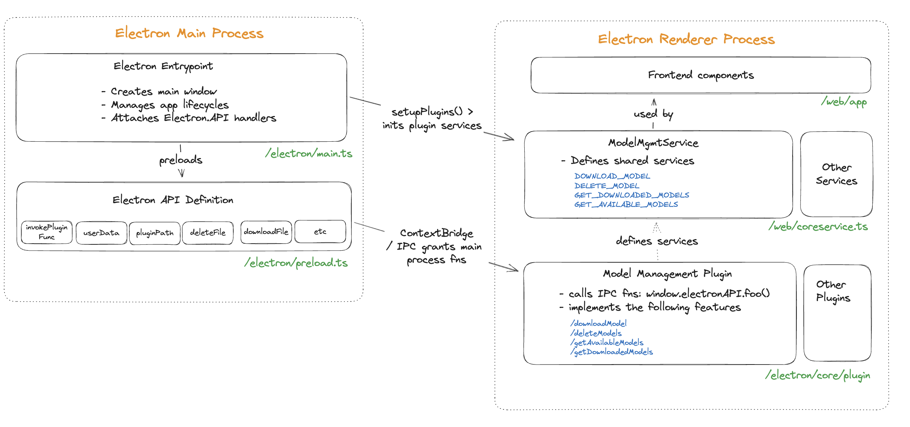

# ADR 003: JAN PLUGINS

## Changelog

- Oct 5th 2023: Initial draft

## Status

Accepted

## Context

Modular Architecture w/ Plugins:

- Jan will have an architecture similar to VSCode or k8Lens
- "Desktop Application" whose functionality can be extended thru plugins
- Jan's architecture will need to accomodate plugins for (a) Persistence(b) IAM(c) Teams and RBAC(d) Policy engines(e) "Apps" (i.e. higher-order business logic)(f) Themes (UI)
- Nitro's architecture will need to accomodate plugins for different "model backends"(a) llama.cpp(b) rkwk (and others)(c) 3rd-party AIs

## Decision

## Consequences

What becomes easier or more difficult to do because of this change?

## Reference
[Plugin APIs](./adr-003-jan-plugins.md)
