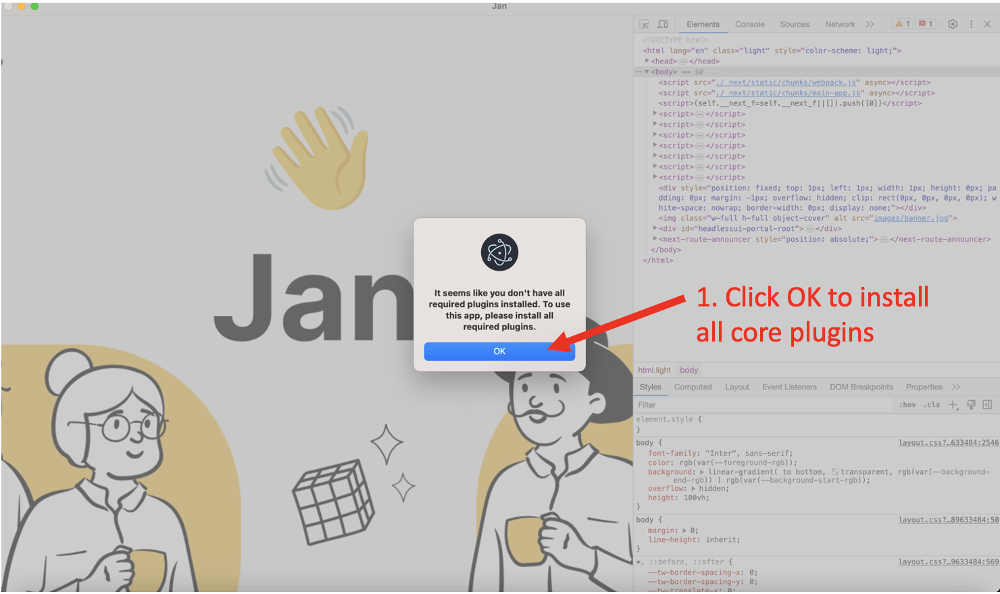
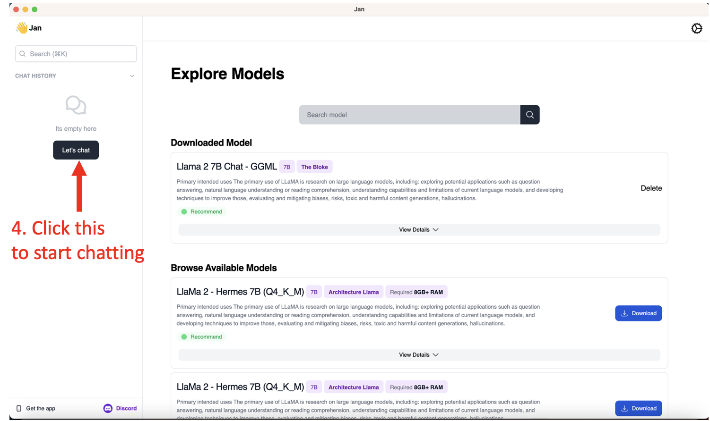
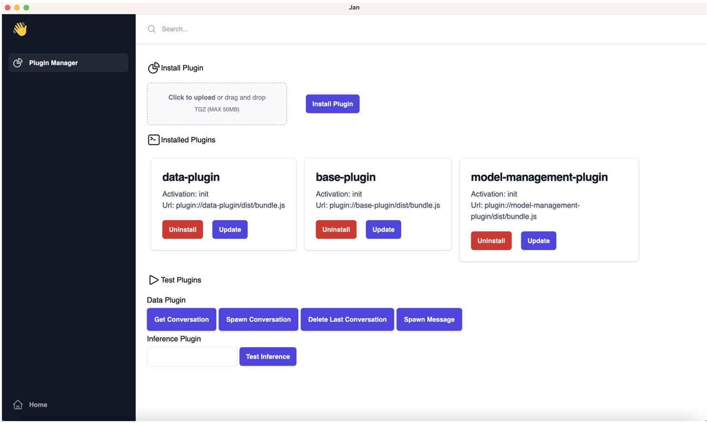

# App

Jan Desktop is an Electron application designed to allow users to interact with the Language Model (LLM) through chat or create art using Stable Diffusion.

## Features

- Chat with the Language Model: Engage in interactive conversations with the Language Model. Ask questions, seek information, or simply have a chat.

- Generate Art with Stable Diffusion: Utilize the power of Stable Diffusion to generate unique and captivating pieces of art. Experiment with various parameters to achieve desired results.

## Installation and Usage

### Use as complete suite (in progress)
 
### For interactive development

Note: This instruction is tested on MacOS only.

1. **Clone the Repository:**

   ```
   git clone https://github.com/janhq/jan
   cd jan/app
   ```

2. **Install dependencies:**

   ```
   yarn install
   ```

3. **Download Model and copy to userdata directory** (this is a hacky step, will be remove in future versions)

   ```
   # Determining the path to save model with /Users/<username>/Library/Application Support/jan-web/
   # Now download the model to correct location by running command
   wget -O /Users/<username>/Library/Application Support/jan-web/llama-2-7b-chat.gguf.q4_0.bin https://huggingface.co/TheBloke/Llama-2-7b-Chat-GGUF/resolve/main/llama-2-7b-chat.Q4_0.gguf
   ```

4. **Run development and Using Jan Desktop**

   ```
   yarn electron:start
   ```
   This will start the development server and open the desktop app.
   In this step, there are a few notification about installing base plugin, just click `OK` and `Next` to continue.
   
   
   

   After that, you can use Jan Desktop as normal.
   
   
   


   

## Configuration

TO DO

## Dependencies

TO DO

## Contributing

Contributions are welcome! If you find a bug or have suggestions for improvements, feel free to open an issue or submit a pull request on the [GitHub repository](https://github.com/janhq/jan).

## License

This project is licensed under the Fair-code License - see the [License](https://faircode.io/#licenses) for more details.

---

Feel free to reach out [Discord](https://jan.ai/discord) if you have any questions or need further assistance. Happy coding with Jan Web and exploring the capabilities of the Language Model and Stable Diffusion! 🚀🎨🤖