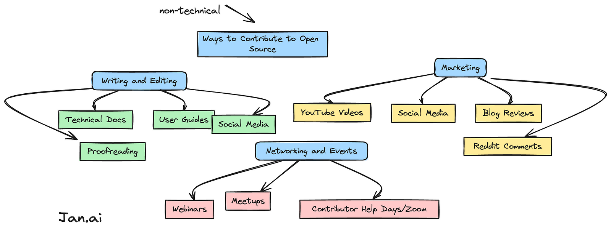
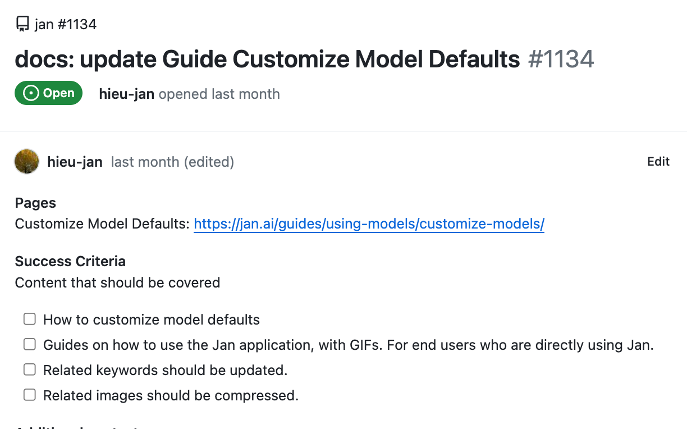

Ever wondered what ‘contribution’ really means in open-source communities? Calling back to John Picozzi’s presentation at DrupalCon 2022 and his article on [Opensource.com,](https://opensource.com/article/22/8/non-code-contribution-powers-open-source) we look at how his views on contributions align with ours at [Jan](https://jan.ai)

[https://jan.ai/about/#open-source](https://jan.ai/about/#open-source)

#### Broadening the Definition of Contribution - how it benefits everyone

Contribution in open source isn’t just about coding, and Picozzi nails it with this point.

At Jan, we’re all about embracing different skills — because that’s what fuels innovation and growth.

> Contribution? It’s when you take time to push forward ideas, vision, and awareness. Here are some solid ideas and how they’ve been executed before.

#### Documentation - One Pillar of Contribution

Remember those ancient storytellers and their crucial role in history? That’s what modern documentation does in tech. It’s the backbone of knowledge transfer. Without it, we’d be lost in translating what our products are all about.

credit- Janhq/jan repo

#### Writing and Editing

Got a knack for words? Awesome! Making complex stuff easy and friendly is a real game-changer. Search around and see if your favourite open-source project has a tone of voice guide or style guide. (We’re currently making one!)

#### Translating

Speak another language? You could jump in and help translate documents. You’ll be flinging open doors for heaps of non-native language speakers and will scale awareness and adoption in a pretty big way.

#### Creating Tutorials and Guides

Projects thrive on collective knowledge being shared. Maybe your way of contributing is helping newbies find their feet by showcasing how you use the product?

### Spreading the Word- Storytelling and ‘Marketing

In the OS world, marketing is more about storytelling and community building than selling.

Here’s what can make an impact that isn’t code-

- Social media, blogs, forums- When the folks running open source projects are knee-deep in code, spreading the word might slip their minds. Your tweets, blogs, and comments? They’re more impactful than you think.

* Content creation -If you’re into making videos or infographics, your skills can tell the project’s story in ways that really stick.

#### Event Planning and Meetups

Hosting online meetups or webinars? It’s a great way to share knowledge, connect people, and gather feedback as to how people are connecting with the project.

### Contributing via ‘Dot Connecting’

Know people who might be interested or can chip in? Bringing in new energy and ideas is what keeps open source buzzing. Spot an opportunity for a partnership? Go for it!

Linking up with educational bodies, non-profits, or businesses can work wonders depending on the projects end goals.

### Why People Contribute to Open Source

As Picozzi points out, it’s all about embracing every kind of skill. At Jan, we celebrate each team member’s unique contributions.

It’s about being part of something bigger, honing new skills, and feeling that sense of belonging.

#### What the Company/Project Gets Out of It

By valuing non-code contributions, open-source projects, and companies tap into a broader skill set, leading to more well-rounded development and problem-solving. A diverse community is key to Jan’s success, just like Picozzi emphasizes.

### Challenges in Non-Code Contributing

Imposter syndrome? We get it, and we’re tackling it by creating a welcoming space for all contributions. Jan’s big on balancing work, life, and contribution — integrating it into our culture without overwhelming the team.

#### How Do You Start Contributing to OpenSource?

Just like Nike’s “just do it”, we’re all about making it easy for our team to dive into areas they’re passionate about. Here’s our [labelled issues for contributors](https://github.com/janhq/jan/issues?q=is%3Aopen+is%3Aissue+label%3A%22good+first+issue%22)

#### Here’s the [Jan readme](https://github.com/janhq/jan?tab=readme-ov-file#readme)

#### [Join us on Discord](https://discord.gg/JPcNRaJyzJ)
