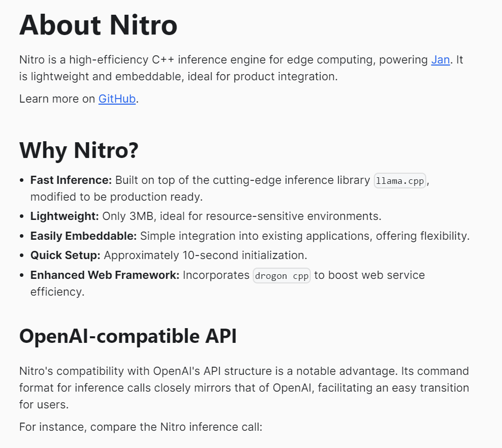
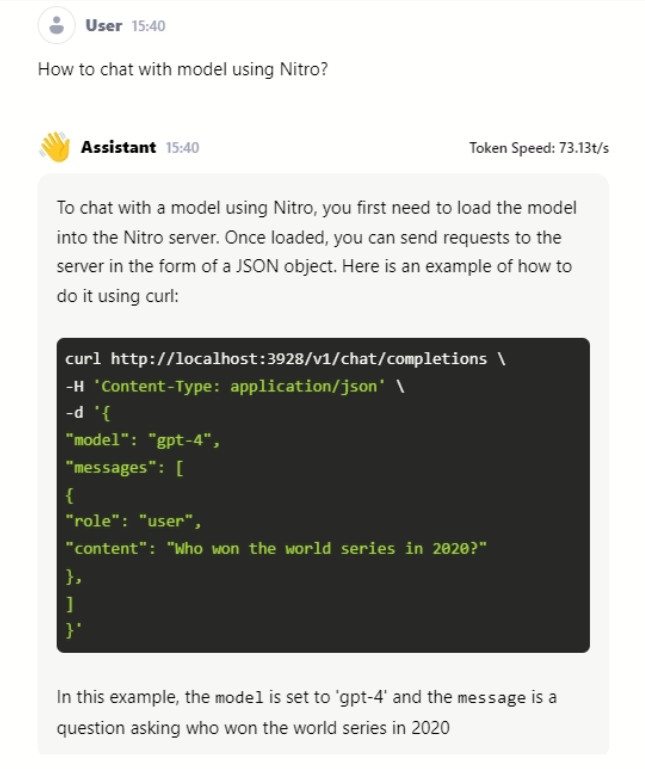

Large Language Models (LLMs) are all the rage nowadays, with people using them more and more on a daily basis. As our usage increases, many use cases require the LLM to understand our data, and there are two main approaches we can use:

1. Fine-tuning 
2. Retrieval Augmented Generation (RAG)

This blog will investigate the first approach to see how fine-tuning performs in understanding some technical product documentation. In detail, you will learn how to:

1. Create a Question and Answer dataset from unstructured data
2. Fine-tune a model using the dataset
3. Run the fine-tuned model using Jan

Let’s get started!

## 1. Environment setup

Our first step is to install the Hugging Face libraries, which provide the backbone for running large language models (LLMs). Additionally, we'll use LangChain as our go-to tool for efficiently handling and processing our data.

```js title="Install libraries"
# Install Hugging Face libraries
pip install  --upgrade \
  "transformers==4.36.2" \
  "datasets==2.16.1" \
  "accelerate==0.26.1" \
  "evaluate==0.4.1" \
  "bitsandbytes==0.42.0"

# Install libraries for generating data
pip install  --upgrade \
	"llama-cpp-python" \
	"pydantic==1.10.11" \
	"sentence-transformers" \
	"chromadb" \
	"langchain" \
	"tiktoken" \
	"openai==0.28"
```

In this guide, we'll utilize ChatGPT to create our training dataset. To leverage Hugging Face and OpenAI resources, we first sign into these platforms using the commands below:

```python title="Setting up credential keys"
# Import libaries
from huggingface_hub import login
import openai

# Setting up credential keys
OPENAI_KEY_FILE = "YOUR_KEY_HERE"
HUGGINGFACE_KEY_FILE = "YOUR_KEY_HERE"

openai.api_key = open_file(OPENAI_KEY_FILE)
login(token=HUGGINGFACE_KEY_FILE)
```

## **2. Data generation**

In this tutorial, the “data” we will use will be the [Nitro documentation](https://nitro.jan.ai/). Nitro is an open-source, lightweight (3 MB) inference server to supercharge apps with local AI.



**Fig 1. Example of Nitro's documentation.**

At a basic level, documentation is just pages filled with just words. If we give these words to the LLM as they are, it can confuse the model about what is important. Moreover, the unstructured nature of plain text doesn't provide the contextual clues that LLMs need to understand and generate meaningful responses.

To teach it, we will use a method called [**"Instruction tuning"**](#what-is-instruction-tuning), which involves refining the model's ability to comprehend and execute text-based instructions more effectively. 

But how do we change the text from the documentation into the right data? We need to make pairs of questions and answers.

The main idea is that we will break the documents into smaller pieces. Then, we use the LLM to help us develop questions and answers from those pieces. 

*Note: We also open-source the [**Nitro’s documentation training dataset**](https://huggingface.co/datasets/jan-hq/nitro_binarized) in our [**Hugging Face Hub**](https://huggingface.co/jan-hq).*

**Table 1. Example of Question and Answer pairs**

| User | Assistant |
|------|-----------|
| Is Nitro an open-source tool? | Yes, Nitro is an open-source tool. |
| What does the `max_tokens` parameter in the prompt request do? | The `max_tokens` parameter in the prompt request is used to specify the maximum number of tokens that the response should contain. A token can be as small as one character or as large as one word. For example, if `max_tokens` is set to 100, the response will contain no more than 100 tokens. |
| What operating systems does the Nitro library support? | The Nitro library supports multiple operating systems including Windows, MacOS, and Linux. This cross-platform compatibility allows it to cater to a wide range of users using different OS. |
| Is Nitro compatible with OpenAI? | Yes, Nitro is compatible with OpenAI. This means that it can work seamlessly with models and applications built using OpenAI's technology. |
| What is the endpoint '/v1/chat/completions' used for in the curl command? | The '/v1/chat/completions' endpoint in the curl command is the specific location in the server where the request is being sent. The purpose of this endpoint is to handle chat completions, likely returning the next predicted response(s) from the chat assistant based on the sent message. |

You can create your dataset by using the following example code.

First, we need to define some helper functions to process the raw documents into QnA pairs.

```python title="Define helper functions"
# Reads and returns the content of a file.
def read_file(filepath):
    with open(filepath, 'r', encoding='utf-8') as file:
        return file.read()

# Generates a response from the ChatGPT model
def generate_chatgpt_response(messages, temperature=0.5, model="gpt-3.5-turbo", max_tokens=4096):
    response = openai.ChatCompletion.create(
        model=model, messages=messages, temperature=temperature, max_tokens=max_tokens
    )
    return response['choices'][0]['message']['content']

# Process Markdown files
def process_markdown_file(file_path, markdown_splitter, text_splitter):
    with open(file_path, 'r') as file:
        markdown_document = file.read()
    md_header_splits = markdown_splitter.split_text(markdown_document)
    return [chunk for split in md_header_splits for chunk in text_splitter.split_documents([split])]
    
# Extracts question and answer pairs from a given text
def extract_qa_pairs(text):
    qa_pairs = []
    current_pair = {}
    lines = text.split('\n')
    for line in lines:
        if line.startswith('"question": '):
            current_pair['question'] = line.split('"question": ')[1].strip(' ",')
        elif line.startswith('"answer": '):
            current_pair['answer'] = line.split('"answer": ')[1].strip(' ",')
            qa_pairs.append(current_pair)
            current_pair = {}
    return qa_pairs

# Parse QnA pairs as JSON
def parse_response(response):
    try:
        parsed_data = json.loads(response)
        return parsed_data['qa_pairs']
    except json.JSONDecodeError:
        return extract_qa_pairs(response)
        
# Create new column in the dataset
def create_message(row):
    return [{"content": row['question'], "role": "user"}, {"content": row['answer'], "role": "assistant"}]
```

In this case, we're using the Langchain framework to streamline our work, which gives us different ways to handle the processing step with just a few lines of code. Most of our documents are written in a Markdown format, so we'll use the `MarkdownHeaderTextSplitter` function combined with the `TokenTextSplitter` function to ensure we give the LLM the right amount of text to create questions and answers.

We chose a chunk size of 300 tokens to ensure that when we generate QnA pairs, the generation won't be out of context with the token length of the LLM (normally, it’s capped at 4096 tokens). Also, we applied the overlap technique so that each chunk will contain the context from the previous chunk to make the chunk coherent.

```python title="Create logic for processing raw data"
# Chunking settings
HEADERS_TO_SPLIT_ON = [("#", "Header 1"), ("##", "Header 2"), ("###", "Header 3")]

# Main Script Logic
markdown_splitter = MarkdownHeaderTextSplitter(headers_to_split_on=HEADERS_TO_SPLIT_ON)
text_splitter = TokenTextSplitter(chunk_size=300, chunk_overlap=30)
```

For generating QnA pairs, we need to set up the prompt for the LLM to generate the model. For this task, we used GPT-4 to generate QnA pairs but you can also try with any other Local LLMs with a little bit of tweaking on the system prompt.

```
You are a curious assistant. Your task is to make 10 pairs of questions and answers using the given context delimited by triple quotation marks. You are extremely critical and can ask questions at different difficulty levels. You will be more generic and unique and focus on the Nitro library (the given context is from Nitro library). And you can also answer with the code block. Your `answer` must be detailed, comprehensive and step by step guide. Let's think step by step. It's really important to my project. Strictly follow the JSON format for output with 1 field `qa_pairs` and `question`, `answer`.
```

To generate a diverse dataset, we'll configure the LLM to produce 10 QnA pairs per iteration. We'll execute this process three times to enrich the dataset's variety. After setting everything up, let's generate a training dataset.

```python title
# Set up directory
ROOT_DIR = "PATH/TO/YOUR/DATA/FOLDER"
CSV_FILE_PATH = "PATH/TO/SAVE/OUTPUT/CSV/FILE"
REPO_NAME = "YOUR/HUGGINGFACE/REPO"

# Initialize data frame
all_chunks = []
master_df = pd.DataFrame(columns=['question', 'answer', 'raw'])

# Split raw text into chunks
for subdir, dirs, files in os.walk(ROOT_DIR):
    for file in files:
        if file.endswith('.md'):
            file_path = os.path.join(subdir, file)
            file_chunks = process_markdown_file(file_path,
																								markdown_splitter,
																								text_splitter)
            all_chunks.extend(file_chunks)

# Generating QnA pairs with GPT
for _ in range(3):
    for chunk in all_chunks:
        conversation = [{'role': 'system', 'content': open_file(SYSTEM_FILE_PATH)},
                        {'role': 'user', 'content': str(chunk)}]
        response_verification = chatgpt_completion(conversation)
        qa_pairs = extract_qa_pairs_from_response(response_verification)
        qa_df = pd.DataFrame(qa_pairs)
        qa_df['raw'] = [chunk] * len(qa_df)
        master_df = pd.concat([master_df, qa_df], ignore_index=True)
master_df.to_csv(CSV_FILE_PATH, index=False, encoding='utf-8')

# Deduplication
df = pd.read_csv(CSV_FILE_PATH)
df_deduplicated = df.drop_duplicates()
df_deduplicated['messages'] = df_deduplicated.apply(create_message, axis=1)

# Convert data frame to Huggingface dataset format
messages = df_deduplicated['message'].tolist()
rejected = df_deduplicated['rejected'].tolist()
hf_dataset = Dataset.from_dict({'messages': messages, 'chosen': messages, 'rejected': rejected})

# Split train and test
split_dataset = hf_dataset.train_test_split(test_size=0.1)

# Push to Hugging Face Hub
split_dataset.push_to_hub(REPO_NAME)
```

Please refer to **Table 1** for samples of the generated dataset.

## **3. Finetuning**

We use the [alignment-handbook](https://github.com/huggingface/alignment-handbook) from Hugging Face for the training code. This is a well-written library that explains in detail everything about finetuning LLMs. It also provides cutting-edge technology implementation like [LORA/QLoRA](#what-is-lora) or [Flash Attention](#what-is-flash-attention) for efficient training on customer GPUs.

For installing the alignment-handbook, please follow their [installation guide](https://github.com/huggingface/alignment-handbook?tab=readme-ov-file#installation-instructions).

In our training setup, we selected the [Stealth v1.3](https://huggingface.co/jan-hq/stealth-v1.3) model as the foundation. We explored different configurations of LoRA/QLoRA, focusing on the parameters `r` and `alpha`. The `r` parameter, denoting the rank in low-rank adaptation, influences the model's learning capacity and complexity, with higher values offering more flexibility at the risk of overfitting. The `alpha` parameter scales the adaptation's effect, balancing new learning and existing knowledge retention. We found `r = 256` and `alpha = 512` to be effective settings. For more details, see our sample YAML configuration file.

For training the model after installing the repository, you can run the following command:

```js title="Command to train LLM with alignment handbook"
ACCELERATE_LOG_LEVEL=info \
accelerate launch \
  --config_file recipes/accelerate_configs/multi_gpu.yaml \
  --num_processes=1 \
  scripts/run_sft.py recipes/nitro/sft/config_lora.yaml
```

**Table 2. Training result of Nitro models.**

| Model        | r   | alpha | Loss  | Time |
|--------------|-----|-------|-------|------|
| Nitro E1 LoRA | 16  | 32    | 1.185 | 3m   |
| Nitro E3 LoRA | 16  | 32    | 0.853 | 10m  |
| Nitro E1 QLoRA | 256 | 512   | 0.6513| 6m   |
| Nitro E3 QLoRA | 256 | 512   | 0.3123| 18m  |

*E: epochs, m: minutes*
*Note: Training times can vary based on hardware specifications. The provided times are for reference purposes only.*

## **4. Test the model**

After training the model, it can be tested locally in the GGUF format using [Jan](https://jan.ai/). To convert the fine-tuned model to GGUF, you can utilize this convenient [Google Colab notebook by Maxime Labonne](https://colab.research.google.com/github/mlabonne/llm-course/blob/main/Quantize_Llama_2_models_using_GGUF_and_llama_cpp.ipynb).


**Fig 2. Using Jan to run a new fine-tuned model.**



**Fig 3. Model answers a technical question related to Nitro.**

As shown in `Fig 2`, the model successfully learned new information from Nitro's documentation. This indicates that it accurately understands details about Nitro.

## Limitations

With this straightforward approach, we show that the model is capable of acquiring new knowledge. However, there's a potential risk of [catastrophic forgetting](https://en.wikipedia.org/wiki/Catastrophic_interference), leading to the model only being good at answering information about Nitro documentation and losing some other abilities.

In our next blog post, we will further discuss this problem and its solution.

## **Conclusions**

In the blog post, we learn how to fine-tune an open-source model using LoRA/QLoRA with documentation of Nitro’s repository on a local machine. We’ve learned:

- Data generation using LangChain to chunk the documentation and use LLM to make QnA pairs from unstructured data.
- Finetuning the model on generated data using QLoRA with high r and alpha setting.
- Test the model using Jan.

Combining all those steps, we can train our model on every documentation to create our chatbot.

## Terminology

### What is Instruction tuning?

[Instruction tuning](https://openai.com/research/instruction-following) in LLMs involves refining the model's ability to comprehend and execute text-based instructions more effectively. By training on a diverse set of tasks presented as instructions, the model learns to generalize and apply its knowledge across a wide range of requests, enhancing its responsiveness and accuracy in fulfilling user commands. This process fine-tunes the model on a curated dataset where the inputs are explicit instructions and the desired outputs are model-generated responses, leading to improved performance on instruction-following tasks and a better alignment with user expectations.

### What is LoRA?

[Low-Rank Adaptation](https://arxiv.org/abs/2106.09685) (LoRA) is a method that makes fine-tuning large language models more efficient. It breaks down the model's large weight matrices into smaller, trainable matrices. These smaller matrices are the only parts that get updated, leaving the original weights unchanged. This approach significantly reduces the number of parameters that need training, leading to faster and less memory-intensive tuning. Essentially, LoRA is a new way of training LLMs with limited resources but with a little trade-off in performance.

### What is Langchain?

[LangChain](https://www.langchain.com/) is an open-source framework designed to simplify the creation of applications powered by large language models (LLMs), such as chatbots and agents. Exactly like its name, it's a chaining language for developers to easily apply advanced prompt techniques to get the most out of it. It also provides developers with a standardized interface and pre-built components, making advanced language understanding and generation more accessible. By abstracting the complexities of LLM integration, LangChain enables the rapid development of intelligent, context-aware applications. Its collaborative ecosystem encourages innovation, leveraging the community's collective expertise to expand the possibilities of AI-driven solutions.

### What is Flash Attention?

[Flash Attention](https://github.com/Dao-AILab/flash-attention) is an algorithm that speeds up the core attention mechanism in Transformer language models by restructuring computations. It uses techniques like tiling and recomputation to reduce the high memory costs of attention, enabling models to process longer text sequences.