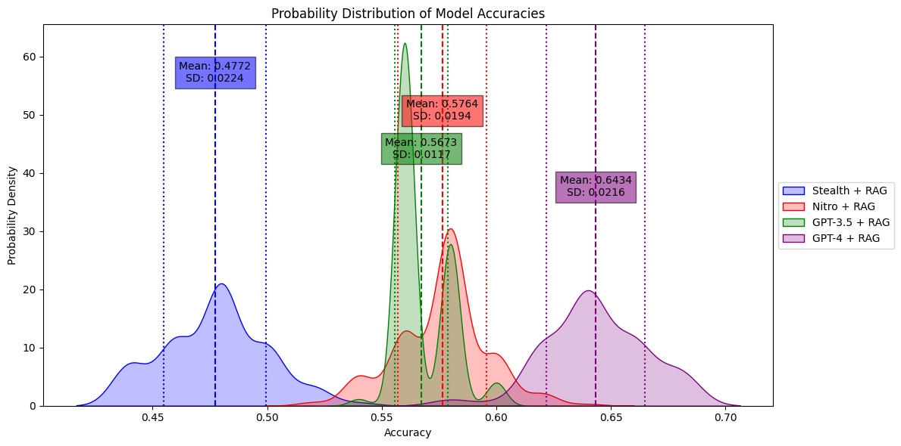

## Abstract

A strong foundation model such as Mistral sets the stage for advanced opensource model capabilities. By merging math, coding and generalist models, and further enriching with a synthetic instruction dataset created from proprietary content, we achieve a new fine-tuned model outperforms GPT-3.5 in technical documentation understanding tasks. The implication is clear: adopting this straightforward methodology enables everyone to custom-train models not only for enhanced technical reasoning but also for various specific domain tasks, offering a practical blueprint for opensource models development.

## Choosing strong foundational model

The cornerstone of any successful AI endeavor is the quality of its foundational model. A robust base model serves as the springboard for all future enhancements, enabling the development of highly specialized tools without the need for starting from scratch. This principle is vividly illustrated by the emergence of [Mistral 7B](https://mistral.ai/news/announcing-mistral-7b/), a model that has quickly become renowned for its stability and quality within the open-source community. Developed in September 2023, Mistral stands out for its impressive performance, rivaling and in some aspects surpassing established models like Meta's Llama-2 7B and even those offered by Google's Gemma 7B.

Figure 1. Mistral 7B excels in benchmarks, ranking among the top foundational models.

### Merging and Aligning: cost-effective approach to create highquality model

The popularity of Mistral has led to the development of numerous fine-tuned variants from the opensource community, each excelling in specific benchmarks from math to roleplaying. Recognizing this, we adopted a novel approach termed **"model merging"**. This *cost-effective* strategy combines the strengths of high-performing models into one single model, offering all their capabilities without the need for fine-tuning.
Seeing the math capabilities of Mistral, our experimentation led us to merge three models: [WizardMath](https://huggingface.co/WizardLM/WizardMath-7B-V1.1) for its exceptional performance in mathematics, [WizardCoder](https://huggingface.co/WizardLM/WizardCoder-Python-7B-V1.0) for its coding prowess, and our [Trinity](https://huggingface.co/jan-hq/trinity-v1.2) model, which shows remarkable versatility across general tasks. By merging these models into [Stealth](https://huggingface.co/jan-hq/stealth-v1.3), we archived a model that leverages the Mathemetics strengths of pre-merged models while maintaining a high standard across general tasks through DPO fine-tuning alignment.

Figure 2: The merged model, Stealth, doubles the mathematical capabilities of its foundational model, Mistral.

## Extending Capabilities to a Specific Domain: Technical Documentation Understanding

After establishing a solid foundation through the strategic merging and aligning of high-performing models, our focus shifted towards utilizing this solid base to address specific and complex challenges. Since we are an opensource project, there is a significant need for better onboarding processes, particularly through improved understanding of technical documentation, we directed our efforts towards developing a model tailored for this purpose. This initiative not only serves to evaluate the model's performance in a domain-specific context but also acts as a proof of concept for the broader application of our methodology in various specialized fields.

### Generating a Trainable Dataset from Technical Documentation
Utilizing GPT-4, we transformed Nitro's unstructured markdown-formatted documentation into a structured, synthetic Q&A dataset. This step involved breaking down the documentation into smaller chunks to manage LLMs' context size limitations and reformulating the text into a format conducive to **"Instruction fine-tuning"**. This method has proven effective in enhancing model performance in specialized domains, such as [math](https://arxiv.org/abs/2308.09583), [coding](https://arxiv.org/abs/2306.08568), and [searching ablity](https://github.com/SciPhi-AI/agent-search).

- **Process:**
    - Chunking documentation into **300-token segments** with **30-token overlaps**.
    - Employing a system prompt for **GPT-4** to generate multiple Q&A pairs per API call, drawing inspiration from the high-quality data generation [Evol instruct approach](https://github.com/nlpxucan/WizardLM).
    - Postprocessing for upload to the Huggingface platform, resulting in approximately **[3800 Q&A pairs](https://huggingface.co/datasets/jan-hq/nitro_binarized_v2).**.

### Experiment Setup and Benchmarking

**RAG System Implementation:** A Retrieval-Augmented Generation (RAG) system was set up using the [**Llamaindex**](https://www.llamaindex.ai/) preset and the [**bge-en-base-v1.5 embedding**](https://huggingface.co/BAAI/bge-base-en-v1.5) for efficient documentation retrieval and question answering.

**Benchmarking Approach:** We developed a set of **50 manually curated multiple-choice questions** (MCQ) with options designed to test the model's understanding of the technical documentation.The test set included options to challenge the model's discrimination between correct and misleading information.

### Enhancing Model Performance through Finetuning

The *fine-tuned model* achieved a mean accuracy of 57.8%, surpassing the *base model* and the *GPT-3.5* but *GPT-4* is still another level. Furthermore, the finetuned model demonstrated more consistent performance, as indicated by its lower standard deviation in results. This empirical evidence underlines the benefits of model customization for specific domains, showcasing an enhanced ability to interpret and respond to complex technical documentation.

Figure 3. Finetuned model beats GPT-3.5 in a specific task

The transformation of unstructured technical documentation into a structured, synthetic Q&A dataset, followed by the finetuning of models on this dataset, marks a significant leap in the performance of a base model in technical domains. The finetuned models not only surpassed the performance benchmarks set by GPT-3.5 but also demonstrated the profound impact of tailoring AI capabilities to meet the specific demands of niche tasks. This approach enhances both the applicability and effectiveness of models in specialized areas.

## Conclusion

In short, our method demonstrate a straghtforward approach to build an opensource alternatives which could surpass ChatGPT. By selecting a strong generalist base model like Stealth, we've trained a model that excels in specific domains. Also, with the creation of a high-quality, synthetic dataset from proprietary content is the key led to remarkable performance improvements.

Moreover, leveraging open-source models like this process brings additional benefits pivotal to innovation and control in AI development. It ensures data privacy by keeping proprietary information in-house, eliminating the need to share sensitive data with third-party entities like OpenAI. Also, it means we can keep tweaking and enhancing the model, step by step, to align with what we're aiming for.
