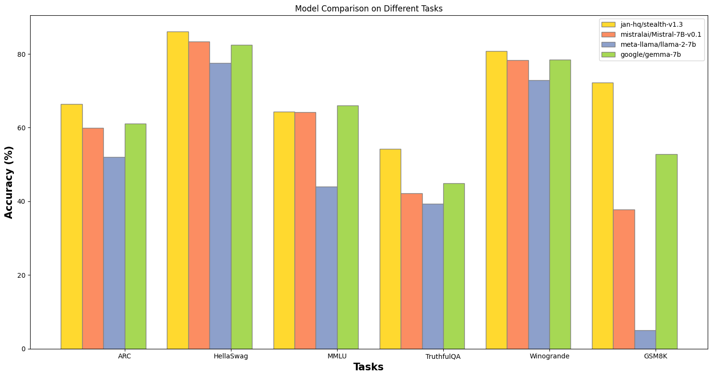

## Abstract

We present a straightforward approach to adapting small, open-source models for specialized use-cases, that can surpass GPT 3.5 performance with RAG. With it, we were able to get superior results on Q&A over [technical documentation](https://nitro.jan.ai/docs) describing a small [codebase](https://github.com/janhq/nitro).

In short, (1) extending a general foundation model like Mistral with strong math and coding, and (2) training it over a high-quality, synthetic dataset generated from the intended corpus, and (3) adding RAG capabilities, can lead to significant accuracy improvements.

Problems still arise with catastrophic forgetting in general tasks, commonly observed during continued fine-tuning [1]. In our case, this is likely exacerbated by our lack of access to Mistral’s original training dataset and various compression techniques used in our approach to keep the model small.

## Selecting a strong foundation model

Mistral 7B continues to outshine [Meta's Llama-2 7B](https://huggingface.co/meta-llama/Llama-2-7b) and [Google's Gemma 7B](https://huggingface.co/google/gemma-7b) on meaningful benchmarks, so we selected this as a starting point. 

Having a robust base model is critical. In our experiments, using Mistral as a starting point ensured the highest accuracy for subsequent specialized adaptations.

*Figure 1. Mistral 7B excels in benchmarks, ranking among the top foundational models.*

*Note: we are not sponsored by the Mistral team. Though many folks in their community do like to run Mistral locally using our desktop client - [Jan](https://jan.ai/).*

## Cost effectively improving the base model

Mistral alone has known, poor math capabilities, which we needed for our highly technical use case. Thus, we tested all model variants on top of Mistral, from foundation models to finetunes to model merges, in order to find a stronger base model to receive our own finetuning.

*Figure 2: The merged model, Stealth, doubles the mathematical capabilities of its foundational model while retaining the performance in other tasks.*

We found model merging to be a viable approach where each iteration is cost-effective + fast to deploy.

We ended up with [Stealth v1.1](https://huggingface.co/jan-hq/stealth-v1.1), a [SLERP](https://github.com/Digitous/LLM-SLERP-Merge) merge of Mistral with the following:

- [WizardMath](https://huggingface.co/WizardLM/WizardMath-7B-V1.1) for its math capabilities
- [WizardCoder](https://huggingface.co/WizardLM/WizardCoder-Python-7B-V1.0) for its coding capabilities
- Our own [Trinity](https://huggingface.co/jan-hq/trinity-v1.2) model for its versatility across general tasks

This particular combination yielded the best tradeoff across mathematical & technical reasoning while retaining the most pre-merge performance on general tasks.

## **DPO finetuning**

Merging different LLMs can lead to the mixed answering style because each model was originally trained on different types of data.

Thus, we applied Direct Preference Optimization ([DPO](https://arxiv.org/abs/2305.18290)) using the [Intel's Orca DPO pairs](https://huggingface.co/datasets/Intel/orca_dpo_pairs) dataset, chosen for its helpful answering style in general, math and coding concentration.

This approach result in a final model - [Stealth v1.2](https://huggingface.co/jan-hq/stealth-v1.2), with minimal loss, and realign to our technical preferences.

## **Using our own technical documentation**

With the base model ready, we started on our specific use case.

Jan is an open-source & bootstrapped project - at one point during our unanticipated growth, we received 1 customer support ticket per minute, with no one to handle customer service.

So, we directed our efforts toward training a model to answer user questions based on existing technical documentation.  

Specifically, we trained it on Nitro [docs](https://nitro.jan.ai/docs). For context, Nitro is the default inference engine for Jan. It’s a serious server implementation of LlamaCPP, written in C++, with multimodal, queues, and other production-level server capabilities. 

It made an interesting corpus because it was rife with post-2023 technical jargon, edge cases, and poor informational layout.

## Generating a training dataset for GPT-4 and training

The first step was to transform Nitro’s unstructured format into a synthetic Q&A dataset designed for [instruction tuning](https://arxiv.org/pdf/2109.01652.pdf). 

The text was split into chunks of 300-token segments with 30-token overlaps. This was to target a GPT-4 with 8k context length. This helped to avoid a [lost-in-the-middle](https://arxiv.org/abs/2307.03172) problem where LLM can’t use context efficiently to answer given questions. 

The chunks were then given to **GPT-4** to generate 3800 Q&A pairs. You can find the [open-sourced dataset here](https://huggingface.co/datasets/jan-hq/nitro_binarized_v2) on HuggingFace. 