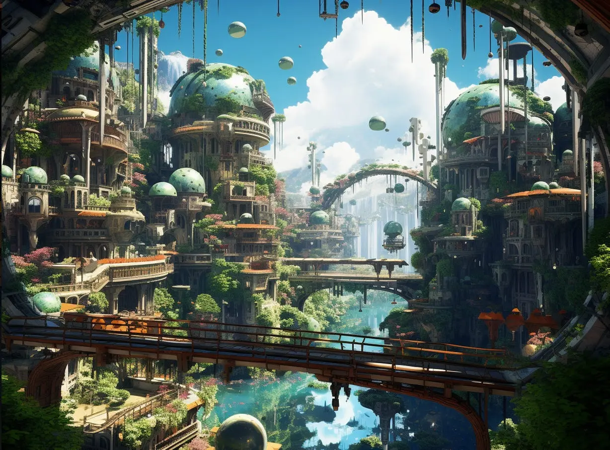

## Jan's vision is to shape a future where humans and machines collaborate, continuing our legacy as toolmakers

Throughout history, humanity has thrived by mastering tools, from [controlling fire](https://en.wikipedia.org/wiki/Control_of_fire_by_early_humans) to [inventing the wheel](https://en.wikipedia.org/wiki/Wheel). These leaps weren't just about survival, they were foundational to our civilization.

Today, we stand on the brink of a new frontier with artificial intelligence. AI is not merely another tool, it represents a new form of collaboration between humans and machines - promising to enhance our creativity, augment our lives, and deepen our understanding of the world.

In the future we envision, AI will be as integral to our lives as fire and the wheel once were, with each individual having their own machines/robots. Mastering AI, like mastering fire, will require understanding its potential, respecting its power, and learning to control it for the betterment of humanity.

### Inspired by Science Fiction, Grounded in Optimism

Our vision is influenced by the harmonious coexistence of humans and machines in science fiction. From the helpful companionship of [C3PO](https://tr.wikipedia.org/wiki/C-3PO) and [Jarvis](https://en.wikipedia.org/wiki/J.A.R.V.I.S.) to the strategic alliances in [Halo](https://www.imdb.com/title/tt2934286/), these stories showcase a future where technology amplifies human potential.

### Jan's Role in Shaping the Future

Jan is our contribution to this future - a tool designed to augment human capabilities, not replace them. We are committed to developing AI that works for humanity, enhancing our creativity, productivity, and well-being. With Jan, we aim to empower individuals and communities to achieve more, together.

Our vision is not just a dream, it's a blueprint for a future where technology and humanity harmonize to unlock unprecedented possibilities.

## How we imagine the world in the future

We are fundamentally optimistic about the future. Jan aligns with the [Solarpunk movement](https://en.wikipedia.org/wiki/Solarpunk), which envisions a world where technology and nature coexist and flourish together. We reject the notion of climate doomerism and instead, focus on the positive impact we can make with AI.

Imagine a world where every individual is empowered by their own robots, where machines are not just tools but partners in our journey. This is the future Jan is striving to create.

Now, let's take a glimpse into this future through a day in the life of Emre, a reflection of how Jan's vision manifests in everyday life.

## A Day in the Life of Emre in 2050

> In 2050, Emre wakes up to the gentle sound of birds chirping, a soothing alarm created by **his own AI robot, Jan**. As he gets ready for the day, **Jan has already prepared** his schedule, factoring in his preferences and the day's weather.
>
> At breakfast, Emre discusses his upcoming project with **Jan, who offers insights and suggestions**, enhancing Emre's creativity. As he heads to work, his self-driving car, **integrated with Jan**, takes the most scenic and efficient route, allowing Emre to enjoy a moment of tranquility.
>
> In the office, Emre collaborates with colleagues from around the globe in a virtual workspace. **Jan assists** by translating languages in real-time and organizing ideas, making collaboration seamless and productive.
>
> During lunch, Emre decides to explore a new hobby. **Jan quickly curates** a list of resources and connects Emre with a virtual mentor, making learning accessible and enjoyable.
>
> In the afternoon, Emre takes a break to connect with nature. His smart garden, **managed by Jan**, is thriving, blending technology with the natural world in perfect harmony.
>
> As the day winds down, Emre reflects on his accomplishments. **With Jan's help**, he's been able to focus on what truly matters, achieving a balance between work, personal growth, and well-being.
>
> In 2050, Jan is more than just a tool, it's an integral part of Emre's life, **augmenting his abilities** and enabling him to live a more fulfilling life.

What a day, hah!

---

Jan's vision commits to developing thinking machines that work alongside humans - learning, adapting, and contributing to a broader, smarter society. This journey isn't just about technology. It's about creating a future where humans and machines collaborate.

Let's build the future together - join the journey!
