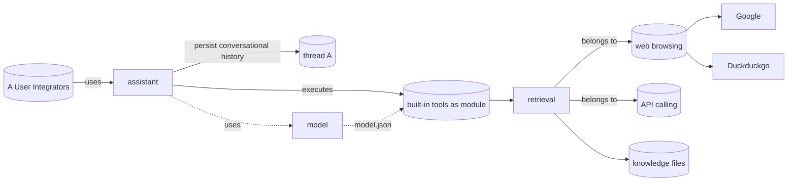

:::warning

This page is still under construction, and should be read as a scratchpad

:::

Jan use the local filesystem for data persistence, similar to VSCode. This allows for composability and tinkerability.

```yaml
janroot/               # Jan's root folder (e.g. ~/jan)
    models/            # For raw AI models
    threads/           # For conversation history
    assistants/        # For AI assistants' configs, knowledge, etc.
```

```yaml
/models
    /modelA
        model.json        # Default model settings
        llama-7b-q4.gguf  # Model binaries
/threads
    /jan-unixstamp
        thread.json       # thread metadata (e.g. subject)
        messages.jsonl    # messages
        files/            # RAG
/assistants
    /jan                  # A default assistant that can use all models
        assistant.json    # Assistant configs (see below)
        package.json      # Import npm modules, e.g. Langchain, Llamaindex
        /src              # For custom code
            index.js      # Entrypoint
                          # `/threads` at root level
                          # `/models` at root level
    /shakespeare          # Example of a custom assistant
        assistant.json
        package.json
        /threads          # Assistants remember conversations in the future
        /models           # Users can upload custom models
```

## Data Dependencies



- User/ Integrator
- Assistant object
- Model object
- Thread object
- Built-in tool object
