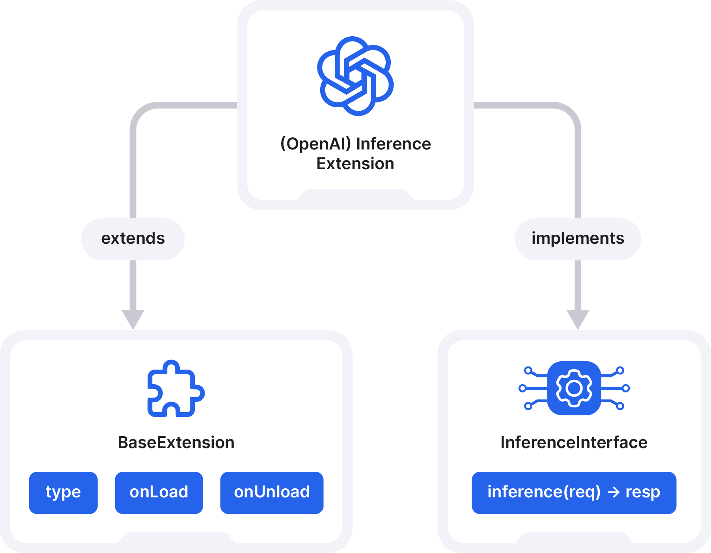

The diagram above illustrates the class hierarchy and interface implementation for an extension. The plugin that you have created has two important aspects: 
- `BaseExtension`
-  `InferenceInterface`
### BaseExtension
This class acts as a base that defines the properties and methods for your engine. These methods include:
- `type`: Defines the type of the extension.
- `onLoad`: A method that will be called when the extension is loaded or registered into the Jan application.
- `onUnload`: A method for cleanup tasks when the extension is being removed or unloaded from the Jan application.
### InferenceInterface
This interface defines the methods that must be provided to implement your engine's interface.
- `inference(req) -> resp`: A method responsible for handling inference operations. It takes a request `req` as input and returns a response `resp`. This method's implementation should contain the logic for processing input data and producing an inference result.