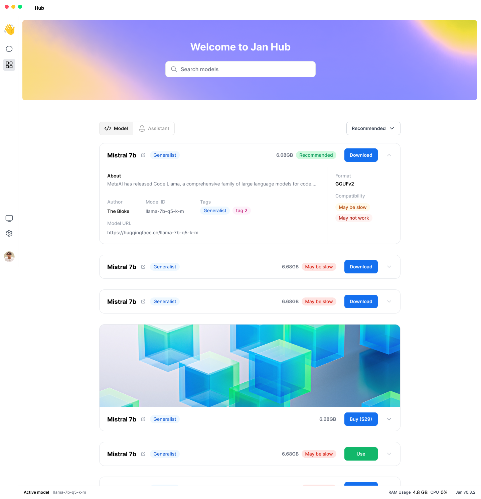

<head>
  <title>Hub</title>
  <meta charset="utf-8" />
  <meta name="description" content="Jan is a ChatGPT-alternative that runs on your own computer, with a local API server." />
  <meta name="keywords" content="Jan AI, Jan, ChatGPT alternative, local AI, private AI, conversational AI, no-subscription fee, large language model" />
  <meta name="twitter:card" content="summary" />
  <link rel="canonical" href="https://jan.ai/hub" />
  <meta property="og:title" content="Hub" />
  <meta property="og:description" content="Jan is a ChatGPT-alternative that runs on your own computer, with a local API server." />
  <meta property="og:url" content="https://jan.ai/hub" />
  <meta property="og:type" content="article" />
</head>

## Overview

The Hub is like a store for everything, where users can discover and download models, assistants, and more.

## User Stories

<!-- Can also be used as a QA Checklist -->

- Users can discover recommended models (Jan ships with a few preconfigured `model.json` files)
- Users can download models suitable for their devices, e.g. compatible with their RAM
- Users can download models via a HuggingFace URL (coming soon)
