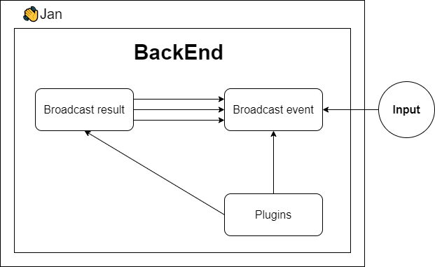

The asynchronous architecture allows Jan to handle multiple operations simultaneously without waiting for one to complete before starting another. This results in a more efficient and responsive user experience. The provided diagram breaks down the primary components and their interactions.

### Components

- **Results:** After processing certain tasks or upon specific triggers, the backend can broadcast the results. This could be a processed data set, a calculated result, or any other output that needs to be shared.

- **Events** Similar to broadcasting results but oriented explicitly towards events. This could include user actions, system events, or notifications that other components should be aware of.

- **Actions:**

    - **Notify:** Upon the conclusion of specific tasks or when particular triggers are activated, the system uses the Notify action to send out notifications from the **Results**. The Notify action is the conduit through which results are broadcasted asynchronously, whether they concern task completions, errors, updates, or any processed data set.

    - **Listen:** Here, the **BackEnd** actively waits for incoming data or events. It is geared towards capturing inputs from users or updates from plugins.

- **Plugins:** These are modular components or extensions designed to enhance the application's functionalities. Each plugin possesses a "Listen" action, enabling it to stand by for requests emanating from user inputs.

### Flow

1. Input is provided by the user or an external source.
2. This input is broadcasted as an event into the **Broadcast event**.
3. The **BackEnd** processes the event. Depending on the event, it might interact with one or several Plugins.
4. Once processed, **Broadcast result** can be sent out asynchronously through multiple notifications via Notify action.

