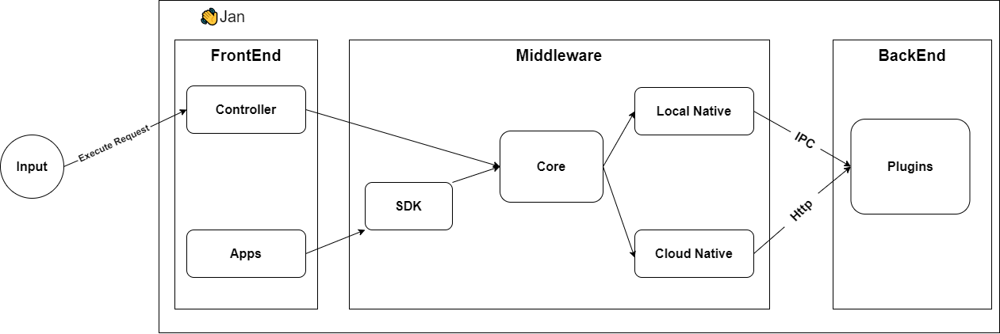

The architecture of Jan can be thought of as a layered system, comprising of the FrontEnd, Middleware, and BackEnd. Each layer has distinct components and responsibilities, ensuring a modular and scalable approach.

### FrontEnd
The **FrontEnd** is the visible part of Jan that interacts directly with the user.

- **Controller:** This is the main control unit of the FrontEnd. It processes the user's inputs, handles UI events, and communicates with other layers to fetch or send data.

- **Apps:** This represents applications or extensions that can be integrated with Jan.

- **Execute Request** act as the initial triggers to initiate processes within the application.

### Middleware

It's a bridge between the FrontEnd and BackEnd. It's responsible for translating requests and ensuring smooth data flow.

- **SDK:** Stands for Software Development Kit. It provides a set of tools, libraries, and guidelines for developers to build and integrate custom applications or features with Jan.

- **Core:** It's tasked with managing the connections between the FrontEnd and BackEnd. It ensures data is routed correctly and efficiently between the two.

- **Local Native:** Refers to the connectors that enable communication with local services or applications. This will use your own hardware to ddeploy models.

- **Cloud Native:** As the name suggests, these connectors are tailored for cloud-based interactions, allowing Jan to leverage cloud services or interact with other cloud-based applications.

:::info
The Middleware communicates with the BackEnd primarily through **IPC** for Local and **Http** for Cloud.
:::

### BackEnd

It is responsible for data processing, storage, and other core functionalities.

- **Plugins:** Extendable modules that can be added to the Jan system to provide additional functionalities or integrations with third-party applications.

- **Nitro:** This is a high-performance engine or a set of services that power specific functionalities within Jan. Given its placement in the architecture, it's reasonable to assume that Nitro provides acceleration or optimization capabilities for tasks.
