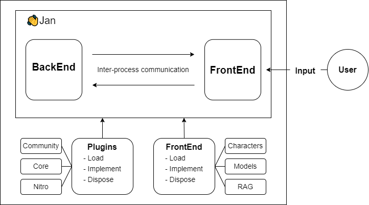

The architecture of the Jan application is designed to provide a seamless experience for the users while also being modular and extensible.

### BackEnd and FrontEnd

- **BackEnd:** The BackEnd serves as the brain of the application. It processes the information, performs computations, and manages the main logic of the system.

:::info
This is like an [OS (Operating System)](https://en.wikipedia.org/wiki/Operating_system) in the computer.
:::

- **FrontEnd:** The FrontEnd is the interface that users interact with. It takes user inputs, displays results, and communicates with the BackEnd through Inter-process communication bi-directionally.

:::info
This is like [VSCode](https://code.visualstudio.com/) application
:::
    
- **Inter-process communication:** A mechanism that allows the BackEnd and FrontEnd to communicate in real time. It ensures that data flows smoothly between the two, facilitating rapid response and dynamic updates.

### Plugins and Apps
- **Plugins:** In Jan, Plugins contains all the core features. They could be Core Plugins or [Nitro](https://github.com/janhq/nitro)

- **Actions:**
    - **Load:** This denotes the initialization and activation of a plugin when the application starts or when a user activates it.

    - **Implement:** This is where the main functionality of the plugin resides. Developers code the desired features and functionalities here. This is a "call to action" feature.

    - **Dispose:** After the plugin's task is completed or deactivated, this function ensures that it releases any resources it uses, providing optimal performance and preventing memory leaks.

:::info
This is like [Extensions](https://marketplace.visualstudio.com/VSCode) in VSCode.
:::

- **Apps:** Apps function similarly to plugins. However, the difference is that users can create apps for their own specific needs.

> For example, users can build a `Personal Document RAG App` to chat with specific documents or articles.

With **Plugins and Apps**, users can build a broader ecosystem surrounding Jan.