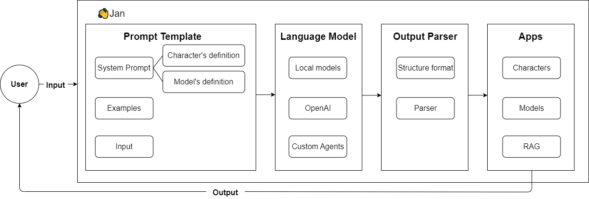

The architecture of the Jan desktop application is structured into four primary modules: "Prompt Template," "Language Model," "Output Parser," and "Apps." Let's break down each module and understand its components.

### Prompt Template

This is where predefined templates are stored. It sets the format and structure for user interactions. It contains:

- **Character's definition:** Definitions of various characters or entities that may be interacted with or invoked during user requests (e.g., name, personality, and communication style).

- **Model's definition:** Definitions related to the different language models (e.g., objectives, capabilities, and constraints)

- **Examples:** Sample inputs and outputs for guidance. If given good examples, LLM could enable basic reasoning or planning skills.

- **Input:** The actual user query or request that is being processed.

### Large Language Model

This processes the input provided.

- **Local models:** These are the downloaded models that reside within the system. They can process requests without the need to connect to external resources.

- **OpenAI:** This will connect you with OpenAI API, allowing the application to utilize powerful models like GPT-3.5 and GPT-4.

:::info
To use OpenAI models, you must have an OpenAI account and secret key. You can get your [OpenAI key](https://platform.openai.com/account/api-keys) here.
:::

- **Custom Agents:** These are user-defined or third-party models that can be integrated into the Jan system for specific tasks.

### Output Parser

Language models produce textual content. However, often, there's a need for more organized data instead of plain text. This is achieved using output parsers.

- **Parser:** This component ensures that the output conforms to the desired structure and format, removing unwanted information or errors.

### Apps

This represents applications or extensions that can be integrated with Jan.

- **Characters:** Characters or entities that can be utilized within the applications.

- **Models:** Different Large Language Models, Large Multimodal Models, and Stable Diffusion models that the apps might use.

- **Retrieval Augmented Generation (RAG):** helps in fetching relevant data and generating responses based on it.
