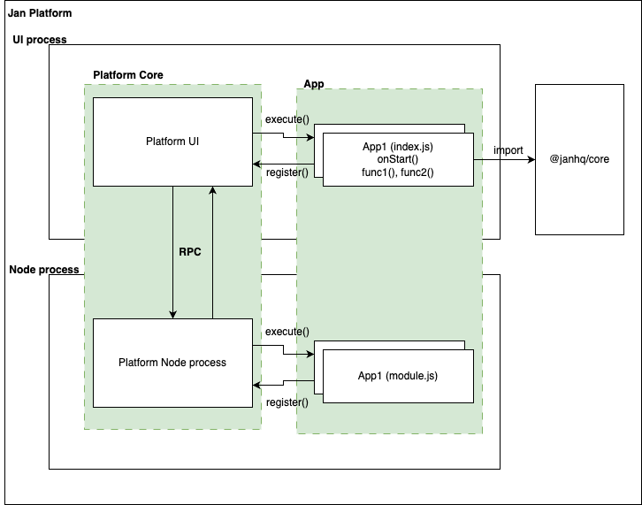

## Jan overall architecture

- Jan platform includes the following components:
  - Processes:
    - UI process: 
      - This is Electron framework `renderer` component (Web technology equivalent)
      - Jan provides core platform UI that:
        - Allows App to `register()` function blueprint with name and arguments
        - Run `execute()` registered App functions
    - Node process (NodeJS technology equivalent)
      - This is Electron framework `main process` component (NodeJS runtime)
      - Jan provides core platform UI that:
        - Allows App to `register()` function blueprint with name and arguments
        - Run `execute()` registered App functions
  - `@janhq/core` library that exposes Core API for App to reuse. Currently it only supports App `index.ts`

- Vertically, there are `Platform Core` component and `App` component. Each of those includes UI and Node process that work in pair.
