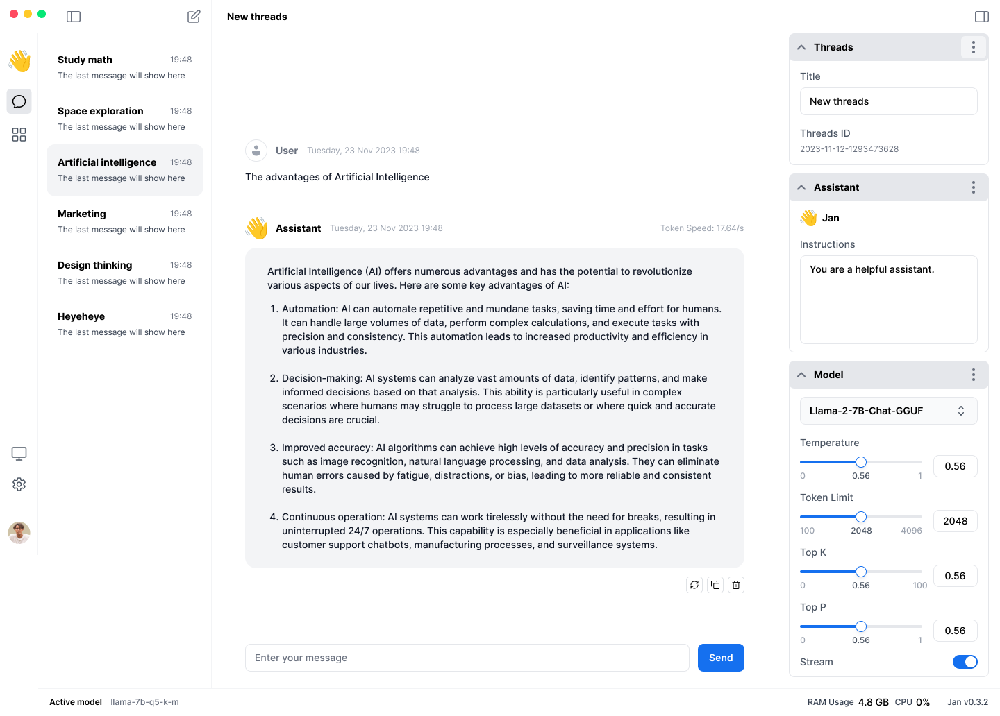

## Overview

A home screen for users to chat with [assistants](/docs/engineering/assistants) via conversation [threads](/docs/engineering/threads).

## User Stories

<!-- Can also be used as a QA Checklist -->

- Users can chat with `Jan` the default assistant
- Users can customize chat settings like model parameters via both the GUI & `thread.json`
