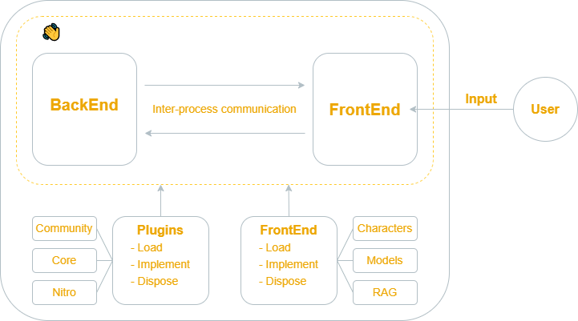
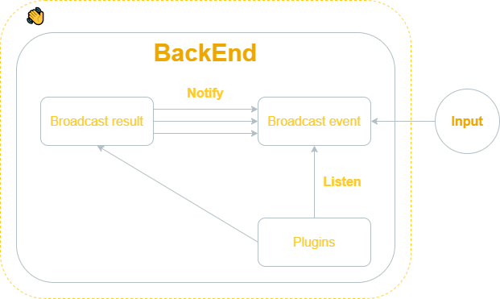

This page explains all the architecture of [Jan.ai](https://jan.ai/).

## Synchronous architecture

### Overview

The architecture of the Jan.ai application is designed to provide a seamless experience for the users while also being modular and extensible.

### BackEnd and FrontEnd

**BackEnd:**

- The BackEnd serves as the brain of the application. It processes the information, performs computations, and manages the main logic of the system.

:::info
For easy to understand, this is like an [OS (Operating System)](https://en.wikipedia.org/wiki/Operating_system) in the computer.
:::

**FrontEnd:**

- The FrontEnd is the interface that users interact with. It takes user inputs, displays results, and communicates with the BackEnd through Inter-process communication bi-directionally.

:::info
This is like [VSCode](https://code.visualstudio.com/) application
:::
    
**Inter-process communication:**

- A mechanism that allows the BackEnd and FrontEnd to communicate in real time. It ensures that data flows smoothly between the two, facilitating rapid response and dynamic updates.

### Plugins and Apps
**Plugins:**

In Jan, Plugins contains all the core features. They could be Core Plugins or [Nitro](https://github.com/janhq/nitro)

- **Load:** This denotes the initialization and activation of a plugin when the application starts or when a user activates it.

- **Implement:** This is where the main functionality of the plugin resides. Developers code the desired features and functionalities here. This is a "call to action" feature.

- **Dispose:** After the plugin's task is completed or deactivated, this function ensures that it releases any resources it uses, providing optimal performance and preventing memory leaks.

:::info
This is like [Extensions](https://marketplace.visualstudio.com/VSCode) in VSCode.
:::

**Apps:**
 
Apps are basically Plugin-like. However, Apps can be built by users for their own purposes.

> For example, users can build a `Personal Document RAG App` to chat with specific documents or articles.

With **Plugins and Apps**, users can build a broader ecosystem surrounding Jan.ai.

## Asynchronous architecture

### Overview

The asynchronous architecture allows Jan to handle multiple operations simultaneously without waiting for one to complete before starting another. This results in a more efficient and responsive user experience. The provided diagram breaks down the primary components and their interactions.

### Components

#### Results

After processing certain tasks or upon specific triggers, the backend can broadcast the results. This could be a processed data set, a calculated result, or any other output that needs to be shared.

#### Events

Similar to broadcasting results but oriented explicitly towards events. This could include user actions, system events, or notifications that other components should be aware of.

- **Notify:**

Upon the conclusion of specific tasks or when particular triggers are activated, the system uses the Notify action to send out notifications from the **Results**. The Notify action is the conduit through which results are broadcasted asynchronously, whether they concern task completions, errors, updates, or any processed data set.

- **Listen:**

Here, the BackEnd actively waits for incoming data or events. It is geared towards capturing inputs from users or updates from plugins.

#### Plugins

These are modular components or extensions designed to enhance the application's functionalities. Each plugin possesses a "Listen" action, enabling it to stand by for requests emanating from user inputs.

### Flow

1. Input is provided by the user or an external source.
2. This input is broadcasted as an event into the **Broadcast event**.
3. The **BackEnd** processes the event. Depending on the event, it might interact with one or several Plugins.
4. Once processed, **Broadcast result** can be sent out asynchronously through multiple notifications via Notify action. 