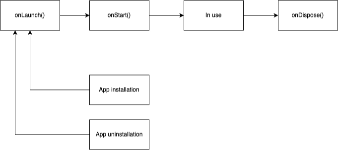
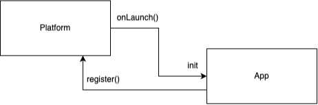
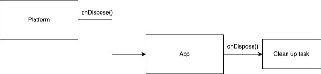

### High level architecture

Jan mission is to power the next gen App with the limitless extensibility by providing BUILDER:
- Unified API/ Helpers so that they only need to care about what matters
- Wide range of Optimized and State of the art models that can help your App with Thinking/ Hearing/ Seeing capabilities. This is powered by our [Nitro](https://github.com/janhq/nitro)
- Strong support for App marketplace and Model market place that streamline value from end customers to builders at all layers
- The most important: The user of Jan can use the Apps via UI and API for integration

At Jan, we strongly believe in `portable AI` that is created once and run anywhere.

### Low level architecture

- Jan platform includes the following components:

  - Processes:
    - UI process:
      - This is Electron framework `renderer` component (Web technology equivalent)
      - Jan provides core platform UI that:
        - Allows App to `register()` function blueprint with name and arguments
        - Run `execute()` registered App functions
    - Node process (NodeJS technology equivalent)
      - This is Electron framework `main process` component (NodeJS runtime)
      - Jan provides core platform UI that:
        - Allows App to `register()` function blueprint with name and arguments
        - Run `execute()` registered App functions
  - `@janhq/core` library that exposes Core API for App to reuse. Currently it only supports App `index.ts`

- Vertically, there are `Platform Core` component and `App` component. Each of those includes UI and Node process that work in pair.

## Events

#### onLaunch()
  
#### onStart()
  
#### onDispose()
  

#### onAppInstallation() and onAppUninstallation()
The Platform simply restarts and trigger onDispose() then onLaunch().

### Information flow
- When App is being used, here is how the information passes between Platform and Apps
  
