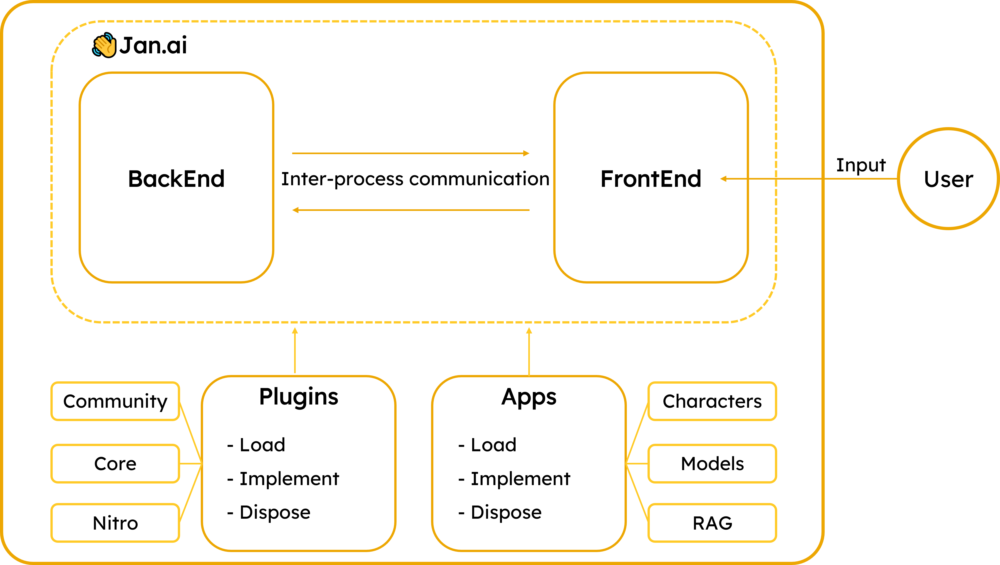

This page explains all the architecture of [Jan.ai](https://jan.ai/).

## Note: This one should be in the welcome page
Jan mission is to power the next gen App with the limitless extensibility by providing users:

- Unified API/ Helpers so that they only need to care about what matters.
- Wide range of Optimized and State of the art models that can help your App with Thinking/ Hearing/ Seeing capabilities. This is powered by our [Nitro](https://github.com/janhq/nitro).
- Strong support for App marketplace and Model market place that streamline value from end customers to builders at all layers.
- The most important: The users of Jan can use the Apps via UI and API for integration.

At Jan, we strongly believe in `Portable AI` and `Personal AI` that is created once and run anywhere.

## Synchronous architecture

### Overview

The architecture of the Jan.ai application is designed to provide a seamless experience for the users, while also being modular and extensible.

### BackEnd and FrontEnd

**BackEnd:**

- The BackEnd serves as the brain of the application. It processes the information, performs computations, and manages the main logic of the system.

> **ELI5:** This is like an [OS (Operating System)](https://en.wikipedia.org/wiki/Operating_system) in the computer

**FrontEnd:**

- The FrontEnd is the interface that users interact with. It takes user inputs, displays results, and communicates with the BackEnd through Inter-process communication bi-directionally.

> **ELI5:** This is like [VSCode](https://code.visualstudio.com/) application

**Inter-process communication:**

- A mechanism that allows the BackEnd and FrontEnd to communicate in real-time. It ensures that data flows smoothly between the two, facilitating rapid response and dynamic updates.

### Plugins and Apps
**Plugins:**

In Jan, Plugins are cotains of all the core features. They could be Core Plugins or [Nitro](https://github.com/janhq/nitro)

- **Load:** This denotes the initialization and activation of a plugin when the application starts or when a user activates it.

- **Implement:** This is where the main functionality of the plugin resides. Developers code the desired features and functionalities here. This is a "call to action" feature.

- **Dispose:** After the plugin's task is completed or when it's deactivated, this function ensures that the plugin releases any resources it used, ensuring optimal performance and preventing memory leaks.

> ELI5: This is like [Extensions](https://marketplace.visualstudio.com/VSCode) in VSCode.

**Apps:**
 
Apps are basically Plugin-like. However, Apps can be built by users for their own purposes.

> For example, users can build a `Personal Document RAG App` to chat with specific documents or articles.

With Plugins and Apps, users can build a broader ecosystem surrounding Jan.ai.

## Asynchronous architecture

TODOS: