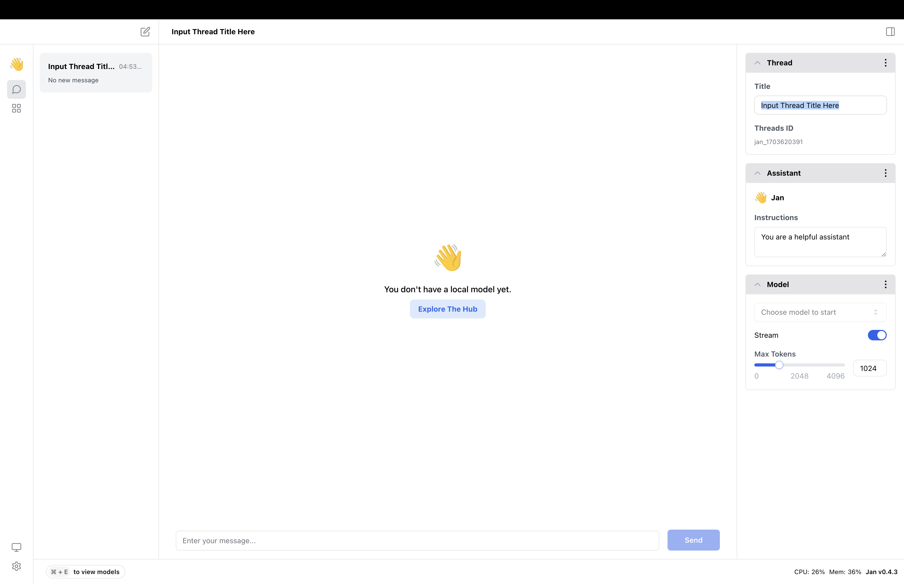
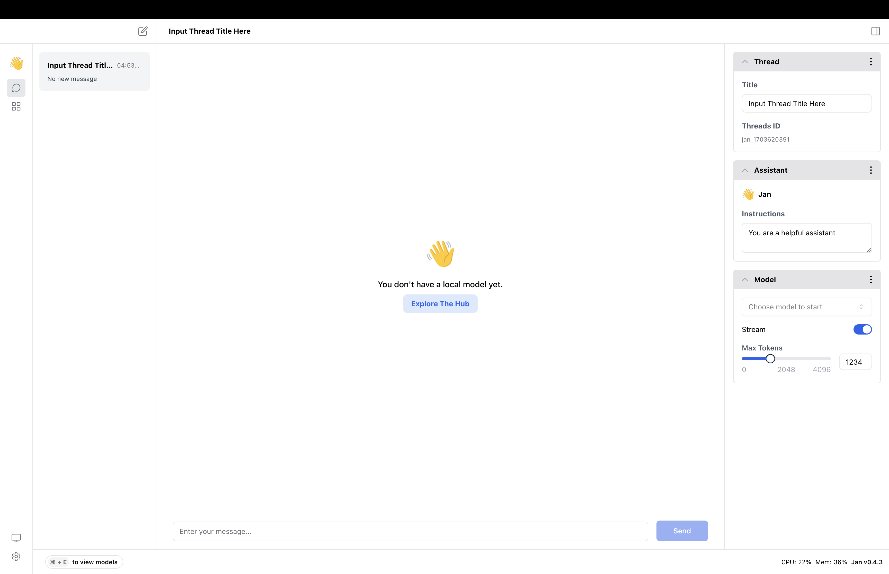

Jan persists your app usage locally on your filesystem, so your data never leaves your computer. This guide will walk you through how to direct manage your application files and start a thread.

  

### Setting Thread Title

A thread title acts as a name for your thread. It appears on the left side of the chat window, helping you easily navigate through your interactions. If you do not set a thread title, Jan will set it to 'New Thread' as default.

### Setting Assistant Instructions

On Jan, you can set assistant instructions that guide the responses of your assistant. These instructions are set at the conversation level. Globally, as default, assistant instructions will apply to all conversations in this thread unless you change it at the conversation level. In one thread, you can change the assistant instructions for each conversation. If you do not set assistant instructions, Jan will set it to empty as default.

### Choosing a Model

Jan offers a variety of models to suit your conversational needs. Each model has its unique characteristics and capabilities. You can choose a model that best fits your needs via the hub and download your preferred model. Then, you can set the model for your thread.

### Customizing Model Params

You can customize parameters for your thread, e.g., `max_tokens`. If you do not set the model params, Jan will set it to the default values as default.

