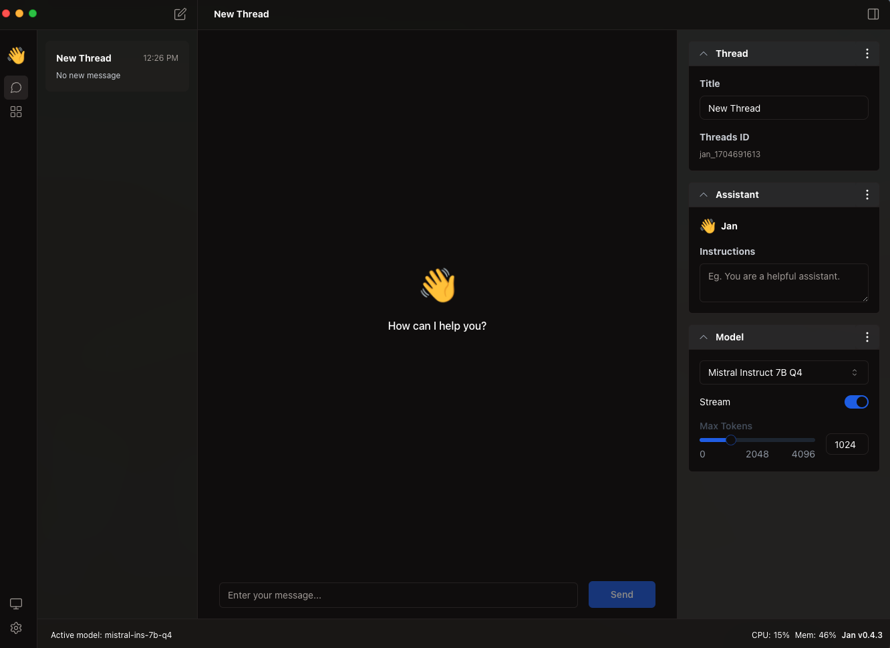

## How to Start a Thread

After [choosing the Large Language Model (LLM)](../04-using-models/01-install-from-hub.mdx), you will be redirected to the **Thread Screen**.

## 1. The Left Panel of Thread Screen

### 1. Start Button

Press the **Start Button** to start a **Thread**

### 2. Thread List

The historical Threads will be shown in the **Thread List Section**

### 3. Switching between Thread and Hub

| Name | Description |
| ---- | ----------- |
| Hub Button | Explore the LLM to download and use |
| Thread Button | Play around with the LLM you are using |

### 4. Switching between System Monitor and Settings

| Name | Description |
| ---- | ----------- |
| System Monitor Button | See the RAM and CPU usage of the LLM |
| Settings Button | Change Appearance, Manage Extensions |

## 2. The Right Panel of Thread Screen

### 1. Thread

Name the Thread

### 2. Assistant

Provide instruction to the LLM you are using

### 3. Model

Change the LLM and its corresponding parameters