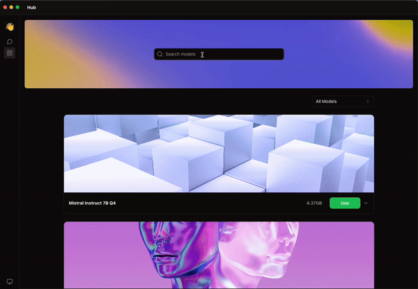
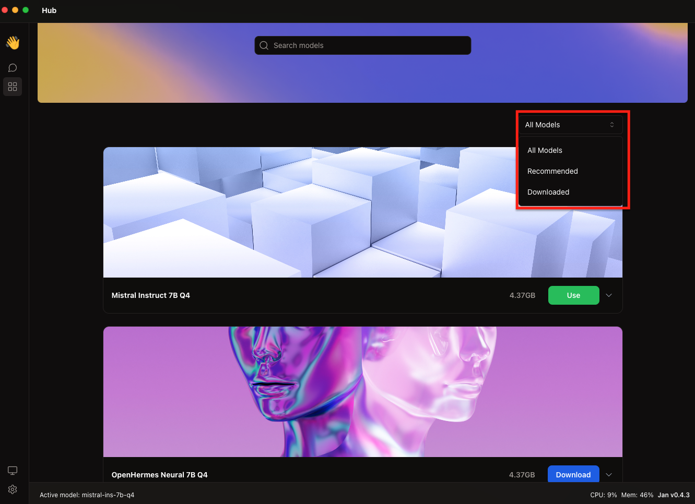
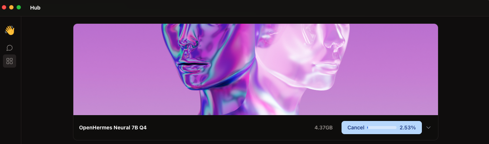

In this guide, we will walk through the process of installing a **Large Language Model (LLM)** from the Hub.

## Steps to Install Models from the Hub

### 1. Explore and Select a Model

Explore the available LLMs by scrolling through the Hub or using the **Search Bar**.

Utilize the **Filter Button** to choose the **recommended LLM**. LLM is recommended based on the [RAM usage](https://github.com/janhq/jan/issues/1384).

| Name        | Description                           |
| ----------- | ------------------------------------- |
| All Models  | Show all LLMs available               |
| Recommended | Show the Recommended LLM              |
| Downloaded  | Show the LLM that has been downloaded |

If you want to use a model that is not available in the Hub, you can also [import the Model Manually](./02-import-manually.mdx).

### 2. Download the Model

Once you've identified the desired LLM, simply click the **Download** button to initiate the download. A progress bar will appear to indicate the download progress.

### 3. Use the Model

Once the download is completed, you can start using the model by clicking the **Use** button.

