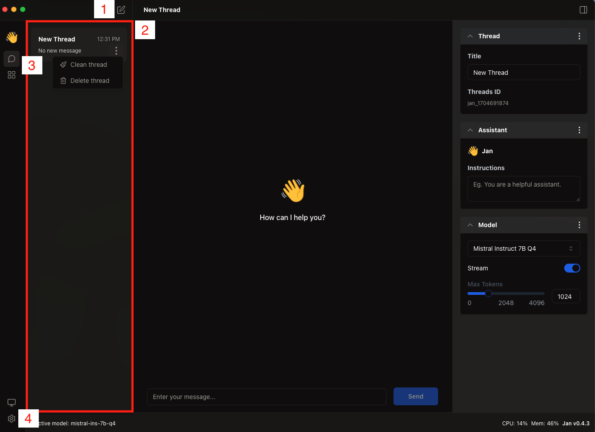

## How to use Jan

### 1. Download the LLM that you want to use from the Hub

### 2. Use the Model

Once you use a model, you will be directed to the Thread screen below 

### 3. The right panel

#### 1. Thread

#### 2. Assistant

#### 3. Model

### 4. The left panel

#### 1. Start Button

#### 2. Thread List

#### 3. Switching between Thread and Hub

#### 4. Switching between System Monitor  and Settings