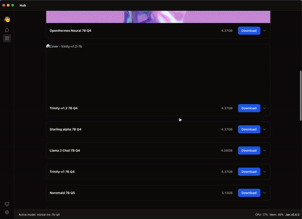
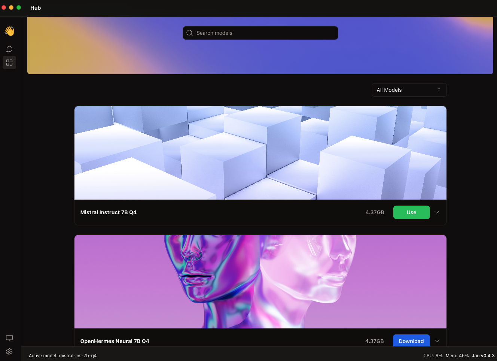

In this guide, we will walk through the process of installing a **Large Language Model (LLM)** from the Hub.

## Steps to Install Large Language Model (LLM) from Hub

### 1. Search the LLM that you want to use from the Hub

Explore all the LLM available by scrolling, or use the **Search Bar**

Utilize the **Filter Button** to choose the **Recommended LLM**.

| Name | Description |
| ---- | ----------- |
| All Models | Show all LLM available |
| Recommended | Show the Recommended LLM |
| Downloaded | Show the LLM that has been downloaded|

LLM is Recommended based on the [RAM usage](https://github.com/janhq/jan/issues/1384)

If the LLM that you want to use isn't currently available, you can also [Import the Model Manually](./02-import-manually.mdx)

### 2. Download the LLM

Once you've identified the desired LLM, simply click the **Download Button** to initiate the download.

Please wait for the model download to finish before the **Use Button** becomes available.

### 3. Use the Model

Upon clicking the **Use Button**, you will be directed to the corresponding **Thread Screen** below.

Now you're ready to [Start a Thread](../03-chatting/04-start-thread.mdx).