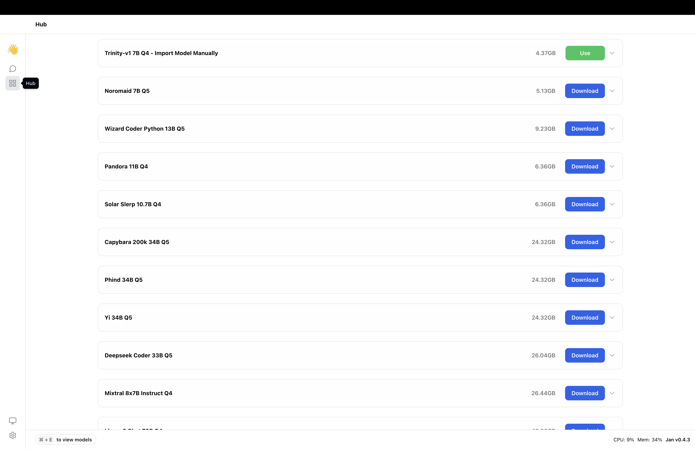

:::caution
This is currently under development.
:::

{/* Imports */}
import Tabs from "@theme/Tabs";
import TabItem from "@theme/TabItem";

Jan is compatible with all GGUF models.

If you can not find the model you want in the Hub or have a custom model you want to use, you can import it manually.

In this guide, we will show you how to import a GGUF model from [HuggingFace](https://huggingface.co/), using our latest model, [Trinity](https://huggingface.co/janhq/trinity-v1-GGUF), as an example.

> We are fast shipping a UI to make this easier, but it's a bit manual for now. Apologies.

## Steps to Manually Import a Model

### 1. Create a Model Folder

Navigate to the `~/jan/models` folder. You can find this folder by going to `App Settings` > `Advanced` > `Open App Directory`.

<Tabs groupId="operating-systems">
  <TabItem value="mac" label="macOS">
    
    ```sh
    cd ~/jan/models
    ```
  
  </TabItem>
  <TabItem value="win" label="Windows">
  
    ```sh
    C:/Users/<your_user_name>/jan/models
    ```
  
  </TabItem>
  <TabItem value="linux" label="Linux">
  
    ```sh
    cd ~/jan/models
    ```
  
  </TabItem>
</Tabs>

In the `models` folder, create a folder with the name of the model.

<Tabs groupId="operating-systems">
  <TabItem value="mac" label="macOS">
    
    ```sh 
    mkdir trinity-v1-7b
    ```

  </TabItem>
  <TabItem value="win" label="Windows">
    
    ```sh
    mkdir trinity-v1-7b
    ```

  </TabItem>
  <TabItem value="linux" label="Linux">
    
    ```sh
    mkdir trinity-v1-7b
    ```

  </TabItem>
</Tabs>

### 2. Create a Model JSON

Jan follows a folder-based, [standard model template](/docs/engineering/models) called a `model.json` to persist the model configurations on your local filesystem.

This means that you can easily reconfigure your models, export them, and share your preferences transparently.

<Tabs groupId="operating-systems">
  <TabItem value="mac" label="macOS">

    ```sh
    cd trinity-v1-7b
    touch model.json
    ```

  </TabItem>
  <TabItem value="win" label="Windows">
    
    ```sh
    cd trinity-v1-7b
    echo {} > model.json
    ```

  </TabItem>
  <TabItem value="linux" label="Linux">

    ```sh
    cd trinity-v1-7b
    touch model.json
    ```

  </TabItem>
</Tabs>

Edit `model.json` and include the following configurations:

- Ensure the filename must be `model.json`.
- Ensure the `id` property matches the folder name you created.
- Ensure the GGUF filename should match the `id` property exactly.
- Ensure the `source_url` property is the direct binary download link ending in `.gguf`. In HuggingFace, you can find the direct links in the `Files and versions` tab.
- Ensure you are using the correct `prompt_template`. This is usually provided in the HuggingFace model's description page.
- Ensure the `state` property is set to `ready`.

```js
{
    // highlight-start
    "source_url": "https://huggingface.co/janhq/trinity-v1-GGUF/resolve/main/trinity-v1.Q4_K_M.gguf",
    "id": "trinity-v1-7b",
    // highlight-end
    "object": "model",
    "name": "Trinity-v1 7B Q4",
    "version": "1.0",
    "description": "Trinity is an experimental model merge of GreenNodeLM & LeoScorpius using the Slerp method. Recommended for daily assistance purposes.",
    "format": "gguf",
    "settings": {
      "ctx_len": 4096,
      // highlight-next-line
      "prompt_template": "{system_message}\n### Instruction:\n{prompt}\n### Response:"
    },
    "parameters": {
      "max_tokens": 4096
    },
    "metadata": {
      "author": "Jan",
      "tags": ["7B", "Merged"],
      "size": 4370000000
    },
    "engine": "nitro",
    // highlight-next-line
    "state": "ready"
  }
```

### 3. Download the Model

Restart Jan and navigate to the Hub. Locate your model and click the `Download` button to download the model binary.



Your model is now ready to use in Jan.

## Configuring Client Connection to Remote/Local Server

In this guide, we will show you how to configure a client connection to a remote/local server, using LM Studio as an example.

At the moment, you can only connect to one compatible server at a time (e.g OpenAI Platform, Azure OpenAI, LM Studio, etc).

### 1. Configure Local Server in Engine

Navigate to the `~/jan/engines` folder and find the `openai.json` file. Currently, the code support any openai compatible endpoint only read `engine/openai.json` file, thus, it will not search any other files in this directory.

Configure `full_url` properties with the endpoint server that you want to connect. For example, if you want to connect to LM Studio, you can configure as follows:

```js
{
  // highlight-next-line
  "full_url": "http://<REMOTE_LMSTUDIO_IP>:<REMOTE_LMSTUDIO_PORT>/v1/chat/completions",
  // Skip api_key if your local server does not require authentication
  // "api_key": "sk-<your key here>"
}
```

### 2. Create a Model JSON

Navigate to the `~/jan/models` folder. Create a folder named `remote-lmstudio` and create a `model.json` file inside the folder including the following configurations:

- Ensure the filename must be `model.json`.
- Ensure the `id` property matches the folder name you created.
- Ensure the `format` property is set to `api`.
- Ensure the `engine` property is set to `openai`.
- Ensure the `state` property is set to `ready`.

```js
{
    "source_url": "https://lmstudio.ai",
    // highlight-next-line
    "id": "remote-lmstudio",
    "object": "model",
    "name": "remote lmstudio",
    "version": "1.0",
    "description": "Jan integration with remote LMstudio server",
    // highlight-next-line
    "format": "api",
    "settings": {},
    "parameters": {},
    "metadata": {
    "author": "LMstudio",
    "tags": ["remote", "awesome"]
    },
    // highlight-start
    "engine": "openai",
    "state": "ready"
    // highlight-end
}
```

### 3. Start the Model

Restart Jan and navigate to the Hub. Locate your model and click the Use button.

## Assistance and Support

If you have questions or are looking for more preconfigured GGUF models, please feel free to join our [Discord community](https://discord.gg/Dt7MxDyNNZ) for support, updates, and discussions.
