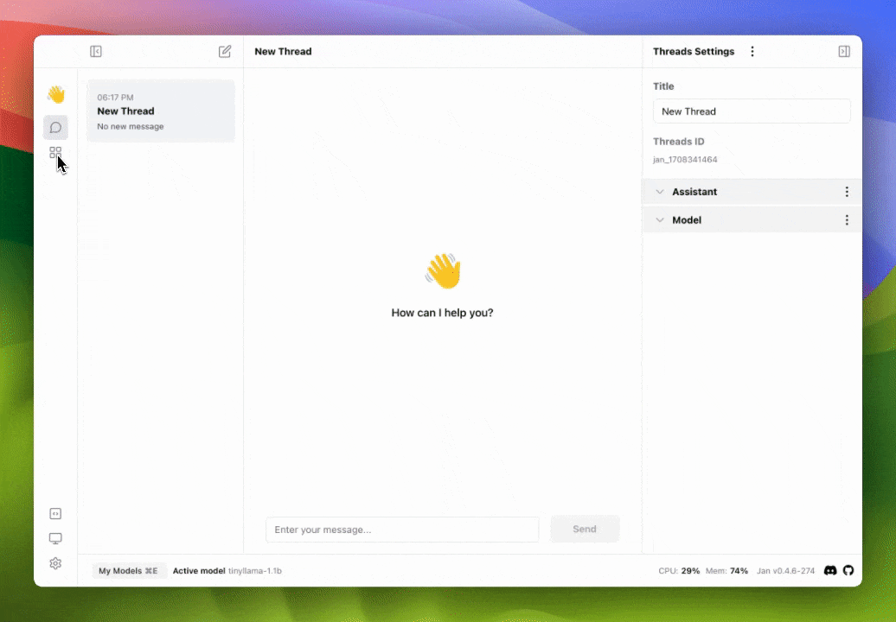

In this guide, we will walk you through the process of importing a model using an absolute filepath in Jan, using our latest model, [Trinity](https://huggingface.co/janhq/trinity-v1-GGUF), as an example.

### 1. Get the Absolute Filepath of the Model

After downloading .gguf model, you can get the absolute filepath of the model file.

### 2. Configure the Model JSON

1. Navigate to the `~/jan/models` folder. 
2. Create a folder named `<modelname>`, for example, `tinyllama`.
3. Create a `model.json` file inside the folder, including the following configurations:

- Ensure the `id` property matches the folder name you created.
- Ensure the `url` property is the direct binary download link ending in `.gguf`. Now, you can use the absolute filepath of the model file.
- Ensure the `engine` property is set to `nitro`.

```json
{
  "sources": [
    {
      "filename": "tinyllama.gguf",
      // highlight-next-line
      "url": "<absolute-filepath-of-the-model-file>"
    }
  ],
  "id": "tinyllama-1.1b",
  "object": "model",
  "name": "(Absolute Path) TinyLlama Chat 1.1B Q4",
  "version": "1.0",
  "description": "TinyLlama is a tiny model with only 1.1B. It's a good model for less powerful computers.",
  "format": "gguf",
  "settings": {
    "ctx_len": 4096,
    "prompt_template": "<|system|>\n{system_message}<|user|>\n{prompt}<|assistant|>",
    "llama_model_path": "tinyllama-1.1b-chat-v1.0.Q4_K_M.gguf"
  },
  "parameters": {
    "temperature": 0.7,
    "top_p": 0.95,
    "stream": true,
    "max_tokens": 2048,
    "stop": [],
    "frequency_penalty": 0,
    "presence_penalty": 0
  },
  "metadata": {
    "author": "TinyLlama",
    "tags": ["Tiny", "Foundation Model"],
    "size": 669000000
  },
  "engine": "nitro"
}
```

:::warning

- If you are using Windows, you need to use double backslashes in the url property, for example: `C:\\Users\\username\\filename.gguf`.

:::

### 3. Start the Model

Restart Jan and navigate to the Hub. Locate your model and click the Use button.

