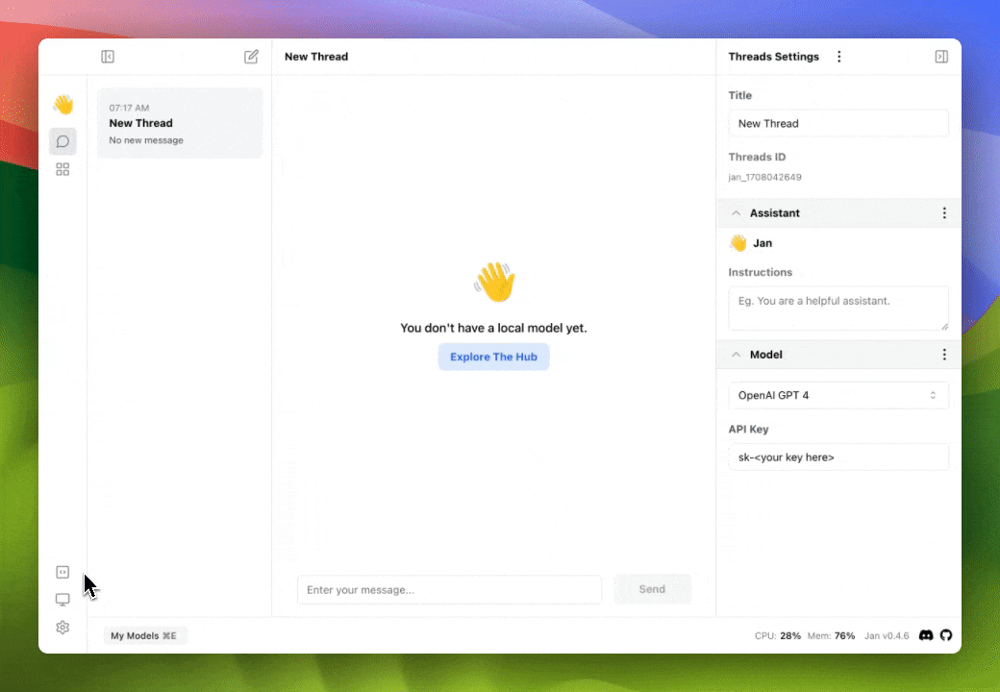
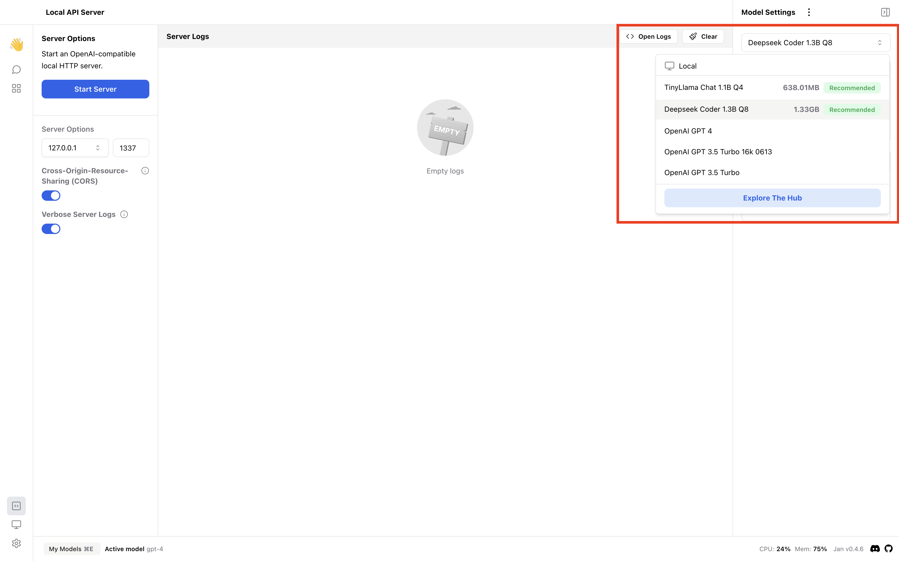
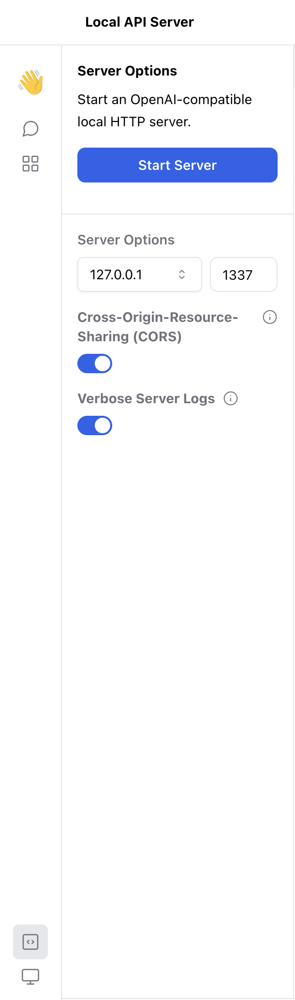
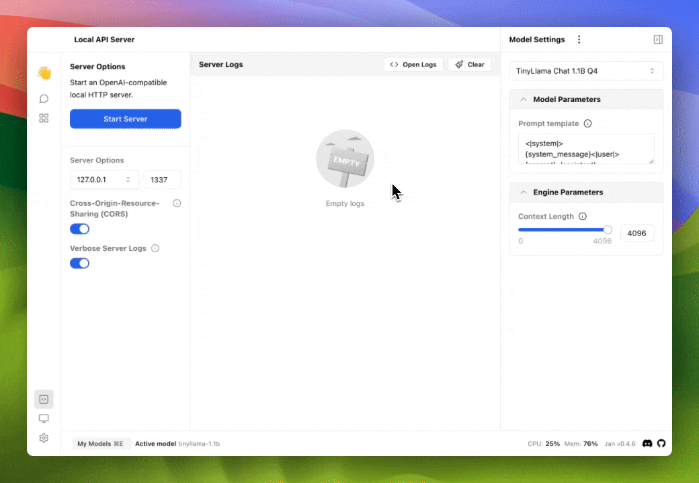

Jan ships with a built-in API server that can be used as a drop-in, local replacement for OpenAI's API. You can run your server by following these simple steps.

## Open Local API Server View

Navigate to the Local API Server view by clicking the corresponding icon on the left side of the screen.

  

## Choosing a Model

On the top right of your screen under `Model Settings`, set the LLM that your local server will be running. You can choose from any of the models already installed, or pick a new model by clicking `Explore the Hub`.

  

## Server Options

On the left side of your screen, you can set custom server options.

  

### Local Server Address

By default, Jan will be accessible only on localhost `127.0.0.1`. This means a local server can only be accessed on the same machine where the server is being run.

You can make the local server more accessible by clicking on the address and choosing `0.0.0.0` instead, which allows the server to be accessed from other devices on the local network. This is less secure than choosing localhost, and should be done with caution.

### Port

Jan runs on port `1337` by default. You can change the port to any other port number if needed.

### Cross-Origin Resource Sharing (CORS)

Cross-Origin Resource Sharing (CORS) manages resource access on the local server from external domains. Enabled for security by default, it can be disabled if needed.

### Verbose Server Logs

The center of the screen displays the server logs as the local server runs. This option provides extensive details about server activities.

## Start Server

Click the `Start Server` button on the top left of your screen. You will see the server log display a message such as `Server listening at http://127.0.0.1:1337`, and the `Start Server` button will change to a red `Stop Server` button.

  

You server is now running and you can use the server address and port to make requests to the local server.
