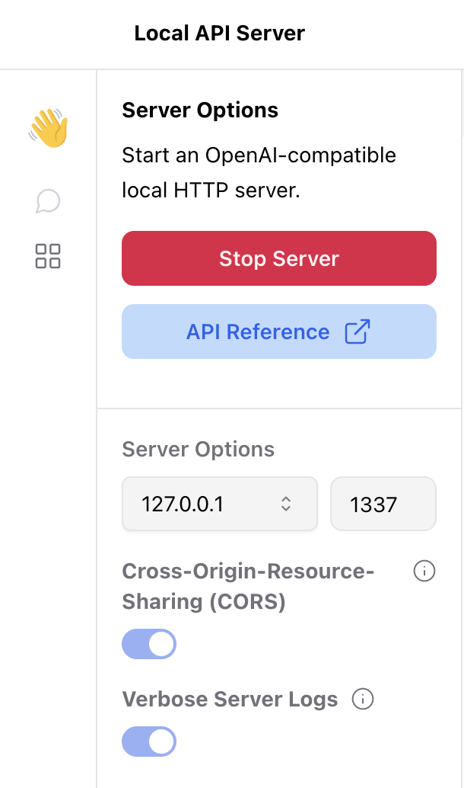
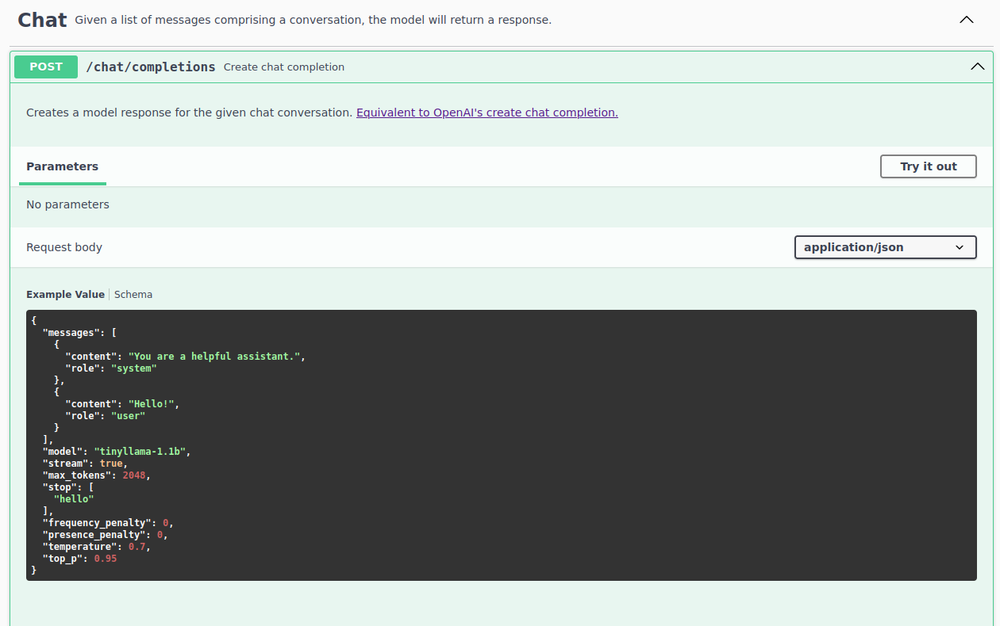

Jan's built-in API server is compatible with [OpenAI's API](https://platform.openai.com/docs/api-reference) and can be used as a drop-in, local replacement. Follow these steps to use the API server.

## Open the API Reference

Jan contains a comprehensive API reference. This reference displays all the API endpoints available, gives you examples requests and responses, and allows you to execute them in browser.

On the top left of your screen below the red `Stop Server` button is the blue `API Reference`. Clicking this will open the reference in your browser.

<br></br>



Scroll through the various available endpoints to learn what options are available and try them out by executing the example requests. In addition, you can also use the [Jan API Reference](https://jan.ai/api-reference/) on the Jan website.

### Chat

In the Chat section of the API reference, you will see an example JSON request body.

<br></br>



With your local server running, you can click the `Try it out` button on the top left, then the blue `Execute` button below the JSON. The browser will send the example request to your server, and display the response body below.

Use the API endpoints, request and response body examples as models for your own application.

### cURL Request Example

Here is an example curl request with a local server running `tinyllama-1.1b`:

<br></br>

```json
{
  "messages": [
    {
      "content": "You are a helpful assistant.",
      "role": "system"
    },
    {
      "content": "Hello!",
      "role": "user"
    }
  ],
  "model": "tinyllama-1.1b",
  "stream": true,
  "max_tokens": 2048,
  "stop": [
    "hello"
  ],
  "frequency_penalty": 0,
  "presence_penalty": 0,
  "temperature": 0.7,
  "top_p": 0.95
}
'
```

### Response Body Example

```json
{
  "choices": [
    {
      "finish_reason": null,
      "index": 0,
      "message": {
        "content": "Hello user. What can I help you with?",
        "role": "assistant"
      }
    }
  ],
  "created": 1700193928,
  "id": "ebwd2niJvJB1Q2Whyvkz",
  "model": "_",
  "object": "chat.completion",
  "system_fingerprint": "_",
  "usage": {
    "completion_tokens": 500,
    "prompt_tokens": 33,
    "total_tokens": 533
  }
}
```
