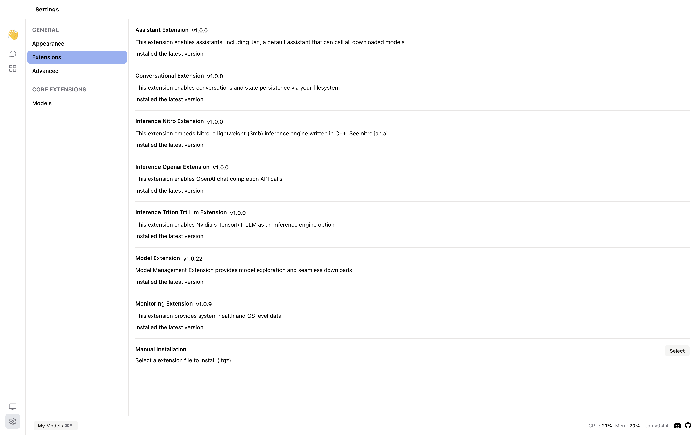

The current Jan Desktop Client has some default extensions built on top of this framework to enhance the user experience. In this guide, we will show you the list of default extensions and how to configure extension settings.

## Default Extensions

You can find the default extensions in the `Settings` > `Extensions`.



### List of Default Extensions

| Extension Name                     | Version | Description                                                                                                        | Source Code Link                                                                                      |
| ---------------------------------- | ------- | ------------------------------------------------------------------------------------------------------------------ | ----------------------------------------------------------------------------------------------------- |
| Assistant Extension                | v1.0.0  | This extension enables assistants, including Jan, a default assistant that can call all downloaded models.         | [Link to Source](https://github.com/janhq/jan/tree/main/extensions/assistant-extension)               |
| Conversational Extension           | v1.0.0  | This extension enables conversations and state persistence via your filesystem.                                    | [Link to Source](https://github.com/janhq/jan/tree/main/extensions/conversational-extension)          |
| Inference Nitro Extension          | v1.0.0  | This extension embeds Nitro, a lightweight (3mb) inference engine written in C++. See [nitro.jan.ai](nitro.jan.ai) | [Link to Source](https://github.com/janhq/jan/tree/main/extensions/inference-nitro-extension)         |
| Inference Openai Extension         | v1.0.0  | This extension enables OpenAI chat completion API calls                                                            | [Link to Source](https://github.com/janhq/jan/tree/main/extensions/inference-openai-extension)        |
| Inference Triton Trt Llm Extension | v1.0.0  | This extension enables Nvidia's TensorRT-LLM as an inference engine option.                                        | [Link to Source](https://github.com/janhq/jan/tree/main/extensions/inference-triton-trtllm-extension) |
| Model Extension                    | v1.0.22 | Model Management Extension provides model exploration and seamless downloads.                                      | [Link to Source](https://github.com/janhq/jan/tree/main/extensions/model-extension)                   |
| Monitoring Extension               | v1.0.9  | This extension provides system health and OS level data.                                                           | [Link to Source](https://github.com/janhq/jan/tree/main/extensions/monitoring-extension)              |

## Configure Extension Settings

You can configure the extension settings by modifying the `extensions.json` file under the `~/jan/extensions` directory including the following configurations:

- `_active`: true means the extension is enabled. If you want to disable an extension, you can set it to false.
- `listeners`: {} is the default value for listeners.
- `origin`: the path to the extension file.
- `installOptions`: configure the installOptions with version and fullMetadata.
- `name`: the name of the extension.
- `version`: the version of the extension.
- `main`: the path to the main file of the extension.
- `description`: the description of the extension.
- `url`: the url of the extension.

```json title="~/jan/extensions/extensions.json"
{
  "@janhq/assistant-extension": {
    "_active": true,
    "listeners": {},
    "origin": "/Applications/Jan.app/Contents/Resources/app.asar.unpacked/pre-install/janhq-assistant-extension-1.0.0.tgz",
    "installOptions": { "version": false, "fullMetadata": false },
    "name": "@janhq/assistant-extension",
    "version": "1.0.0",
    "main": "dist/index.js",
    "description": "This extension enables assistants, including Jan, a default assistant that can call all downloaded models",
    "url": "extension://@janhq/assistant-extension/dist/index.js"
  },
  "@janhq/conversational-extension": {
    "_active": true,
    "listeners": {},
    "origin": "/Applications/Jan.app/Contents/Resources/app.asar.unpacked/pre-install/janhq-conversational-extension-1.0.0.tgz",
    "installOptions": { "version": false, "fullMetadata": false },
    "name": "@janhq/conversational-extension",
    "version": "1.0.0",
    "main": "dist/index.js",
    "description": "This extension enables conversations and state persistence via your filesystem",
    "url": "extension://@janhq/conversational-extension/dist/index.js"
  },
  "@janhq/inference-nitro-extension": {
    "_active": true,
    "listeners": {},
    "origin": "/Applications/Jan.app/Contents/Resources/app.asar.unpacked/pre-install/janhq-inference-nitro-extension-1.0.0.tgz",
    "installOptions": { "version": false, "fullMetadata": false },
    "name": "@janhq/inference-nitro-extension",
    "version": "1.0.0",
    "main": "dist/index.js",
    "description": "This extension embeds Nitro, a lightweight (3mb) inference engine written in C++. See nitro.jan.ai",
    "url": "extension://@janhq/inference-nitro-extension/dist/index.js"
  },
  "@janhq/inference-openai-extension": {
    "_active": true,
    "listeners": {},
    "origin": "/Applications/Jan.app/Contents/Resources/app.asar.unpacked/pre-install/janhq-inference-openai-extension-1.0.0.tgz",
    "installOptions": { "version": false, "fullMetadata": false },
    "name": "@janhq/inference-openai-extension",
    "version": "1.0.0",
    "main": "dist/index.js",
    "description": "This extension enables OpenAI chat completion API calls",
    "url": "extension://@janhq/inference-openai-extension/dist/index.js"
  },
  "@janhq/inference-triton-trt-llm-extension": {
    "_active": true,
    "listeners": {},
    "origin": "/Applications/Jan.app/Contents/Resources/app.asar.unpacked/pre-install/janhq-inference-triton-trt-llm-extension-1.0.0.tgz",
    "installOptions": { "version": false, "fullMetadata": false },
    "name": "@janhq/inference-triton-trt-llm-extension",
    "version": "1.0.0",
    "main": "dist/index.js",
    "description": "This extension enables Nvidia's TensorRT-LLM as an inference engine option",
    "url": "extension://@janhq/inference-triton-trt-llm-extension/dist/index.js"
  },
  "@janhq/model-extension": {
    "_active": true,
    "listeners": {},
    "origin": "/Applications/Jan.app/Contents/Resources/app.asar.unpacked/pre-install/janhq-model-extension-1.0.22.tgz",
    "installOptions": { "version": false, "fullMetadata": false },
    "name": "@janhq/model-extension",
    "version": "1.0.22",
    "main": "dist/index.js",
    "description": "Model Management Extension provides model exploration and seamless downloads",
    "url": "extension://@janhq/model-extension/dist/index.js"
  },
  "@janhq/monitoring-extension": {
    "_active": true,
    "listeners": {},
    "origin": "/Applications/Jan.app/Contents/Resources/app.asar.unpacked/pre-install/janhq-monitoring-extension-1.0.9.tgz",
    "installOptions": { "version": false, "fullMetadata": false },
    "name": "@janhq/monitoring-extension",
    "version": "1.0.9",
    "main": "dist/index.js",
    "description": "This extension provides system health and OS level data",
    "url": "extension://@janhq/monitoring-extension/dist/index.js"
  }
}
```
