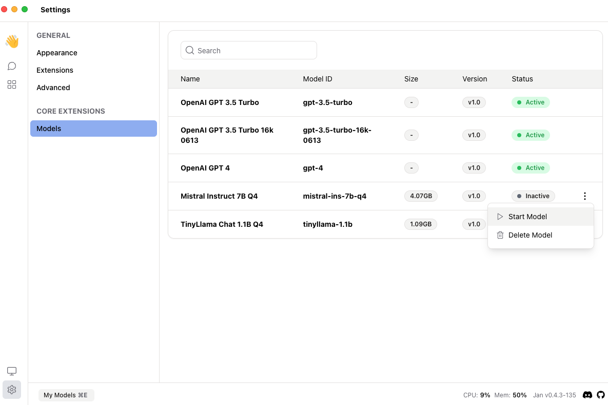
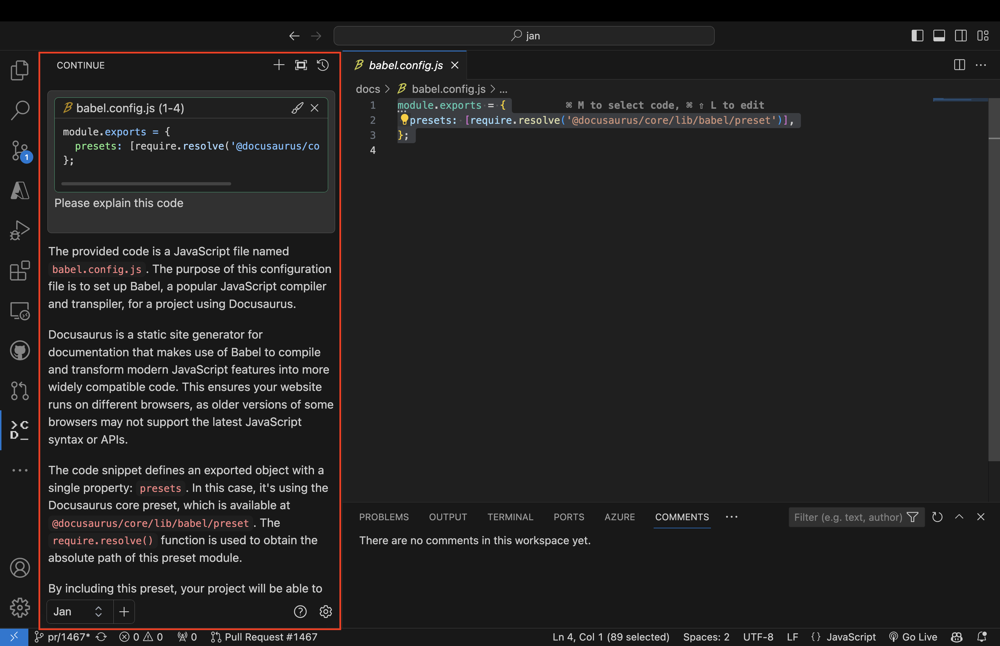

{/* Imports */}
import Tabs from "@theme/Tabs";
import TabItem from "@theme/TabItem";

## Quick Introduction

[Continue](https://continue.dev/docs/intro) is an open-source autopilot for VS Code and JetBrains—the easiest way to code with any LLM.

In this guide, we will show you how to integrate Continue with Jan and VS Code, enhancing your coding experience with the power of the local AI language model.

## Steps to Integrate Continue with Jan and VS Code

### 1. Install Continue for VS Code

To get started with Continue in VS Code, please follow this [guide to install Continue for VS Code](https://continue.dev/docs/quickstart).

### 2. Enable Jan API Server

To configure the Continue to use Jan's Local Server, you need to enable Jan API Server with your preferred model, please follow this [guide to enable Jan API Server](/guides/using-server/start-server).

### 3. Configure Continue to Use Jan's Local Server

Navigate to the `~/.continue` directory.

<Tabs groupId="operating-systems">
  <TabItem value="mac" label="macOS">
    
    ```sh
    cd ~/.continue
    ```
  
  </TabItem>
  <TabItem value="win" label="Windows">
  
    ```sh
    C:/Users/<your_user_name>/.continue
    ```
  
  </TabItem>
  <TabItem value="linux" label="Linux">
  
    ```sh
    cd ~/.continue
    ```
  
  </TabItem>
</Tabs>

Edit the `config.json` file and include the following configuration.

```json title="~/.continue/config.json"
{
  "models": [
    {
      // highlight-next-line
      "title": "Jan",
      "provider": "openai",
      // highlight-start
      "model": "mistral-ins-7b-q4",
      "apiKey": "EMPTY",
      "apiBase": "http://localhost:1337/v1"
      // highlight-end
    }
  ]
}
```

- Ensure that the `provider` is `openai`.
- Ensure that the `model` is the ID of the running model. You can check for the respective ID in System Monitor.
- Ensure that the `apiBase` is `http://localhost:1337/v1`.
- Ensure that the `apiKey` is `EMPTY`.

### 4. Double Check the Model is Running

Open up the `System Monitor` to check that your model is currently running.

If there are not active models, go to `Settings` > `My Models`. Click on the **three dots (⋮)** and **start model**.



### 5. Use Continue in VS Code

#### Asking questions about the code

- Highlight a code snippet and press `Command + M` to open the Continue Extension in VSCode.
- Select Jan at the bottom and ask a question about the code, for example, `Explain this code`.



#### Editing the code directly

- Highlight a code snippet and press `Command + Shift + L` and input your edit request, for example, `Write comments for this code`.


