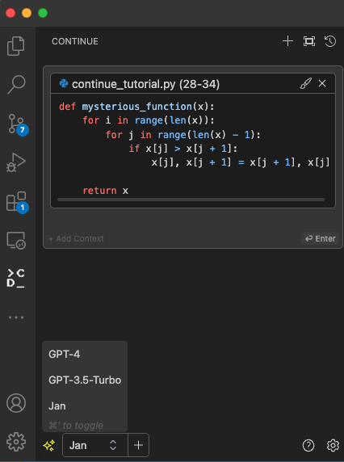
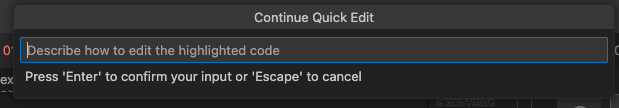

{/* Imports */}
import Tabs from "@theme/Tabs";
import TabItem from "@theme/TabItem";

## Quick Introduction

[Continue](https://continue.dev/docs/intro) is an open-source autopilot for VS Code and JetBrains—the easiest way to code with any LLM.

In this guide, we will show you how to integrate Continue with Jan and VSCode, enhancing your coding experience with the power of local AI language model.

## Steps to Integrate Continue with Jan and VSCode

### 1. Install Continue for VSCode

You need to install Continue for VSCode. You can follow this [guide to install Continue for VSCode](https://continue.dev/docs/quickstart).

### 2. Enable Jan API Server

To configure the Continue to use Jan's Local Server, you need to enable Jan API Server with your preferred model, please follow this [guide to enable Jan API Server](../05-using-server/01-server.md)

### 3. Configure Continue to Use Jan's Local Server

Navigate to the `~/.continue` directory.

<Tabs groupId="operating-systems">
  <TabItem value="mac" label="macOS">
    
    ```sh
    cd ~/.continue
    ```
  
  </TabItem>
  <TabItem value="win" label="Windows">
  
    ```sh
    C:/Users/<your_user_name>/.continue
    ```
  
  </TabItem>
  <TabItem value="linux" label="Linux">
  
    ```sh
    cd ~/.continue
    ```
  
  </TabItem>
</Tabs>

Edit the `config.json` file and include the following configuration.

```json title="~/.continue/config.json"
{
  "models": [
    {
      // highlight-next-line
      "title": "Jan",
      "provider": "openai",
      // highlight-start
      "model": "mistral-ins-7b-q4",
      "apiKey": "EMPTY",
      "apiBase": "http://localhost:1337"
      // highlight-end
    }
  ]
}
```

- Ensure that the `provider` is `openai`.
- Ensure that the `model` is the same as the one you enabled in Jan API Server.
- Ensure that the `apiBase` is `http://localhost:1337`.
- Ensure that the `apiKey` is `EMPTY`.

### 4. Ensure the Using Model Is Activated in Jan

Navigate to `Settings` > `Models`. Activate the model that you want to use in Jan by clicking the **three dots (⋮)** and **start model**.


### 5. Try Out the Integration of Jan and Continue in Vscode

1. Highlight a code, and press `Command + Shift + M`

You will see the **Left Panel** is being opened. Change the Model to use Jan.



Ask a question, and press **Enter**. Example: `Explain this code`

2. Highlight a code, and press `Command + Shift + L`



Type your edit request, and press **Enter**. Example: `Put comments in the code`
