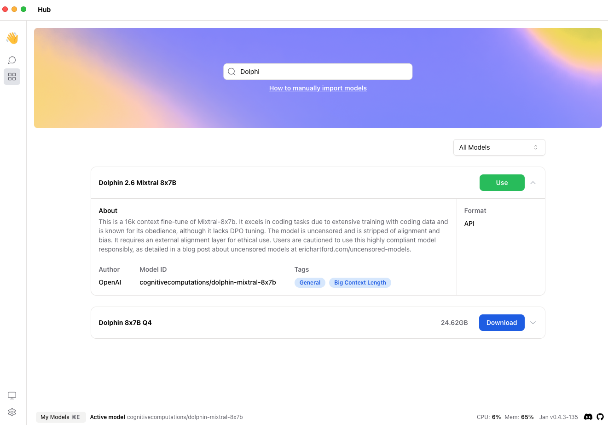

## Quick Introduction

[OpenRouter](https://openrouter.ai/docs#quick-start) is an AI model aggregator. The API can be used by developers to interact with a variety of large language models, generative image models, and generative 3D object models.

In this guide, we will show you how to integrate OpenRouter with Jan, enabling you to leverage remote Large Language Models (LLM) that are available at OpenRouter.

## Steps to Integrate OpenRouter with Jan

### 1. Get the [OpenRouter API key](https://openrouter.ai/keys)

Optionally, you can configure `$OPENROUTER_API_KEY` as part of the enviroment variables so you can easily reference it.

### 2. Grab the `curl`, configure it to what you want to do, and test it in Terminal

```bash
curl https://openrouter.ai/api/v1/chat/completions \
  -H "Content-Type: application/json" \
  -H "Authorization: Bearer $OPENROUTER_API_KEY" \
  -d '{
  "model": "cognitivecomputations/dolphin-mixtral-8x7b",
  "messages": [
    {"role": "user", "content": "What is the meaning of life?"}
  ]
}'
```

### 3. Modify OpenAI `~/jan/engines/openai.json`

- Make sure the `curl` is using header with `Authorization: Bearer $OPENROUTER_API_KEY` or `api-key: $OPENROUTER_API_KEY`
- Change full_url to `https://openrouter.ai/api/v1/chat/completion`
- For the `apiKey` can paste the value as `$OPENROUTER_API_KEY`

```json
{"full_url":"https://openrouter.ai/api/v1/chat/completions","api_key":"sk-or-v1-openrouter-api-key"}
```

### 4. Clone `~/jan/models/gpt-4` and rename it to `openrouter-<model name>`

- Modify `model.json` in `openrouter-<model name>`

```json
{
    "source_url": "https://openai.com",
    "id": "cognitivecomputations/dolphin-mixtral-8x7b",
    "object": "model",
    "name": "Dolphin 2.6 Mixtral 8x7B",
    "version": "1.0",
    "description": "This is a 16k context fine-tune of Mixtral-8x7b. It excels in coding tasks due to extensive training with coding data and is known for its obedience, although it lacks DPO tuning. The model is uncensored and is stripped of alignment and bias. It requires an external alignment layer for ethical use. Users are cautioned to use this highly compliant model responsibly, as detailed in a blog post about uncensored models at erichartford.com/uncensored-models.",
    "format": "api",
    "settings": {},
    "parameters": {},
    "metadata": {
      "author": "OpenAI",
      "tags": ["General", "Big Context Length"]
    },
    "engine": "openai",
    "state": "ready"
}
```

### 4. Go to the Hub, Refresh, search and use the Model

In the **Search Bar**, type for example `Dolphin`, and click **Use Button**



### 5. Try out the integrated OpenRouter model in Jan

