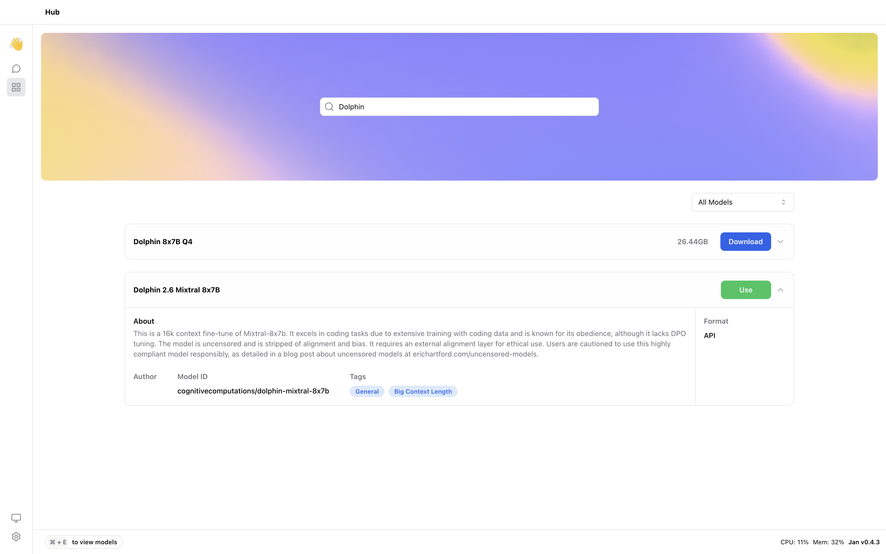

## Quick Introduction

[OpenRouter](https://openrouter.ai/docs#quick-start) is an AI model aggregator. The API can be used by developers to interact with a variety of large language models, generative image models, and generative 3D object models.

In this guide, we will show you how to integrate OpenRouter with Jan, enabling you to leverage remote Large Language Models (LLM) that are available at OpenRouter.

## Steps to Integrate OpenRouter with Jan

### 1. Configure OpenRouter API key

You can find your API keys in the [OpenRouter API Key](https://openrouter.ai/keys) and set the OpenRouter API key in `~/jan/engines/openai.json` file.

```json title="~/jan/engines/openai.json"
{
  // highlight-start
  "full_url": "https://openrouter.ai/api/v1/chat/completions",
  "api_key": "sk-or-v1<your-openrouter-api-key-here>"
  // highlight-end
}
```

### 2. Modify a Model JSON

Navigate to the `~/jan/models` folder. Create a folder named `<openrouter-modelname>`, for example, `openrouter-dolphin-mixtral-8x7b` and create a `model.json` file inside the folder including the following configurations:

- Ensure the filename must be `model.json`.
- Ensure the `id` property is set to the model id from OpenRouter.
- Ensure the `format` property is set to `api`.
- Ensure the `engine` property is set to `openai`.
- Ensure the `state` property is set to `ready`.

```json title="~/jan/models/openrouter-dolphin-mixtral-8x7b/model.json"
{
  "sources": [
    {
      "filename": "openrouter",
      "url": "https://openrouter.ai/"
    }
  ],
  "id": "cognitivecomputations/dolphin-mixtral-8x7b",
  "object": "model",
  "name": "Dolphin 2.6 Mixtral 8x7B",
  "version": "1.0",
  "description": "This is a 16k context fine-tune of Mixtral-8x7b. It excels in coding tasks due to extensive training with coding data and is known for its obedience, although it lacks DPO tuning. The model is uncensored and is stripped of alignment and bias. It requires an external alignment layer for ethical use. Users are cautioned to use this highly compliant model responsibly, as detailed in a blog post about uncensored models at erichartford.com/uncensored-models.",
  // highlight-next-line
  "format": "api",
  "settings": {},
  "parameters": {},
  "metadata": {
    "tags": ["General", "Big Context Length"]
  },
  // highlight-start
  "engine": "openai"
  // highlight-end
}
```

### 3. Start the Model

Restart Jan and navigate to the Hub. Locate your model and click the Use button.



### 4. Try Out the Integration of Jan and OpenRouter


