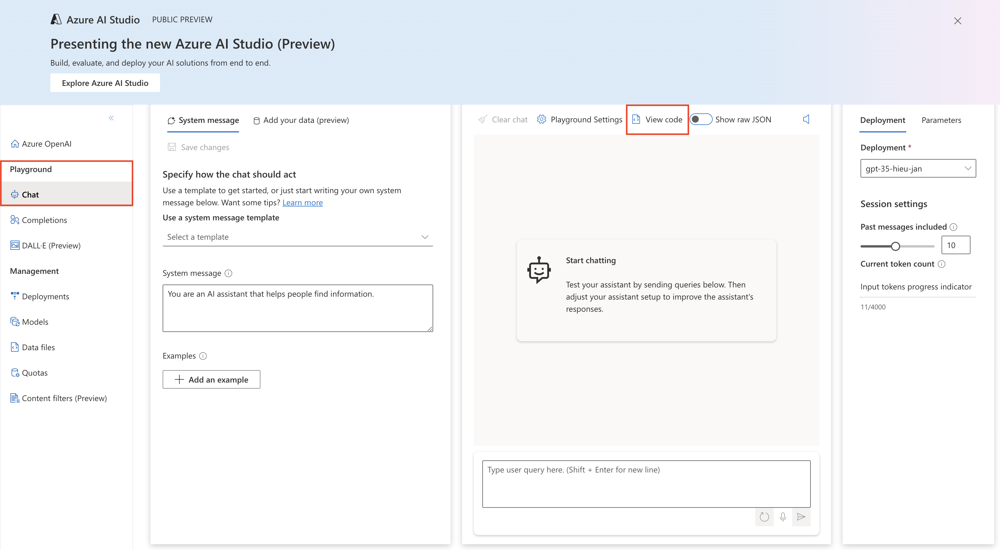
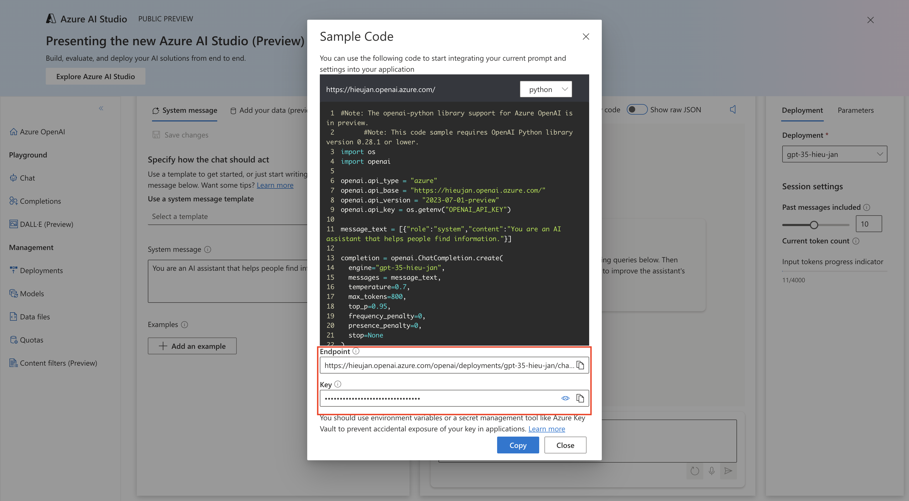
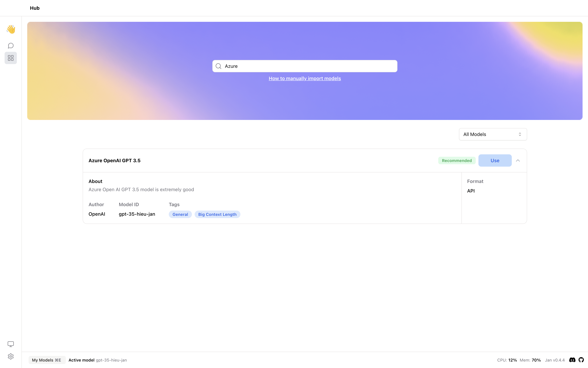

## Quick Introduction

[Azure OpenAI Service](https://learn.microsoft.com/en-us/azure/ai-services/openai/overview?source=docs) provides a set of powerful APIs that enable you to easily integrate the OpenAI's language models.

In this guide, we will show you how to integrate Azure OpenAI Service with Jan.

## Steps to Integrate Azure OpenAI Service with Jan

### 1. Configure Azure OpenAI Service API key

Once you completed setting up and deploying the Azure OpenAI Service, you can find the endpoint and API key in the [Azure OpenAI Studio](https://oai.azure.com/) by navigating to `Chat` > `View code`.



<br> </br>



Set the Azure OpenAI Service endpoint and API key in the `~/jan/engines/openai.json` file.

```json title="~/jan/engines/openai.json"
{
  // https://hieujan.openai.azure.com/openai/deployments/gpt-35-hieu-jan/chat/completions?api-version=2023-07-01-preview
  // highlight-start
  "full_url": "https://<your-resource-name>.openai.azure.com/openai/deployments/<your-deployment-name>/chat/completions?api-version=<api-version>",
  "api_key": "<your-api-key>"
  // highlight-end
}
```

### 2. Modify a Model JSON

Navigate to the `~/jan/models` folder. Create a folder named `<your-deployment-name>`, for example, `gpt-35-hieu-jan` and create a `model.json` file inside the folder including the following configurations:

- Ensure the filename must be `model.json`.
- Ensure the `id` property is set to the same as the folder name and your deployment name.
- Ensure the `format` property is set to `api`.
- Ensure the `engine` property is set to `openai`.
- Ensure the `state` property is set to `ready`.

```json title="~/jan/models/gpt-35-hieu-jan/model.json"
{
  "sources": [
    {
      "filename": "azure_openai",
      "url": "https://hieujan.openai.azure.com"
    }
  ],
  // highlight-next-line
  "id": "gpt-35-hieu-jan",
  "object": "model",
  "name": "Azure OpenAI GPT 3.5",
  "version": "1.0",
  "description": "Azure Open AI GPT 3.5 model is extremely good",
  // highlight-next-line
  "format": "api",
  "settings": {},
  "parameters": {},
  "metadata": {
    "author": "OpenAI",
    "tags": ["General", "Big Context Length"]
  },
  // highlight-start
  "engine": "openai"
  // highlight-end
}
```

### 3. Start the Model

Restart Jan and navigate to the Hub. Locate your model and click the Use button.


### 4. Try Out the Integration of Jan and Azure OpenAI Service


