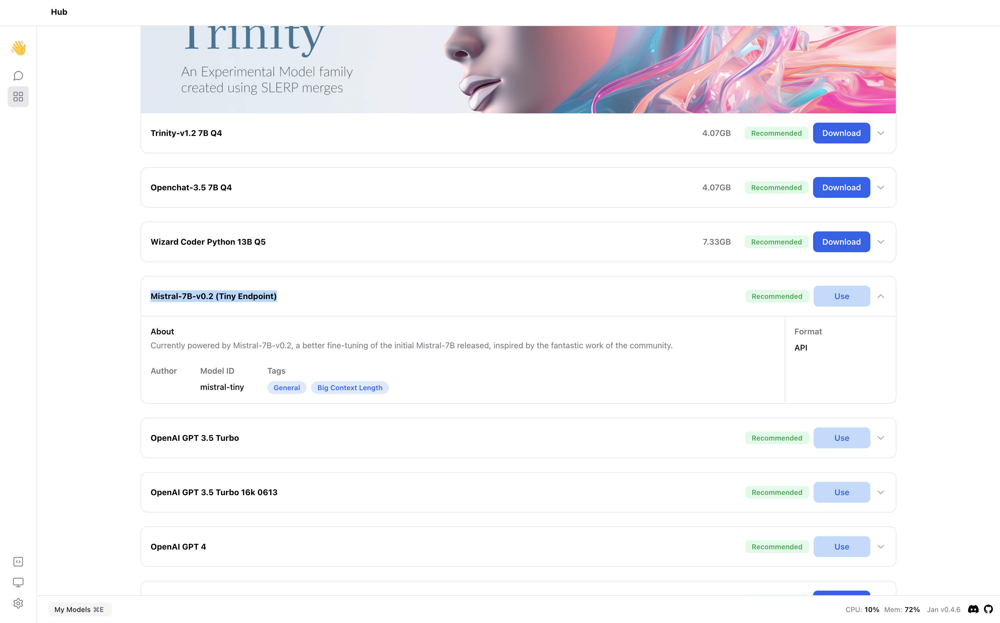

## Quick Introduction

[Mistral AI](https://docs.mistral.ai/) currently provides two ways of accessing their Large Language Models (LLM) - via their API or via open source models available on Hugging Face.  In this guide, we will show you how to integrate Mistral AI with Jan using the API method.

## Steps to Integrate Mistral AI with Jan

### 1. Configure Mistral API key

You can find your API keys in the [Mistral API Key](https://console.mistral.ai/user/api-keys/) and set the Mistral AI API key in `~/jan/engines/openai.json` file.

```json title="~/jan/engines/openai.json"
{
  // highlight-start
  "full_url": "https://api.mistral.ai/v1/chat/completions",
  "api_key": "<your-mistral-ai-api-key>"
  // highlight-end
}
```

### 2. Modify a Model JSON

Navigate to the `~/jan/models` folder. Create a folder named `<mistral-modelname>`, for example, `mistral-tiny` and create a `model.json` file inside the folder including the following configurations:

- Ensure the filename must be `model.json`.
- Ensure the `id` property is set to the model id from Mistral AI.
- Ensure the `format` property is set to `api`.
- Ensure the `engine` property is set to `openai`.
- Ensure the `state` property is set to `ready`.

```json title="~/jan/models/mistral-tiny/model.json"
{
  "sources": [
    {
      "filename": "mistral-tiny",
      "url": "https://mistral.ai/"
    }
  ],
  "id": "mistral-tiny",
  "object": "model",
  "name": "Mistral-7B-v0.2 (Tiny Endpoint)",
  "version": "1.0",
  "description": "Currently powered by Mistral-7B-v0.2, a better fine-tuning of the initial Mistral-7B released, inspired by the fantastic work of the community.",
  // highlight-next-line
  "format": "api",
  "settings": {},
  "parameters": {},
  "metadata": {
    "author": "Mistral AI",
    "tags": ["General", "Big Context Length"]
  },
  // highlight-start
  "engine": "openai"
  // highlight-end
}
```

:::tip

Mistral AI provides different endpoints. Please check out their [endpoint documentation](https://docs.mistral.ai/platform/endpoints/) to find the one that suits your needs. In this example, we will use the `mistral-tiny` model.

:::

### 3. Start the Model

Restart Jan and navigate to the Hub. Locate your model and click the Use button.



### 4. Try Out the Integration of Jan and Mistral AI


