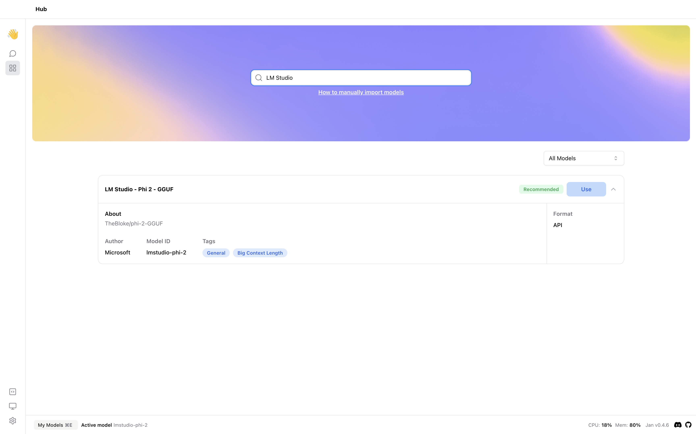
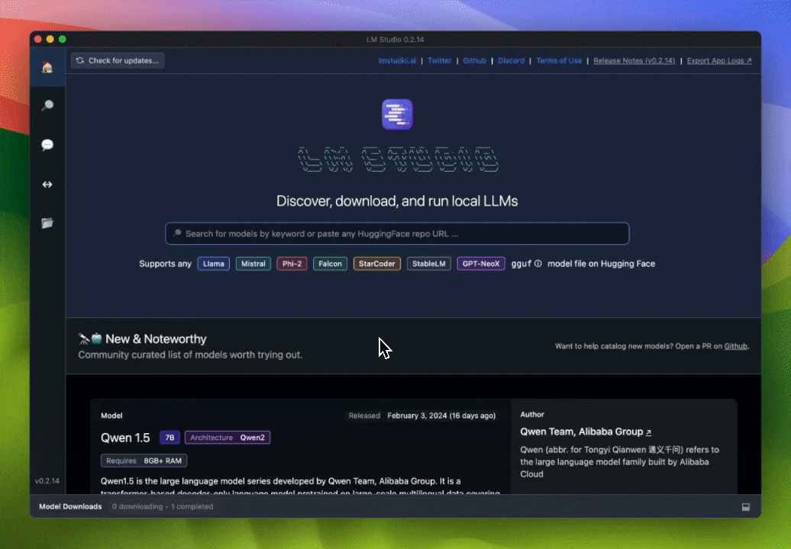

## Quick Introduction

With [LM Studio](https://lmstudio.ai/), you can discover, download, and run local Large Language Models (LLMs). In this guide, we will show you how to integrate and use your current models on LM Studio with Jan using 2 methods.  The first method is integrating LM Studio server with Jan UI. The second method is migrating your downloaded model from LM Studio to Jan. We will use the [Phi 2 - GGUF](https://huggingface.co/TheBloke/phi-2-GGUF) model on Hugging Face as an example.

## Steps to Integrate LM Studio Server with Jan UI

### 1. Start the LM Studio Server

1. Navigate to the `Local Inference Server` on the LM Studio application.  
2. Select the model you want to use. 
3. Start the server after configuring the server port and options. 


<br></br>

Modify the `openai.json` file in the `~/jan/engines` folder to include the full URL of the LM Studio server.

```json title="~/jan/engines/openai.json"
{
  "full_url": "http://localhost:<port>/v1/chat/completions"
}
```

:::tip

- Replace `<port>` with the port number you set in the LM Studio server. The default port is `1234`.

:::

### 2. Modify a Model JSON

Navigate to the `~/jan/models` folder. Create a folder named `<lmstudio-modelname>`, for example, `lmstudio-phi-2` and create a `model.json` file inside the folder including the following configurations:

- Set the `format` property to `api`.
- Set the `engine` property to `openai`.
- Set the `state` property to `ready`.

```json title="~/jan/models/lmstudio-phi-2/model.json"
{
  "sources": [
    {
      "filename": "phi-2-GGUF",
      "url": "https://huggingface.co/TheBloke/phi-2-GGUF"
    }
  ],
  "id": "lmstudio-phi-2",
  "object": "model",
  "name": "LM Studio - Phi 2 - GGUF",
  "version": "1.0",
  "description": "TheBloke/phi-2-GGUF",
  // highlight-next-line
  "format": "api",
  "settings": {},
  "parameters": {},
  "metadata": {
    "author": "Microsoft",
    "tags": ["General", "Big Context Length"]
  },
  // highlight-start
  "engine": "openai"
  // highlight-end
}
```

### 3. Start the Model

1. Restart Jan and navigate to the **Hub**. 
2. Locate your model and click the **Use** button.



### 4. Try Out the Integration of Jan and LM Studio


## Steps to Migrate Your Downloaded Model from LM Studio to Jan (version 0.4.6 and older)

### 1. Migrate Your Downloaded Model

1. Navigate to `My Models` in the LM Studio application and reveal the model folder.



2. Copy the model folder that you want to migrate to `~/jan/models` folder.

3. Ensure the folder name property is the same as the model name of `.gguf` filename by changing the folder name if necessary. For example, in this case, we changed foldername from `TheBloke` to `phi-2.Q4_K_S`.

### 2. Start the Model

1. Restart Jan and navigate to the **Hub**. Jan will automatically detect the model and display it in the **Hub**. 
2. Locate your model and click the **Use** button to try the migrating model.


## Steps to Pointing to the Downloaded Model of LM Studio from Jan (version 0.4.7+)

Starting from version 0.4.7, Jan supports importing models using an absolute filepath, so you can directly use the model from the LM Studio folder.

### 1. Reveal the Model Absolute Path

Navigate to `My Models` in the LM Studio application and reveal the model folder. Then, you can get the absolute path of your model.


### 2. Modify a Model JSON

Navigate to the `~/jan/models` folder. Create a folder named `<modelname>`, for example, `phi-2.Q4_K_S` and create a `model.json` file inside the folder including the following configurations:

- Ensure the `id` property matches the folder name you created.
- Ensure the `url` property is the direct binary download link ending in `.gguf`. Now, you can use the absolute filepath of the model file. In this example, the absolute filepath is `/Users/<username>/.cache/lm-studio/models/TheBloke/phi-2-GGUF/phi-2.Q4_K_S.gguf`.
- Ensure the `engine` property is set to `nitro`.

```json
{
  "object": "model",
  "version": 1,
  "format": "gguf",
  "sources": [
    {
      "filename": "phi-2.Q4_K_S.gguf",
      "url": "<absolute-path-of-model-file>"
    }
  ],
  "id": "phi-2.Q4_K_S",
  "name": "phi-2.Q4_K_S",
  "created": 1708308111506,
  "description": "phi-2.Q4_K_S - user self import model",
  "settings": {
    "ctx_len": 4096,
    "embedding": false,
    "prompt_template": "{system_message}\n### Instruction: {prompt}\n### Response:",
    "llama_model_path": "phi-2.Q4_K_S.gguf"
  },
  "parameters": {
    "temperature": 0.7,
    "top_p": 0.95,
    "stream": true,
    "max_tokens": 2048,
    "stop": ["<endofstring>"],
    "frequency_penalty": 0,
    "presence_penalty": 0
  },
  "metadata": {
    "size": 1615568736,
    "author": "User",
    "tags": []
  },
  "engine": "nitro"
}
```

:::warning

- If you are using Windows, you need to use double backslashes in the url property, for example: `C:\\Users\\username\\filename.gguf`.

:::


### 3. Start the Model

1. Restart Jan and navigate to the **Hub**. 
2. Jan will automatically detect the model and display it in the **Hub**. 
3. Locate your model and click the **Use** button to try the migrating model.  


