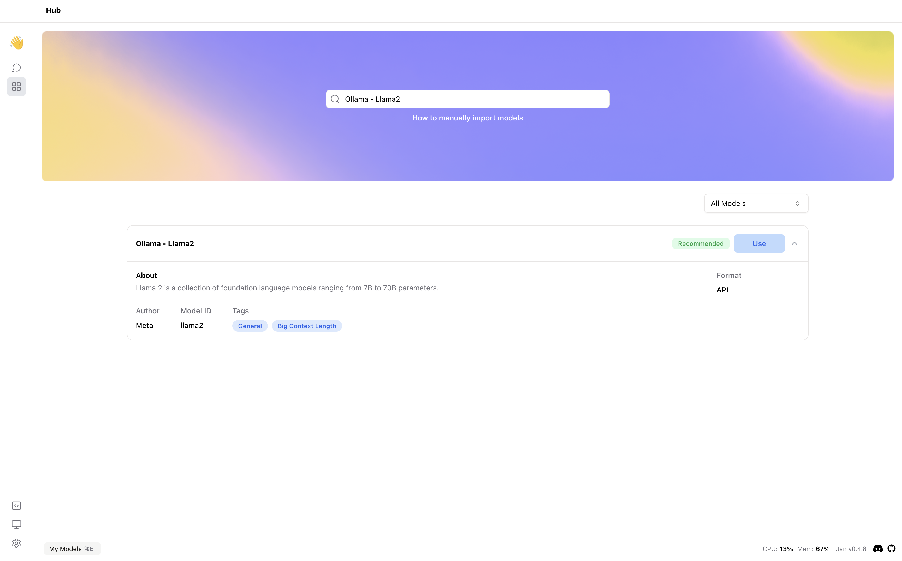

## Quick Introduction

With [Ollama](https://ollama.com/), you can run large language models locally. In this guide, we will show you how to integrate and use your current models on Ollama with Jan using 2 methods.  The first method is integrating Ollama server with Jan UI. The second method is migrating your downloaded model from Ollama to Jan. We will use the [llama2](https://ollama.com/library/llama2) model as an example.

## Steps to Integrate Ollama Server with Jan UI

### 1. Start the Ollama Server

1. Select the model you want to use from the [Ollama library](https://ollama.com/library). 
2. Run your model by using the following command:
  
```bash
ollama run <model-name>
```

3. According to the [Ollama documentation on OpenAI compatibility](https://github.com/ollama/ollama/blob/main/docs/openai.md), you can use the `http://localhost:11434/v1/chat/completions` endpoint to interact with the Ollama server. Thus, modify the `openai.json` file in the `~/jan/engines` folder to include the full URL of the Ollama server.

```json title="~/jan/engines/openai.json"
{
  "full_url": "http://localhost:11434/v1/chat/completions"
}
```

### 2. Modify a Model JSON

1. Navigate to the `~/jan/models` folder. 
2. Create a folder named `<ollam-modelname>`, for example, `lmstudio-phi-2`.
3. Create a `model.json` file inside the folder including the following configurations:

- Set the `id` property to the model name as Ollama model name.
- Set the `format` property to `api`.
- Set the `engine` property to `openai`.
- Set the `state` property to `ready`.

```json title="~/jan/models/llama2/model.json"
{
  "sources": [
    {
      "filename": "llama2",
      "url": "https://ollama.com/library/llama2"
    }
  ],
  // highlight-next-line
  "id": "llama2",
  "object": "model",
  "name": "Ollama - Llama2",
  "version": "1.0",
  "description": "Llama 2 is a collection of foundation language models ranging from 7B to 70B parameters.",
  // highlight-next-line
  "format": "api",
  "settings": {},
  "parameters": {},
  "metadata": {
    "author": "Meta",
    "tags": ["General", "Big Context Length"]
  },
  // highlight-next-line
  "engine": "openai"
}
```

### 3. Start the Model

1. Restart Jan and navigate to the **Hub**.
2. Locate your model and click the **Use** button.



### 4. Try Out the Integration of Jan and Ollama


