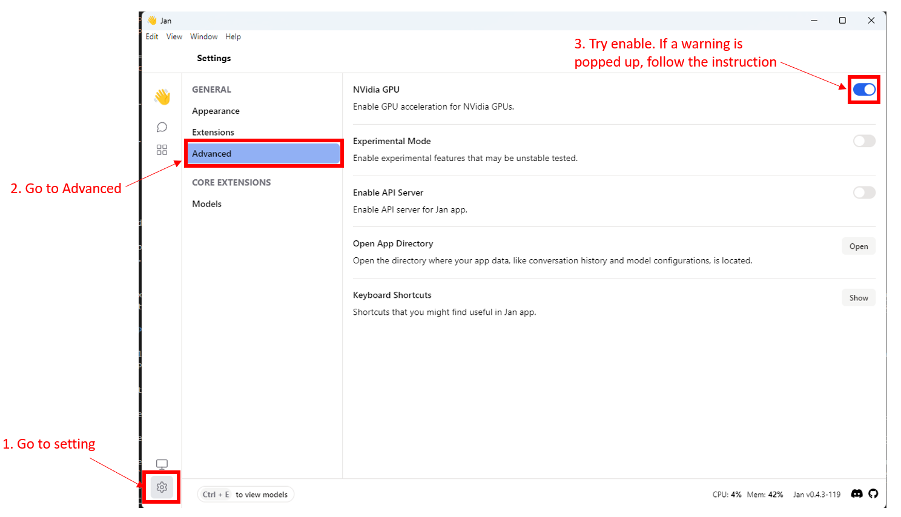

This guide provides steps to troubleshoot and resolve issues when Jan app does not utilize the GPU on Windows and Linux systems.

## Requirements for Running Jan in GPU Mode on Windows and Linux

### NVIDIA Driver

Ensure that you have installed the NVIDIA driver that supports CUDA 11.7 or higher. For a detailed of CUDA compatibility, please refer [here](https://docs.nvidia.com/deploy/cuda-compatibility/index.html#binary-compatibility__table-toolkit-driver).

To verify, open PowerShell or Terminal and enter the following command:

```bash
nvidia-smi
```

If you see a result similar to the following, you have successfully installed the NVIDIA driver:

```bash
+-----------------------------------------------------------------------------+
| NVIDIA-SMI 470.57.02    Driver Version: 470.57.02    CUDA Version: 11.7     |
|-------------------------------+----------------------+----------------------+
| GPU  Name        Persistence-M| Bus-Id        Disp.A | Volatile Uncorr. ECC |
| Fan  Temp  Perf  Pwr:Usage/Cap|         Memory-Usage | GPU-Util  Compute M. |
|                               |                      |               MIG M. |
|===============================+======================+======================|
|   0  NVIDIA GeForce ...  Off  | 00000000:01:00.0  On |                  N/A |
|  0%   51C    P8    10W / 170W |    364MiB /  7982MiB |      0%      Default |
|                               |                      |                  N/A |
+-------------------------------+----------------------+----------------------+
```

### CUDA Toolkit

Ensure that you have installed the CUDA toolkit that is compatible with your NVIDIA driver. For a detailed of CUDA compatibility, please refer [here](https://docs.nvidia.com/deploy/cuda-compatibility/index.html#binary-compatibility__table-toolkit-driver).

To verify, open PowerShell or Terminal and enter the following command:

```bash
nvcc --version
```

If you see a result similar to the following, you have successfully installed CUDA:

```bash
nvcc: NVIDIA (R) Cuda compiler driver

Cuda compilation tools, release 11.7, V11.7.100
Build cuda_11.7.r11.7/compiler.30033411_0
```

### Specific Requirements for Linux

**GCC and G++ Version**: Ensure that you have installed `gcc-11`, `g++-11`, `cpp-11` or higher, refer [here](https://gcc.gnu.org/projects/cxx-status.html#cxx17). For Ubuntu, you can install g++ 11 by following the instructions [here](https://linuxconfig.org/how-to-switch-between-multiple-gcc-and-g-compiler-versions-on-ubuntu-20-04-lts-focal-fossa).

```bash
# Example for ubuntu
# Add the following PPA repository
sudo add-apt-repository ppa:ubuntu-toolchain-r/test
# Update the package list
sudo apt update
# Install g++ 11
sudo apt-get install -y gcc-11 g++-11 cpp-11

# Update the default g++ version
sudo update-alternatives --install /usr/bin/gcc gcc /usr/bin/gcc-11 110 \
                      --slave /usr/bin/g++ g++ /usr/bin/g++-11 \
                      --slave /usr/bin/gcov gcov /usr/bin/gcov-11 \
                      --slave /usr/bin/gcc-ar gcc-ar /usr/bin/gcc-ar-11 \
                      --slave /usr/bin/gcc-ranlib gcc-ranlib /usr/bin/gcc-ranlib-11
sudo update-alternatives --install /usr/bin/cpp cpp /usr/bin/cpp-11 110
# Check the default g++ version
g++ --version
```

**Post-Installation Actions**: You must add the `.so` libraries of CUDA to the `LD_LIBRARY_PATH` environment variable by following the [Post-installation Actions instruction](https://docs.nvidia.com/cuda/cuda-installation-guide-linux/index.html#post-installation-actions).

```bash
# Example for ubuntu with CUDA 11.7
sudo nano /etc/environment
# Add /usr/local/cuda-11.7/bin to the PATH environment variable - the first line
# Add the following line to the end of the file
LD_LIBRARY_PATH=/usr/local/cuda-11.7/lib64

# Save and exit
# Restart your computer or log out and log in again, the changes will take effect
```

## Switching Between CPU/GPU Modes in Jan

By default, Jan runs in CPU mode. Upon start, Jan checks if your system is capable of running in GPU mode. If compatible, GPU mode is enabled automatically, and the GPU with the highest VRAM is selected. This setting can be verified in the `Settings` > `Advanced` section.



If you find that GPU mode is available but not enabled by default, consider the following troubleshooting steps:

:::tip

1. Check if you have installed the NVIDIA driver that supports CUDA 11.7 or higher. For a detailed of CUDA compatibility, please refer [here](https://docs.nvidia.com/deploy/cuda-compatibility/index.html#binary-compatibility__table-toolkit-driver).

2. Ensure that the CUDA toolkit is installed and compatible with your NVIDIA driver. For a detailed of CUDA compatibility, please refer [here](https://docs.nvidia.com/deploy/cuda-compatibility/index.html#binary-compatibility__table-toolkit-driver).

3. For Linux, it's crucial to add the `.so` libraries of CUDA and the CUDA compatible driver to the `LD_LIBRARY_PATH` environment variable. For Windows, users should ensure that the `.dll` libraries of CUDA and the CUDA compatible driver are included in the PATH environment variable. Usually, when installing CUDA on Windows, this environment variable is automatically added, but if you do not see it, you can add it manually by referring [here](https://docs.nvidia.com/cuda/cuda-installation-guide-microsoft-windows/index.html#environment-setup).

:::

## Checking GPU Settings in Jan

1. To check the current GPU settings detected by Jan, navigate to `Settings` > `Advanced` > `Open App Directory`

<br></br>


<br></br>

2. Open the `settings.json` file under the `settings` folder. The following is an example of the `settings.json` file:

<br></br>

```json title="~/jan/settings/settings.json"
{
  "notify": true,
  "run_mode": "gpu",
  "nvidia_driver": {
    "exist": true,
    "version": "531.18"
  },
  "cuda": {
    "exist": true,
    "version": "12"
  },
  "gpus": [
    {
      "id": "0",
      "vram": "12282"
    },
    {
      "id": "1",
      "vram": "6144"
    },
    {
      "id": "2",
      "vram": "6144"
    }
  ],
  "gpu_highest_vram": "0"
}
```

:::tip

Troubleshooting tips:

- Ensure the `nvidia_driver` and `cuda` fields indicate that requirements software are installed.
- If the `gpus` field is empty or does not list your GPU, verify the installation of the NVIDIA driver and CUDA toolkit.
- For further assistance, please share the `settings.json` with us.

:::

## Tested Configurations

- Windows 11 Pro 64-bit, NVIDIA GeForce RTX 4070ti GPU, CUDA 12.2, NVIDIA driver 531.18 (Bare metal)
- Ubuntu 22.04 LTS, NVIDIA GeForce RTX 4070ti GPU, CUDA 12.2, NVIDIA driver 545 (Bare metal)
- Ubuntu 20.04 LTS, NVIDIA GeForce GTX 1660ti GPU, CUDA 12.1, NVIDIA driver 535 (Proxmox VM passthrough GPU)
- Ubuntu 18.04 LTS, NVIDIA GeForce GTX 1660ti GPU, CUDA 12.1, NVIDIA driver 535 (Proxmox VM passthrough GPU)

## Common Issues and Solutions

1. If the issue persists, please install the [Nightly version](/install/nightly) instead.

2. If the issue persists, ensure your (V)RAM is accessible by the application. Some folks have virtual RAM and need additional configuration.

3. If you are facing issues with the installation of RTX issues, please update the NVIDIA driver that supports CUDA 11.7 or higher. Ensure that the CUDA path is added to the environment variable.

4. Get help in [Jan Discord](https://discord.gg/mY69SZaMaC).
