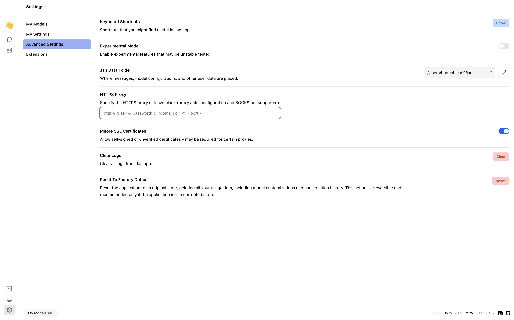

In this guide, we will show you how to set up your own HTTPS proxy server and configure Jan to use it.

## Why HTTPS Proxy?
An HTTPS proxy helps you to maintain your privacy and security while still being able to browser the internet circumventing geographical restrictions. 

## Setting Up Your Own HTTPS Proxy Server
In this section, we will show you a high-level overview of how to set up your own HTTPS proxy server. This guide focus on using Squid as a popular and open-source proxy server software, but there are other software options you might consider based on your needs and preferences.

### Step 1: Choosing a Server
Firstly, you need to choose a server to host your proxy server. We recommend using a cloud provider like Amazon AWS, Google Cloud, Microsoft Azure, Digital Ocean, etc. Ensure that your server has a public IP address and is accessible from the internet.

### Step 2: Installing Squid
```bash
sudo apt-get update
sudo apt-get install squid
```

### Step 3: Configure Squid for HTTPS

To enable HTTPS, you will need to configure Squid with SSL support.

- Generate SSL certificate

Squid requires an SSL certificate to be able to handle HTTPS traffic. You can generate a self-signed certificate or obtain one from a Certificate Authority (CA). For a self-signed certificate, you can use OpenSSL:

```bash
openssl req -new -newkey rsa:2048 -days 365 -nodes -x509 -keyout squid-proxy.pem -out squid-proxy.pem
```

- Configure Squid to use the SSL certificate: Edit the Squid configuration file `/etc/squid/squid.conf` to include the path to your SSL certificate and enable the HTTPS port:

```bash
http_port 3128 ssl-bump cert=/path/to/your/squid-proxy.pem
ssl_bump server-first all
ssl_bump bump all
```

- Enable SSL Bumping: To intercept HTTPS traffic, Squid uses a process called SSL Bumping. This process allows Squid to decrypt and re-encrypt HTTPS traffic. To enable SSL Bumping, ensure the `ssl_bump` directives are configured correctly in your `squid.conf` file.

### Step 4 (Optional): Configure ACLs and Authentication

- Access Control Lists (ACLs): You can define rules to control who can access your proxy. This is done by editing the squid.conf file and defining ACLs:

```bash
acl allowed_ips src "/etc/squid/allowed_ips.txt"
http_access allow allowed_ips
```

- Authentication: If you want to add an authentication layer, Squid supports several authentication schemes. Basic authentication setup might look like this:

```bash
auth_param basic program /usr/lib/squid/basic_ncsa_auth /etc/squid/passwords
acl authenticated proxy_auth REQUIRED
http_access allow authenticated
```

### Step 5: Restart and Test Your Proxy

After configuring, restart Squid to apply the changes:

```bash
sudo systemctl restart squid
```

To test, configure your browser or another client to use the proxy server with its IP address and port (default is 3128). Check if you can access the internet through your proxy.

:::tip

Tips for Secure Your Proxy:
- Firewall rules: Ensure that only intended users or IP addresses can connect to your proxy server. This can be achieved by setting up appropriate firewall rules.
- Regular updates: Keep your server and proxy software updated to ensure that you are protected against known vulnerabilities.
- Monitoring and logging: Monitor your proxy server for unusual activity and enable logging to keep track of the traffic passing through your proxy.

::: 

## Setting Up Jan to Use Your HTTPS Proxy

Once you have your HTTPS proxy server set up, you can configure Jan to use it. Navigate to `Settings` > `Advanced Settings` and specify the HTTPS proxy (proxy auto-configuration and SOCKS not supported).

You can turn on the feature `Ignore SSL Certificates` if you are using a self-signed certificate. This feature allows self-signed or unverified certificates.

