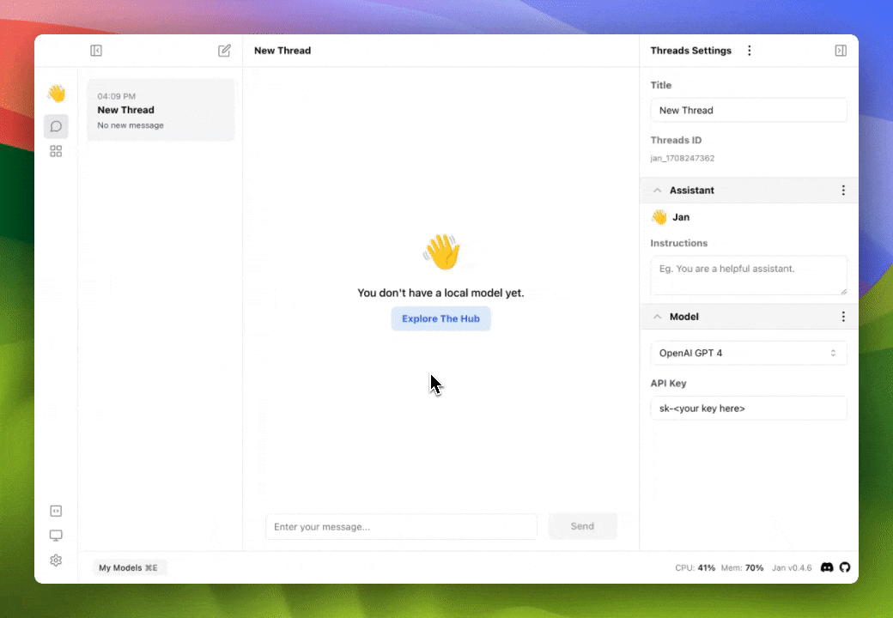

This guide will show you how to use the advanced settings in Jan.

## Keyboard Shortcuts

Keyboard shortcuts are a great way to speed up your workflow. Here are some of the keyboard shortcuts that you can use in Jan.

| Combination     | Description                                        |
| --------------- | -------------------------------------------------- |
| `⌘ E`           | Show list your models                              |
| `⌘ K`           | Show list navigation pages                         |
| `⌘ B`           | Toggle collapsible left panel                      |
| `⌘ ,`           | Navigate to setting page                           |
| `Enter`         | Send a message                                     |
| `Shift + Enter` | Insert new line in input box                       |
| `Arrow Up`      | Navigate to previous option (within search dialog) |
| `Arrow Down`    | Navigate to next option (within search dialog)     |

  

:::note
`⌘` is the command key on macOS, and `Ctrl` on Windows.
:::

## Experimental Mode

Experimental mode allows you to enable experimental features that may be unstable tested.

## Jan Data Folder

The Jan data folder is the location where messages, model configurations, and other user data are placed. You can change the location of the data folder to a different location.

## HTTPS Proxy & Ignore SSL Certificate

HTTPS Proxy allows you to use a proxy server to connect to the internet. You can also ignore SSL certificates if you are using a self-signed certificate.
Please check out the guide on [how to set up your own HTTPS proxy server and configure Jan to use it](../advanced-settings/https-proxy) for more information.

## Clear Logs

Clear logs will remove all logs from the Jan application.

## Reset To Factory Default

Reset the application to its original state, deleting all your usage data, including model customizations and conversation history. This action is irreversible and recommended only if the application is in a corrupted state.

