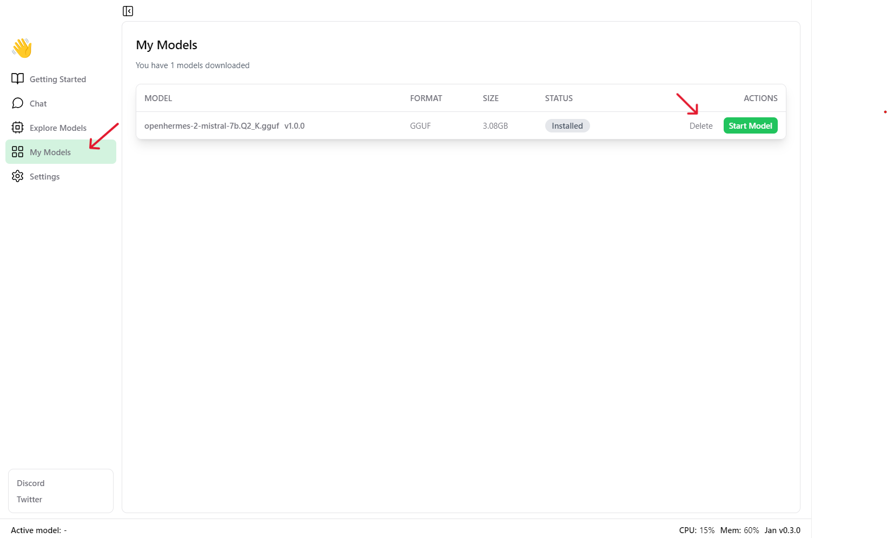

To save disk storage space, you should remove some models that you are not using:

- **Step 1:** Click on the 'My Models' panel.

- **Step 2:** Select the model you no longer need and click on the "Delete" button.

