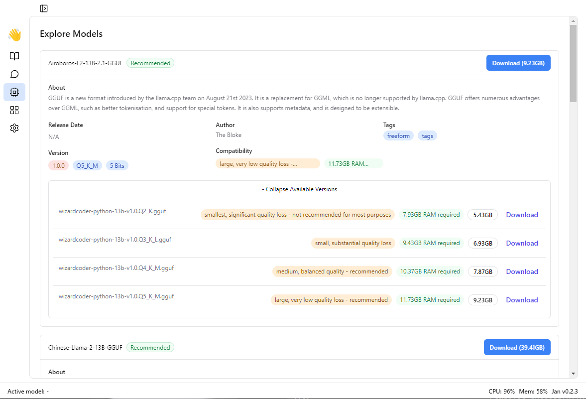
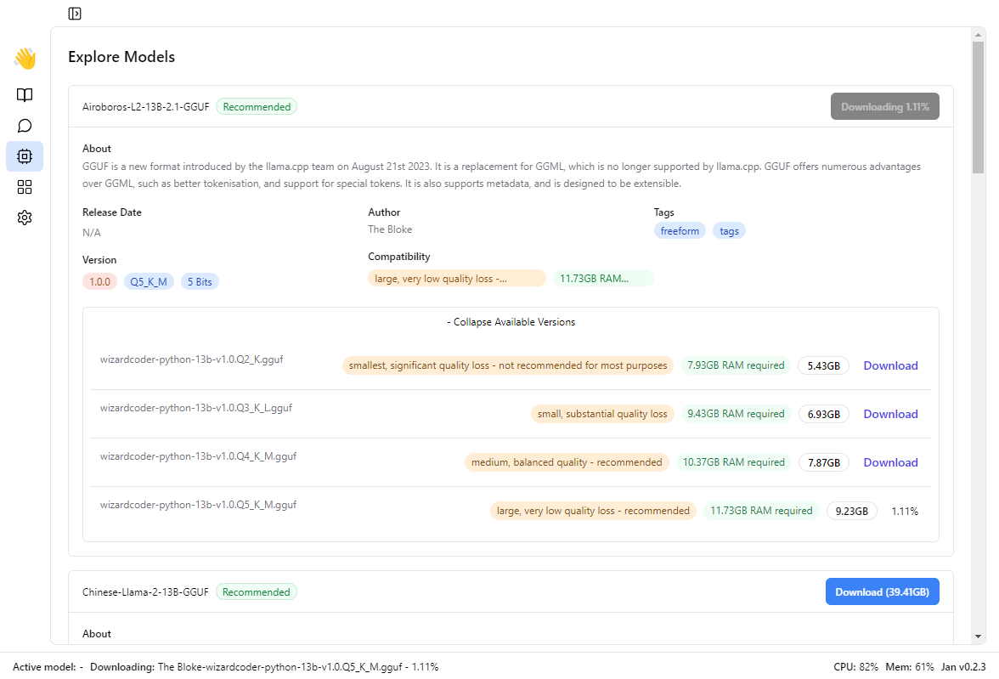

**Step 1:** Open 👋Jan application on your desktop.

**Step 2:** Welcome to the Jan homepage!

Click on the 'Explore Models' option to view the list of available models.

**Step 3:** You can view the different quantized versions by clicking the "Show Available Versions" button.

:::info
Select a model suited to your computer's memory and RAM specifications.

For the highest performance, the "Q5 variants" are recommended.
:::

**Step 4:** Select your preferred model and click "Download".

Congratulations! You have your very first local Large Language Model.