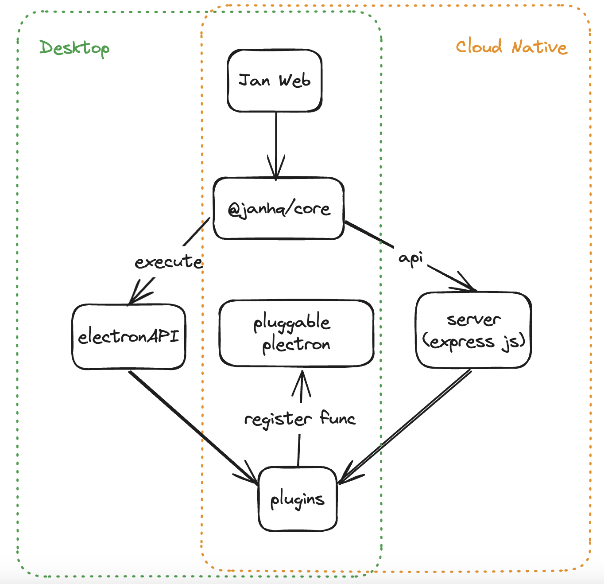

# Installing Jan Cloud Native

Cloud Native is useful when you want to deploy Jan to a shared/remote/cloud server, rather than running it as a local Desktop app.

> This is an experimental feature - expect breaking changes!

### Getting Started

#### Run from source code

```bash
git clone https://github.com/janhq/jan
cd jan
git checkout feat-255 && git pull
yarn install
yarn start:server
```

Open your browser at [http://localhost:4000](http://localhost:4000)

### Run from docker file

```bash
git clone https://github.com/janhq/jan
cd jan
git checkout feat-255 && git pull
docker build --platform linux/x86_64 --progress=plain  -t jan-server .
docker run --platform linux/x86_64 --name jan-server  -p4000:4000 -p3928:3928 -it jan-server
```

Open your browser at [http://localhost:4000](http://localhost:4000)

### Architecture



### TODOs

- [Authencation Plugins](https://github.com/janhq/jan/issues/334)
- [Remote server](https://github.com/janhq/jan/issues/200)
