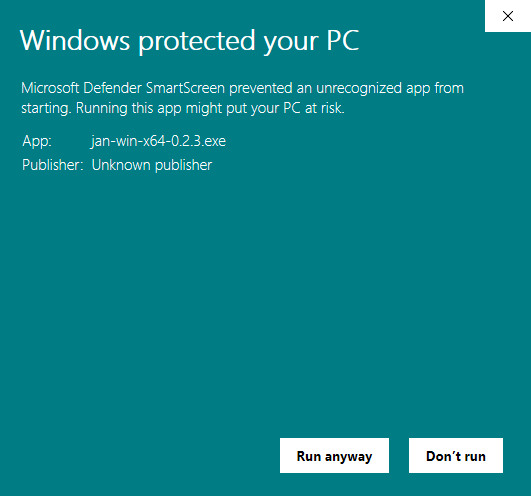

To begin using 👋Jan.ai on your Windows computer, follow these steps:

- **Step 1:** Visit [Jan](https://jan.ai/) website.
- **Step 2:** Click on the "Download for Windows" button to download the Jan Installer.


- **Step 3:** Start the installation.

- **Step 4:** Proceed the Windows Defender

    When you run the Jan Installer, Windows Defender may display a warning. Here's what to do:

    - Click "Run away" to accept and install 👋Jan.ai.

    

    - Wait for the 👋Jan.ai installation to complete.

    

    - This will run on your **CPU**.

:::info
If your computer has a GPU, we highly recommend running Jan on it.
:::

- For running on **GPU** to accelerate the performance:

    1. **NVIDIA GPU**

    Make sure to have the **CUDA toolkit** installed.
    
    You can download it from here: [CUDA Toolkit](https://developer.nvidia.com/cuda-downloads) or [CUDA Installation guide](https://docs.nvidia.com/cuda/cuda-installation-guide-microsoft-windows/index.html#verify-you-have-a-cuda-capable-gpu).

    Check the installation by

    ```bash
    nvidia-smi
    ```

    2. **AMD GPU**

    You should use [WSLv2](https://learn.microsoft.com/en-us/windows/wsl/install).
    
    You can download it from here: [ROCm Quick Start (Linux)](https://rocm.docs.amd.com/en/latest/deploy/linux/quick_start.html).