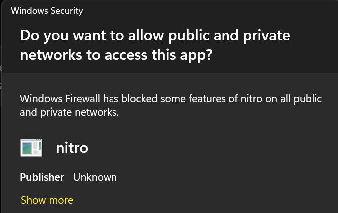

## Overview

Users with Nvidia GPUs can get **20-40% faster token speeds** compared to using LlamaCPP engine on their laptop or desktops by using [TensorRT-LLM](https://github.com/NVIDIA/TensorRT-LLM). The greater implication is that you are running FP16, which is also more accurate than quantized models.

## TensortRT-LLM Extension

This guide walks you through how to install Jan's official [TensorRT-LLM Extension](https://github.com/janhq/nitro-tensorrt-llm). This extension uses [Nitro-TensorRT-LLM](https://github.com/janhq/nitro-tensorrt-llm) as the AI engine, instead of the default [Nitro-Llama-CPP](https://github.com/janhq/nitro). It includes an efficient C++ server to natively execute the [TRT-LLM C++ runtime](https://nvidia.github.io/TensorRT-LLM/gpt_runtime.html). It also comes with additional feature and performance improvements like OpenAI compatibility, tokenizer improvements, and queues.

:::warning

- This feature is only available for Windows users. Linux is coming soon.

- Additionally, we only prebuilt a few demo models. You can always build your desired models directly on your machine. For more information, please see [here](#build-your-own-tensorrt-models).

:::

### Pre-requisites

- A Windows PC
- Nvidia GPU(s): Ada or Ampere series (i.e. RTX 4000s & 3000s). More will be supported soon.
- 3GB+ of disk space to download TRT-LLM artifacts and a Nitro binary
- Jan v0.4.9+ or Jan v0.4.8-321+ (nightly)
- Nvidia Driver v535+ (For installation guide, please see [here](/troubleshooting/#1-ensure-gpu-mode-requirements))
- CUDA Toolkit v12.2+ (For installation guide, please see [here](/troubleshooting/#1-ensure-gpu-mode-requirements))

### Step 1: Install TensorRT-Extension

1. Go to **Settings** > **Extensions**.
2. Click **Install** next to the TensorRT-LLM Extension.
3. Check that files are correctly downloaded.

```sh
ls ~\jan\extensions\@janhq\tensorrt-llm-extension\dist\bin
# Your Extension Folder should now include `nitro.exe`, among other artifacts needed to run TRT-LLM
```

### Step 2: Download a Compatible Model

TensorRT-LLM can only run models in `TensorRT` format. These models, aka "TensorRT Engines", are prebuilt specifically for each target OS+GPU architecture.

We offer a handful of precompiled models for Ampere and Ada cards that you can immediately download and play with:

1. Restart the application and go to the Hub.
2. Look for models with the `TensorRT-LLM` label in the recommended models list > Click **Download**.

:::note
This step might take some time. 🙏
:::


3. Click use and start chatting!
4. You may need to allow Nitro in your network



:::warning
If you are our nightly builds, you may have to reinstall the TensorRT-LLM extension each time you update the app. We're working on better extension lifecyles - stay tuned.
:::

### Step 3: Configure Settings

You can customize the default parameters for how Jan runs TensorRT-LLM.

:::info
coming soon
:::

## Troubleshooting

### Incompatible Extension vs Engine versions

For now, the model versions are pinned to the extension versions.

### Uninstall Extension

To uninstall the extension, follow the steps below:

1. Quit the app.
2. Go to **Settings** > **Extensions**.
3. Delete the entire Extensions folder.
4. Reopen the app, only the default extensions should be restored.

### Install Nitro-TensorRT-LLM manually

To manually build the artifacts needed to run the server and TensorRT-LLM, you can reference the source code. [Read here](https://github.com/janhq/nitro-tensorrt-llm?tab=readme-ov-file#quickstart).

### Build your own TensorRT models

:::info
coming soon
:::
